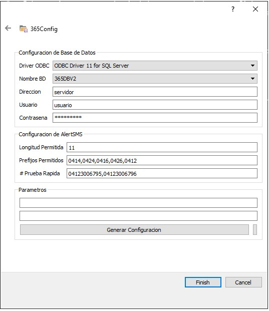

Cuando se utilizan los modem enfora via USB, estos equipos no se pueden instalar en computadoras con Sistema Operativo x64 porque solo existen drivers USB para 32 bits, para poder utilizarlos se deben conectar en una maquina secundaria que posea un sistema de 32 bits.

1. **Copiar la carpeta de instalación ubicada en:**

   `C:\Program Files (x86)\365Monitoreo.com\365Connect Pro.`

   Al ordenador secundario.

2. **Instalar los drivers OBDC.**

- <a href="https://download.microsoft.com/download/1/8/D/18D588C9-8F23-4111-B572-A5157B64F8A1/ESN/x86/msodbcsql.msi" target="_blank">Descargar OBDC 11 x32Bits</a>

- <a href="https://download.microsoft.com/download/1/8/D/18D588C9-8F23-4111-B572-A5157B64F8A1/ESN/x64/msodbcsql.msi" target="_blank">Descargar OBDC 11 x64Bits</a>

3. **Ejecutar el 365config apuntando hacia la dirección del servidor.**

4. **Ejecutar Alert SMS.**

## Manual de usuario de Modem Enfora 1308

<a href="https://drive.google.com/file/d/1ZuUCXpJ6JCrk8jpi9Z4lp7grb35ZfZqF/view?usp=sharing" target="_blank">**Modem Enfora 1308**</a>
