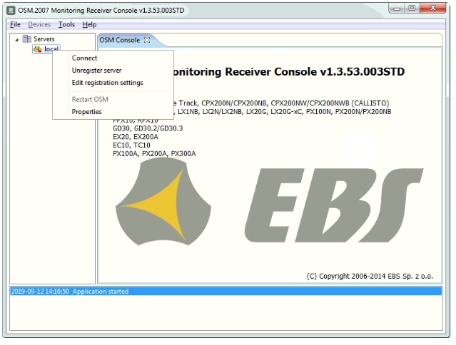
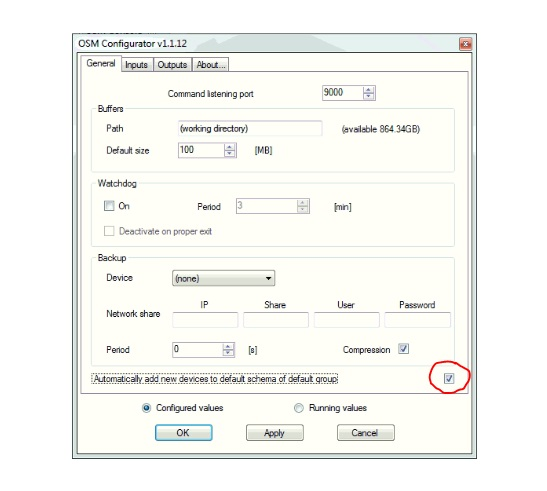
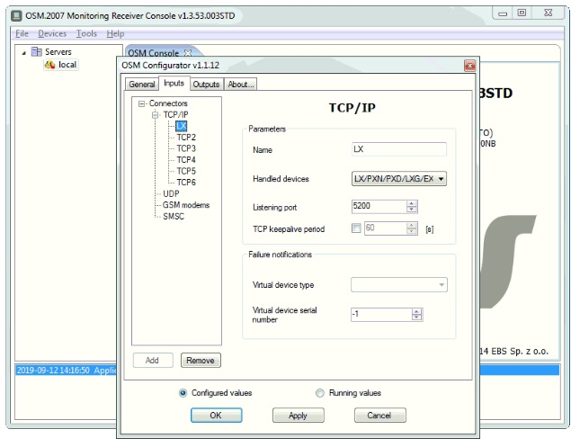
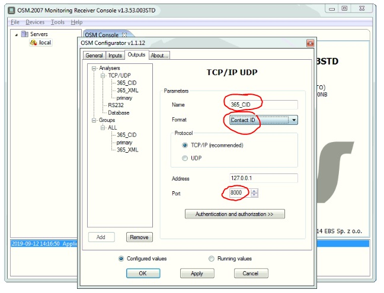
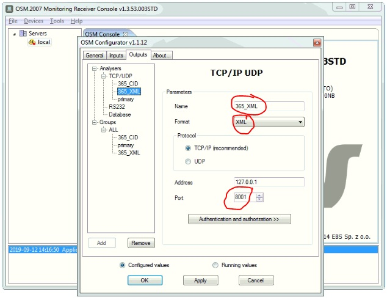
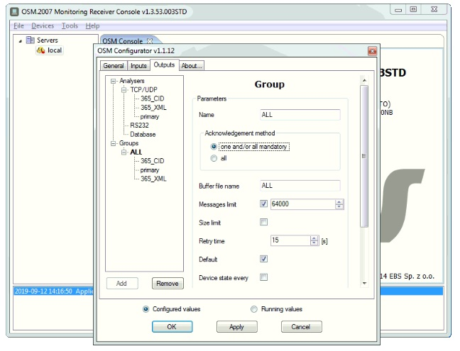
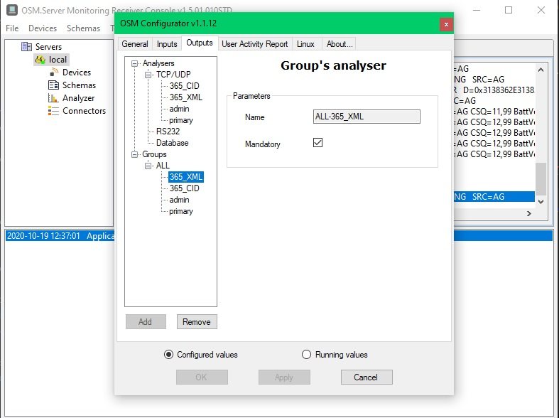
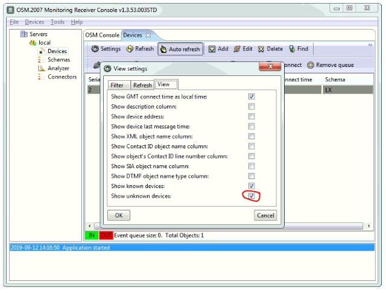

## Ejecutamos el Monitoring Reciver Console

Una vez en la pantalla principal del software hacemos clic en la opcion **Servers**, y luego seleccionamos en la opcion **Local** y con el clic izquierdo desplegamos una lista emergente y seleccionamos **Connect**.

En la pestaña **"General"** marcamos la opcion **"Automatically add new devices to default schema of default group"**, que se encuentra desmarcada.

Nos vamos a la pestaña **Inputs** y luego seleccionamos el **Name** que le queremos asignar en este caso es **LX** y en el **Handled devices** seleccionamos la opcion **LX/PXN/PXD/LXG/EX** Y seleccionamos el puerto por el que deseamos recibir las señales, en la opcion **Listening port** en este caso ese el **5200**.

En la pestaña **Outputs** seleccionamos el **Name** que tendrán al salir del OSM el cual es **365_CID**, el **Format** es **Contact ID** y el puerto utilizado es el **8000**..

**Nota:** Si el servidor esta en la misma maquina se coloca la ip de la maquina 127.0.01, de lo contrario se coloca la ip del servidor, en la opcion **Address**.

Luego agregamos otro Analysers y volvemos a seleccionar el **Name** que tendrán al salir del OSM el cual es **365_XML**, el **Format** es **XML** y el puerto utilizado es el **8001**.

Luego agregamos los dos Analysers creados en **Group**, en **ALL** , para hacerlo hay que hacer clic que arrastrar los dos analysers hasta **Group** en **ALL** y seleccionamos la opcion **"one and/or all mandayory"**, seleccionamos la opcion **Apply** y luego **OK**.

:::warning[Importante]
 También es posible seleccionar cual de los analyser group va a ser **mandatory**, haciendo clic sobre el nombre y marcando la casilla correspondiente.
:::

Una vez hecho esto nos vamos a **Local**, en **Devices**, seleccionamos la opcion **Settings**, hacemos clic en la pestaña **View** marcamos las ultimas dos opciones **show known devices** y **show unkown devices**.

