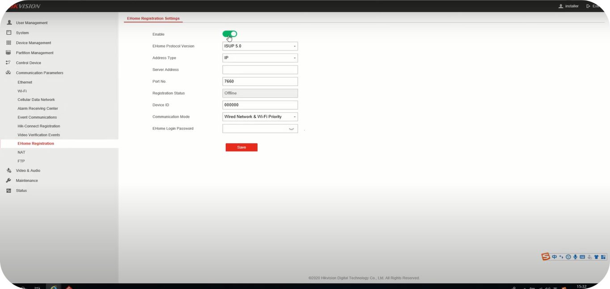

## Instalación y configuración del Hik Ip Receiver

- Nos dirigimos al [**Portal de Hikvision**](https://www.hikvisioneurope.com/eu//portal/?dir=portal/Technical%20Materials/10%20%20Intrusion%26Alarm/08%20ARC%20Integration/Hik%20IP%20Receiver%20Pro/Hik%20IP%20Receiver%20Pro_V1.4.0.4Build20220125) y descargamos el instalador.

- Seleccionamos **Next** hasta que la instalación culmine.

- Procedemos a verificar en la barra de tareas si los servicios estan activos.

:::tip[Nota] 
Si el servicio no se puede apreciar en la barra de tareas, verificar en el Administrador de Tareas si el servicio esta instalado y en ejecución.
:::

- Luego nos ubicamos en el navegador y colocamos **localhost:80**, creamos y confirmamos una contraseña.

:::warning[Importante] 
Es recomendable apagar el **Xampp** para evitar algun tipo de conflicto con los puertos.
:::

- A continuación nos autenticamos en la plataforma con el usuario **admin** y la **contraseña configurada**.

- Una vez dentro, nos dirigimos a la configuración y cambiamos el puerto de la plataforma para evitar posibles conflictos a futuro con el **Xampp**.

:::tip[Nota] 
Si deseamos acceder al portal nuevamente, deberemos colocar el puerto que definimos en esta sección, ejemplo **localhost:81**.
:::

Debemos verificar si estos puertos estan habilitados en el firewall.

:::warning[Importante]
Si la configuración se realiza en una computadora externa hay que aperturar los puertos en el **router** de esa computadora.
:::

- Para conexiones entrantes configuramos los puertos y la IP, la cual se recomienda ser estatica.

:::tip[Nota] 
Si la conexión se genera en local, esta información no necesita ser rellenada.
:::

### ¿Cómo agregar un dispositivo en Hik Ip Receiver?

Primero nos dirigimos a la lista de dispositivos. Esta lista normalmente estará vacía pero puede variar segun versiones del programa.

- Agregamos un dispositivo haciendo click en **+ Add**

- Seleccionamos el tipo de dispositivo como **ISUP5.0 Security Control Panel**, en el campo **Device Name** asignamos el nombre del disposito que se desee, en el campo **Account ID** deberemos colocar el ID del dispositivo y por ultimo en el campo **Key** debemos asignar una contraseña que necesitará el dispositivo para conectarse. Luego presionamos **Add**.

- Se listará el nuevo dispositivo con un estatus de **Offline**.

:::tip[Nota] 
El estatus **Offline** cambiará automaticamente a **Online** una vez se haga la configuración del dispositivo en el **HUB**.
:::

### ¿Cómo configurar la conexión del dispositivo en el HUB?

Debemos configurar la conexion de nuestro dispositivo para que este pueda acceder al Hik Ip Receiver, para ello debemos:

- Ingresar al portal del HUB.

- Ingresar la IP en **Server Adress**, el puerto en **Port No.** el ID del dispositivo en **Device ID** y la contraseña en **EHome Login Password**, todo esto previamente configurado al momento de agregar el dispositivo en el Hik Ip Receiver.

:::tip[Nota] 
El puerto por defecto es el **7661** pero este puede variar en función de la configuración inicial.
:::

## Configuración del Hik Ip Receiver con 365

Para que el Hik Ip Receiver pueda conectar con 365Receiver debemos realizar las siguientes configuraciones.

- Configuramos la salida de los eventos por **Automation Output**, colocamos el tipo de **Protocolo**, **Ip** y **Puerto** que tendrá el receptor en **365Receiver**.

:::tip[Nota] 
En este ultimo ejemplo usamos el protocolo SIA-DCS, usando el puerto 1024 con un herbeat cada cierto tiempo.
:::

- Por ultimo verificamos en **Event Monitor** en la pestaña de **Sending Event** que esten las tramas con un estatus **Succes** al final de la linea.

