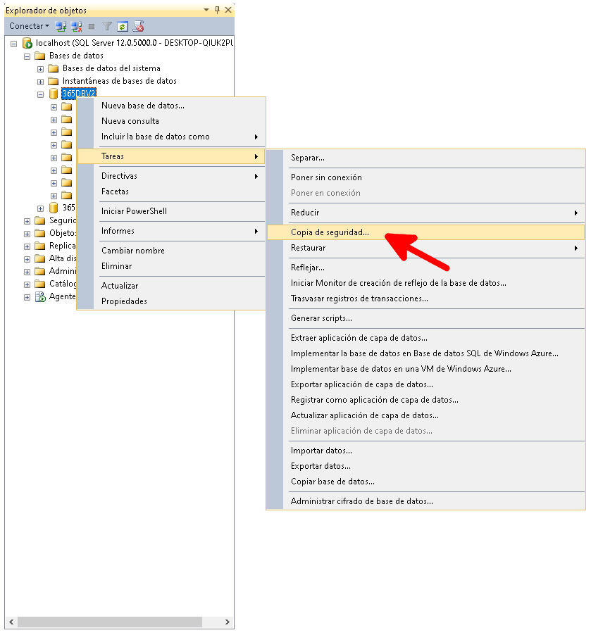

Para evitar perdida de datos al realizar la actualización, lo primero que debemos hacer antes de iniciar es hacer un backup de la Base de datos.

## Respaldo de puertos en firewall

Respaldamos la lista de puertos que se encuentran en la regla de 365Connect Pro dentro del cortafuegos lo almacenamos en un txt.

## Respaldo de puertos de 365ReceiverGPS

Respaldamos la lista de puertos que se encuentran en la carpeta `C:\Program Files (x86)\365Monitoreo.com\365Connect Pro\365ReceiverGPS\conf` en el archivo default.xml, el cual se traduce en copiar todo el contenido de todo ese archivo.

## Respaldo de 365

Respaldamos la carpeta 365 dentro de xampp/htcdocs.
Respaldamos la carpeta de 365ConnectPro en archivos de programa.

## Respaldo de Base de datos

### Desde la plataforma

Ingresamos a la plataforma, vamos al **modulo de parametros**, seleccionamos la opción Respaldo.

El Respaldo se almacena en `C:\xampp\htdocs\365\backupDB`

### Desde SQL Management Studio

Ejecutar **Microsoft SQL Server Management Studio**, ingresamos las credenciales y nos ubicamos sobre la base de datos que deseamos respaldar, hacemos clic derecho, seleccionamos la opción **tareas, copia de seguridad**.

Seleccionar la opción **quitar**.

luego Agregamos una ruta nueva y hacemos clic en el boton que tiene tres puntos.

Seleccionamos la ruta de destino, y le asignamos un nombre al archivo backup, finalizandolo con la extensión **.bak**.

Si hicimos los pasos correctamente nos saldra este ultimo mensaje.

### Desde Migraciones

Ejecutamos el archivo `start.py` , ingresamos las credenciales. Enseguida nos preguntará si queremos hacer un respaldo de la base de datos; escribimos `S` Para realizar el backup.

El backup se almacena en `C:\ProgramFiles\MicrosoftSQLServer\MSSQL12.MSSQLSERVER\MSSQL\Backup`
Ejecutamos Migraciones desde la ruta

## Detenemos Los servicios

Indicarle al Cliente que cierre todas las estaciones. Cerrar el 365Receiver y asegurarnos en el administrador de tareas que el proceso ya no esté en ejecución.

Detenemos el servicio de 365ReceiverGPS, Y Apache.

## Desisntalar 365ConnectPro

Vamos a panel de control, programas y características, y desde allí buscamos 365Connect Pro.
Instalar nueva Version de 365Connect

Se procede a la instalación de forma rutinaria

## Migraciones

Al finalizar la instalación nos dirigimos a la ruta

<code> C:\Program Files (x86)\365Monitoreo.com\365Connect Pro\migraciones </code>

para ejecutar el archivo <code> start.py </code>

En la consola que se nos va a desplegar seleccionamos únicamente la opcion 1
