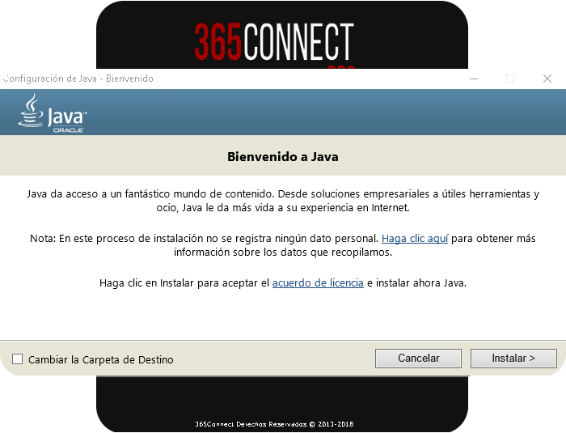

Antes de empezar con la instalación de 365Connect Pro, debemos instalar algunos programas necesarios:

- [**SQL Server**](https://drive.google.com/open?id=0Bzx63q3PmThkMkU5bGRYS3Y1bzg)

Ejecutar el Setup de 365Connect Pro

Nos mostrará la ventana principal de instalación, le damos siguiente hasta que aparezca la siguiente ventana de instalación. **Seleccionamos todos los programas** que son necesarios para que la plataforma funcione.

Hacemos clic en **Siguiente** para continuar con la instalación.

## **Instalación de XAMPP**

Al instalar el XAMPP mostrara un mensaje de alerta, solo hacemos clic en "**OK**" y continuará normalmente con la instalación.

Seleccionamos **Siguiente** hasta que aparezca la siguiente ventana

Desmarcamos todas las opciones excepto **Apache** y **PHP**.

Seleccionamos **Siguiente** hasta que el proceso de instalación finalice.

## **Instalación de Java**

Seleccionamos la opción **Instalar** luego aceptamos los terminos y esperamos hasta que el proceso de instalación culmine.

## **Instalación de Python**

Seleccionamos la opción **"Install for all users"** y presionamos **Next**.

Seleccionamos **Siguiente** en todas las opciones hasta llegar a la siguiente pantalla.

Seleccionamos la ultima opción que dice "**Add python to path**" y seleccionamos la opción
señalada en la imagen.

Seleccionamos la opción **Siguiente** hasta que el proceso de instalación finalice.

Continuamos con el Instalador de la versión Pro, marcamos la opción "**Estoy de acuerdo con los terminos de licencia y condiciones**" y hacemos clic en **siguiente**.

Elegimos la opción de tipo de instalación **típico**

Seleccionamos la opción "**2**" nos aparecerá una linea de codigo.

Presionamos **enter** e instalará unos archivos que necesitamos.

Presionamos **enter** como muestra la imagen y se cerrara la ventana.

Despues se nos mostrará una ventana que dice "**365Connect Pro ha sido correcamente instalado**" y hacemos clic en **finalizar** .
