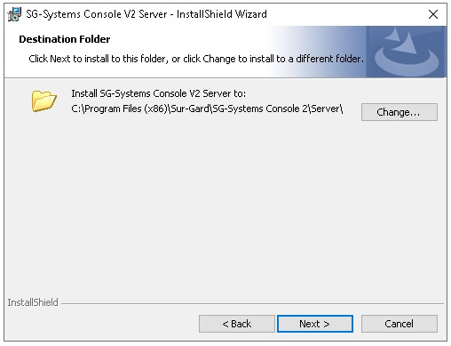

## Ejecutar el Instalador de SG System Console Server

Seleccionamos **Next**.

Aceptamos los terminos y condiciones de uso .

Seleccionamos **Next**.

Hacemos clic en la opcion **"Install"**.

Configuramos el receptor usando el puerto 9000 excepto si hay otro receptor instalado en ese puerto como el OSM.

AGREGAR IMAGEN DE LA BARRAS DE TAREAS REALIZANDO LA ACCIÓN.

clic derecho desde el icono en la barra de tareas, opción play.

Seleccionamos **"Finish"** para terminar con la instalación.

## Ejecutar el instalador de SG System Console Client

Seleccionamos **Next**.

Seleccionamos **"I Agree"**.

Seleccionamos **"Everyone"**.

Hacemos clic en la opción **"Close".**

## Después de Instalar

Confirmar con el cliente el modelo de receptor que se está instalando (System I, System II, etc)

Cambiar el nombre de los accesos directos en el escritorio a SG Client y SG Server

Configurar la Ip del Servidor (para saber cuál es, hay que buscar físicamente en la pantalla del receptor), puerto 1025.

Realizar un test desde la pantalla de configuración, si falla, debemos hacer ping desde CMD, para verificar si esa dirección se encuentra en ese mismo segmento de red o si está siendo utilizada.
