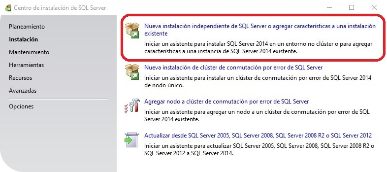

Antes de comenzar con la instalación recomendamos instalar:

- **Actualizaciones de windows**
- **Net framework 3.5**.

Ejecutamos el instalador y seleccionamos la opción **instalación**, y luego **nueva instalación independiente de sql server**.

Introducimos la **clave de producto** del sql server 2014 standard.

Marcamos la opción "**Acepto los terminos de licencia**" y hacemos clic en **siguiente**.

El siguiente paso **Instalar Reglas** tiene como función identificar los posibles problemas
que podrian producirse al ejecutar la instalación.

Si se pasan todas las reglas este paso se procesará y se omitirá automáticamente. Si no se llegan a aprobar algunas reglas, se las deberá corregir para que la configuración pueda continuar. Seleccionamos **Volver a ejecutar** para comprobar que todo este solucionado.

> Si sucede algún error con el NetFramework 3.5 puede dirigirse al siguiente link. [**Error NetFramework 3.5**](../../solucion-de-problemas/365software/problemas-con-la-instalacion.md#instalador-de-sql-server-no-detecta-net-framework-35)

Seleccionamos la opción "**Instalación de características de SQL Server**" y hacemos clic en **siguiente**.

Marcamos la opciones:

- **Motor de base de datos**
- **Herramientas de administración - Basica**
- **Herramientas de administración - Completa**

Hacemos clic en **siguientes** hasta que aparezca la siguiente pantalla.

Seleccionamos el servicio **"Agente SQL Server"** y en el **"Tipo de inicio"** lo cambiamos a **Automático**.

Seleccionamos **"Modo mixto (autentificación de SQL Server y de Windows)"** e introducimos la clave de la base de datos, luego hacemos clic en el botón **"Agregar usuario actual"**.

Seleccionamos **Instalar**

Esperamos que finalice el proceso de instalación.

Una vez terminado el proceso de instalación se mostrara la siguiente ventana.

Hacemos clic en **Cerrar** y finalizara la instalación.
