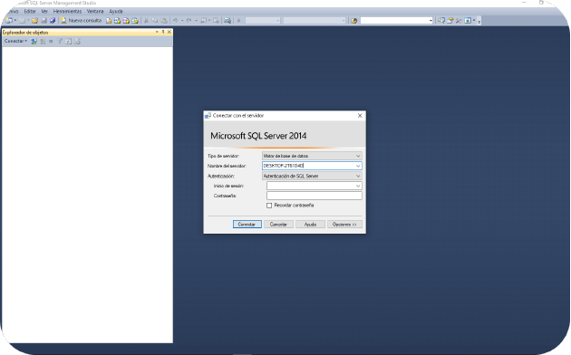
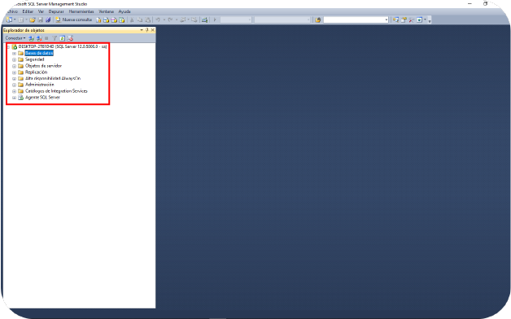

Antes de empezar debemos ubicar nuestro archivo de respaldo en la carpeta donde se encuentra o colocarlo en una carpeta de facil acceso al momento de seleccionarla en el programa.

## Restaurar Base de Datos

Abrimos el **SQL Server Management Studio** seleccionamos nuestro servidor y colocamos las credenciales de autenticación y hacemos clic en **Conectar**

Luego en la parte izquierda se nos listaran algunos elementos desplegables.

Hacemos clic derecho en **Bases de Datos** y seleccionamos la opción **Restaurar Base de Datos**

En el **Origen** vamos a seleccionar **Dispositivo** y luego hacemos clic en los puntos suspensivos **"..."**

Se nos presentará una ventana en donde especificaremos el archivo de respaldo y donde se encuentra ubicado, para ello hacemos clic en **Agregar**

Buscamos el archivo con el nombre de la copia de seguridad de nuestra base de datos, lo seleccionamos y hacemos clic en **Aceptar**

> Nota:
> Por defecto la busqueda inicial se localiza en la carpeta **BackUps** de **Microsoft SQL Server**, por lo que si nuestro archivo de respaldo no se encuentra allí, deberemos buscarlo en la carpeta que lo contenga.

Una vez elegido el archivo hacemos clic en **Aceptar**

Verificamos que la casilla de **Restaurar** se encuentre marcada, presionamos aceptar y esperamos a que la operación finalice

