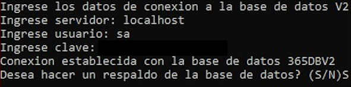

Una vez terminada la instalación del 365connectPro se procede a ejecutar el 365Config.

## 365Config

El archivo 365Config se ejecuta para crear los archivos Config de las aplicaciones, además de las bases de datos 365DBV2 y 365ReceiverGPS si es una instalación desde cero, asi mismo instala el servicio de 365ReceiverGPS.

## Migraciones

Despues de haber ejecutado el archivo 365Config, nos dirigimos a la siguiente ruta `C:\Program Files (x86)\365Monitoreo.com\365Connect Pro\migraciones`.

Una vez en la carpeta hacemos clic sobre la barra de dirección, borramos la dirección y colocamos las letras **cmd** y presionamos **enter**.

Escribimos **python start.py** y presionamos **enter**. Una vez hecho esto ingresamos las credenciales de la base de datos.

Luego ejecutamos la opción 1 y dejamos que corra hasta que nos vuelva a mostrar la lista de opciones.

Y luego ejecutamos la opción 2.

### Actualizar Data Estática

Se utiliza tanto en el proceso de actualización, como de instalación de un nuevo de un cliente, por ahora hay tres formas de actualizar data estatica:

**1. Borrar + Insertar:**
Permite restaurar las tablas como esten en data estatica. Es decir, el registro lo sobreescribe con la informacion.
Esta opción permite elegir si se quieren borrar o no los eventos. Se recomienda unicamente para instalaciones nuevas.

**2. Agregar Data Faltante:**
Inserta la data estatica faltante en todas las tablas.
Ejemplo: inserta eventos que no existen actualmente en el cliente, sin alterar la data que ya está.

> **Data en Tablas Combinadas:**

    	En caso de que la tabla sea combinada, el programa tiene que verificar dentro del registro cada valor de las
    	columnas para ver si concuerdan o no. Si existen conflictos o cambios permite la opción de agregar el registro asignando un nuevo ID autoincrementable. Si elije la opción no, no se realizaran cambios.

**3. Agregar data faltante + actualizar manteniendo el id:**
Además de insertar data faltante, actualiza los eventos manteniendo el mismo id. Esta opción no altera eventos creados por el cliente.

**4. Regresar:**
Permite regresar al menu anterior.

Una vez terminadas de ejecutar las migraciones, deberíamos poder ingresar a la web, en donde procederemos a crear un usuario.

## Crear Usuario a la Empresa

Para entrar a la empresa sin tener ningún usuario creado necesitaremos ingresar a la plataforma con el usuario 365. Dirigirnos al modulo de usuarios y crear un usuario con los datos proporcionados por el cliente.

Para mayor informacion dirigase a [Usuarios](../../manual-y-faq/365connectPro/usuarios.md).

## Crear Prefijos

Una vez dentro de el modulo parámetros, luego entramos en el sub-modulo empresa y nos dirigimos al final del modal donde dice `Agregar Rango de Clientes` y seleccionamos el prefijo que queremos crear en el inicio 0 y en el final 99999999999999, para luego simplemente darle clic en agregar, aquí creamos los prefijos.

- **AL**
- **GPS**
- **GRD**
- **SOS**

:::warning[Importante]
Para que el prefijo AL sea visible en el sub-modulo empresa debemos seguir los siguiente pasos o Configurar el receptor.
:::

1. Dirigirnos al sub-modulo receptores dentro del modulo parámetros.
2. Una vez dentro de receptores hacemos clic en la opción agregar y llenamos los datos necesarios para crear el receptor.
3. Luego nos vamos al final en la sección donde dice Lineas agregadas y redactamos en la tabla el numero de la linea, el prefijo y la descripción.

## Configurar el/los Receptores

Una vez dentro del modulo parametros, luego entramos en el sub-modulo receptores, hacemos clic en el botón agregar ubicado en la barra superior derecha de la pantalla.

:::warning[Importante]
Esta configuración mostrada es solo una configuración de ejemplo, ya que todos los receptores no se configuran igual.
:::

| Campo                | Descripcion               |
| -------------------- | ------------------------- |
| **Descripcion**      | Nombre del receptor       |
| **Tipo**             | Tipo de conexion          |
| **Servidor**         | Direccion IP del servidor |
| **Puerto**           | Numero del Puerto         |
| **Receptor**         | Tipo de Receptor          |
| **Velocidad**        | Ninguna                   |
| **Paridad**          | Ninguna                   |
| **Bits**             | Ninguna                   |
| **Stop Bits**        | Ninguna                   |
| **ACK**              | Si                        |
| **Estatus**          | Activos                   |
| **Prefijo**          | 0                         |
| **Tiempo de espera** | 0                         |

## Configurar Modem

Una vez dentro del modulo parametros, luego entramos en el sub-modulo Modems, hacemos clic en el boton agregar ubicado en la barra superior derecha de la pantalla y llenamos todos los campos.

## Restaurar Puertos de firewall

Restauramos los puertos que respaldamos antes de realizar la instalación, copiamos la lista de puertos del default.xml respaldados y la pegamos en el nuevo.

## Respaldo de puertos de 365ReceiverGPS

Respaldamos la lista de puertos que se encuentran en la carpeta `C:\Program Files (x86)\365Monitoreo.com\365Connect Pro\365ReceiverGPS` en el archivo default.xml, el cual se traduce en copiar todo el contenido de todo ese archivo.

## Verificar Funcionamiento del Receivernpm

Para saber que el receriver esta funcionando bien solo tenemos que esperar que comiencen a llegar señales y que las demas funciones, como:

1.  **SocketMap**
2.  **SocketMonitoreo**
3.  **AlertMail**

## Verificar Funcionamiento del 365ReceiverGPS

Para saber que el 365ReceriverGPS esta funcionando bien solo tenemos que ir a la barra de tareas, hacer clic derecho y buscar la opcion Administrador de tareas. Luego nos vamos a la pestaña de servicios y veamos que el servicio del mismo nombre este en Ejecucion.

## Verificar la Transferencia de Señales en Monitoreo

Para saber que la transferencia de señales esta funcionando bien solo tenemos que ir al modulo de monitoreo abrir la consola y ver que no hay ningun problema con el puerto 9081, si lo hay posiblemente el puerto no este abierto en el firewall de windows o en el router por lo cual no esta funcionando la transmision de señales.

    Configurar DNS()
