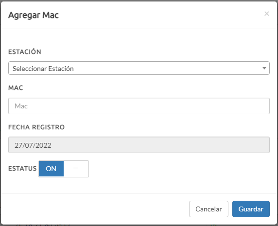
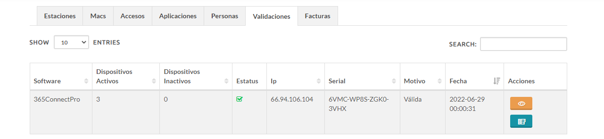

Para crear una nueva licencia de un nuevo cliente, necesitamos ingresar en la web **http://validateapp.365monitoreo.com/login** y acceder con nuestras respectivas credenciales, si no posees una deberas solicitar la creacion de las mismas.

Una vez que ingresamos en el web hacemos clic en la seccion de **clientes**, para visualizar todas las licencias que existen actualmente

Dentro de la seccion de clientes, se nos mostrara una tabla con la razon social, el rif, el represante, el correo, el serial, el status y las acciones, en el boton **NUEVO** ubicado en la parte superior derecha de la pantalla nos deplegara un formulario con todos los datos necesario para crear un nuevo registro

El formulario para crear un nuevo registro de un cliente esta constituido por los siguientes campos.

|Campo|Descripcion|
|---|---|
|Razon Social|Nombre de la Empresa|
|Rif|Rif|
|Representante|Nombre del Representante|
|Correo|Correo del Representante|
|Distribuidor|Seleccione Distribuidor|
|País|Seleccione País|
|Impuesto|Impuesto|
|Serial|Serial|
|Estatus|ON/OFF|

Una vez completados todos estos datos hacemos clic en el boton **Guardar**.

Buscamos el nuevo registro creado en la lista escribiendo el nombre en el campo search y hacemos clic en el boton **DETALLES** en la columna Acciones.

Una vez en la seccion de Panel Cliente nos ubicamos en la pestaña Estaciones 

Nos dirigimos al boton **Agregar** 

Para añadir una nueva estacion (*Sitio donde se encuentra ubicado el servidor*), el usuario y la contraseña de acceso para ingresar al mismo.

|Campo|Descripcion|
|---|---|
|Nombre|Nombre del Sitio|
|Usuario|Usuario|
|Contraseña|Contraseña|
|Estatus|ON/OFF|

Una vez llenos todos estos datos hacemos clic en el boton **Guardar**.

Luego nos ubicamos en la pestaña Macs

Podemos agregar las macs de forma manual haciendo clic en el boton **Agregar** y llenando los datos del formulario

|Campo|Descripcion|
|---|---|
|Estación|Seleccionamos la anterior estación creada|
|Mac|Colocamos la Mac del equipo|
|Fecha de registro|Seleccionamos la fecha de registro|
|Estatus|ON/OFF|

>**Nota:** La mac se puede obtener ingresando **getmac** en la consola de comandos (**CMD**) o  automaticamente iniciando el 365receiver una vez instalado, config creado e ingresado el serial en el web.  

>Otra forma de obtener la mac es a través del router, en los dispositivos conectados a la red deberian aparecer reflejado el nombre del dispositivo, la ip privada asignada y la mac.

Luego nos ubicamos en la pestaña Aplicaciones

Podemos agregar la Aplicaciones de forma manual haciendo clic en el boton **Agregar** y llenando los datos del formulario

|Campo|Descripción|
|---|---|
|Estación|Seleccionamos la anterior estación creada|
|Nombre de la Aplicación|Seleccionamos el nombre|
|Fecha de registro|Seleccionamos la fecha de registro|
|Estatus|ON/OFF|
|Fecha de expiración|Seleccionamos la fecha de expiracion|

Para verificar que todo esta funcionando correctamente y que todo conectado, podemos ir a la pestaña validaciones y ahi se nos mostrara el software conectado, los dispositivos activos, los dispositivos inactivos, el estatus de la conexion, la ip del servidor, el serial, el motivo de la conexion, la fecha y la acciones que puede realizar.

