

Los asociados son un tipo de cliente que comparte varios dispositivos de diferentes clientes, estos pueden ser empresas o personas. En el módulo Asociados se muestra una lista con todos los asociados existentes, los dispositivos sin asociar, además se pueden agregar nuevos asociados, editar datos de los existentes y también eliminar los mismos.

## Funciones

* Monitorear las señales que llegan a los dispositivos asociados (Mas no procesar las señales).

* Visualizar los datos de los dispositivos y navegar entre las pestañas disponibles de los dispositivos asociados.

* Ver la posicion de los dispositivos en el mapa si tienen.

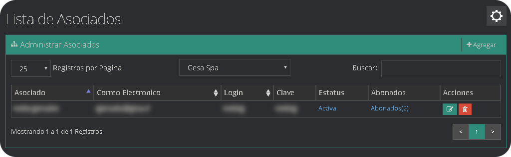

## ¿Cómo agregar un Asociado?
* En el menu de administración de Asociados, pulse **Agregar**.

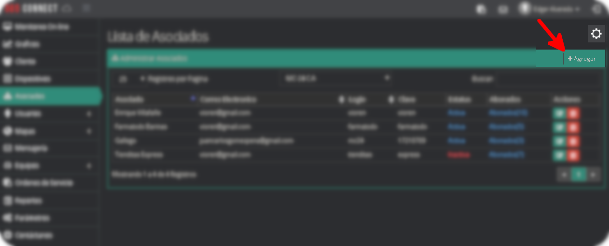

* Se desplegará un formulario que debe llenar con los datos del Asociado.

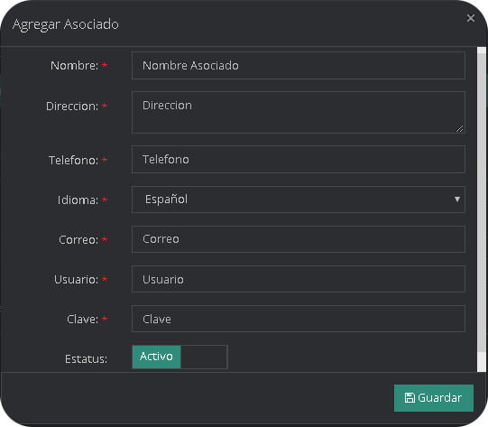

* Una vez llenado los datos con la información correspondiente, le damos clic en el boton guardar.

|Campo|Descripción                                                              |
|----------------|---------------------------------------------------------------|
|`Nombre`|Nombre de la persona, empresa o grupo de asociados|
|`Dirección`|Localización física de la persona, empresa o grupo de asociados|
|`Teléfono`|Número telefónico|
|`Idioma `|Selecciona el idioma que utiliza el asociado                         |
|`Correo`|Dirección valida para recepción de Emails|
|`Usuario`|Nombre del cliente para acceder a la plataforma                      |
|`Clave`|Contraseña del cliente para acceder a la plataforma                    |
|`Estatus`|Interruptor para activar o desactivar la cuenta del asociado         |

## ¿Como editar un Asociado?

* Localice el cliente que desea editar, ubique el Menú de opciones

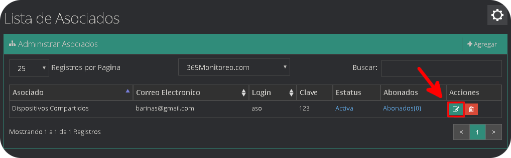

* Se desplegará un formulario con los datos del Asociado, los cuales puede editar.

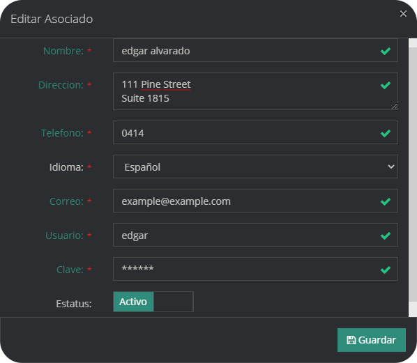

* Una vez llenado los datos con la información correspondiente, le damos clic en el botón guardar.

|Campo|Descripción                                                              |
|----------------|---------------------------------------------------------------|
|`Nombre`|Nombre de la persona, empresa o grupo de asociados|
|`Dirección`|Localización física de la persona, empresa o grupo de asociados|
|`Teléfono`|Número telefónico|
|`Idioma `|Selecciona el idioma que utiliza el asociado                         |
|`Correo`|Dirección valida para recepción de Emails|
|`Usuario`|Nombre del cliente para acceder a la plataforma                      |
|`Clave`|Contraseña del cliente para acceder a la plataforma                    |
|`Estatus`|Interruptor para activar o desactivar la cuenta del asociado         |

## ¿Cómo eliminar un Asociado?

* Localice el cliente que desea eliminar, ubique el Menú de opciones

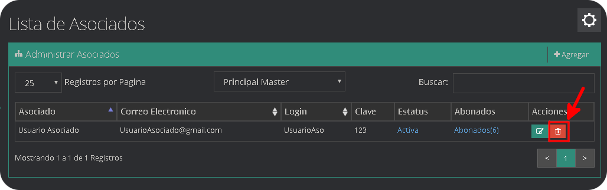

* Seleccione el botón Eliminar cliente, de color rojo.

* Confirme la eliminación del asociado dando clic en el botón eliminar de la ventana emergente.

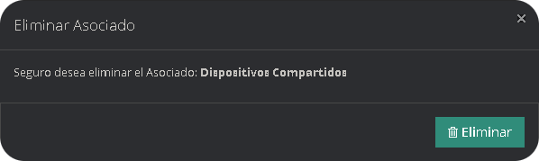

## ¿Cómo asignar dispositivos a un Asociado?

* Ubicamos el asociado al cual se le van a asignar dispositivos y hacemos clic en la palabra `Abonados()`, el número dentro del paréntesis indica cuantos dispositivos tiene asignados.

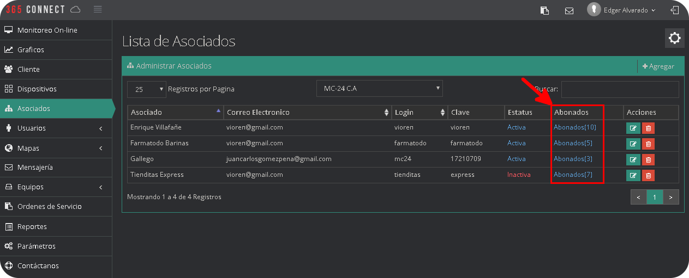

* La pantalla se dividirá en dos listas, la superior con los dispositivos asignados al asociado.

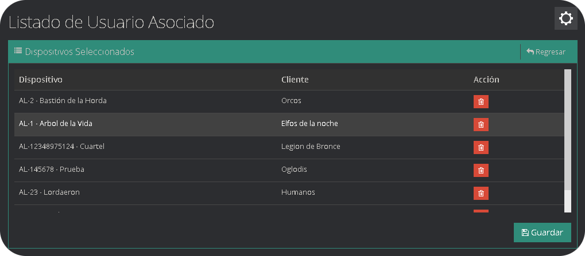

* En la parte inferior se selecciona el cliente.

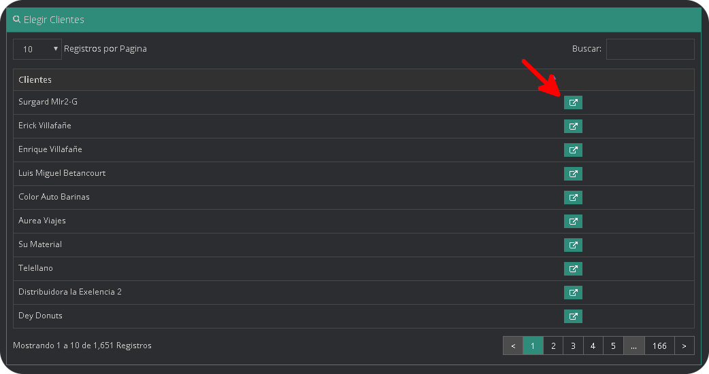

* El cual mostrara los dispositivos que posee el mismo sin asignar, se asignan los dispositivos disponibles y presione el botón cerrar.

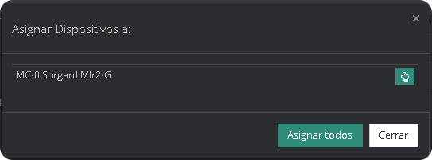

* Una vez termine de asignar los dispositivos utilice el botón guardar para almacenarlos cambios.

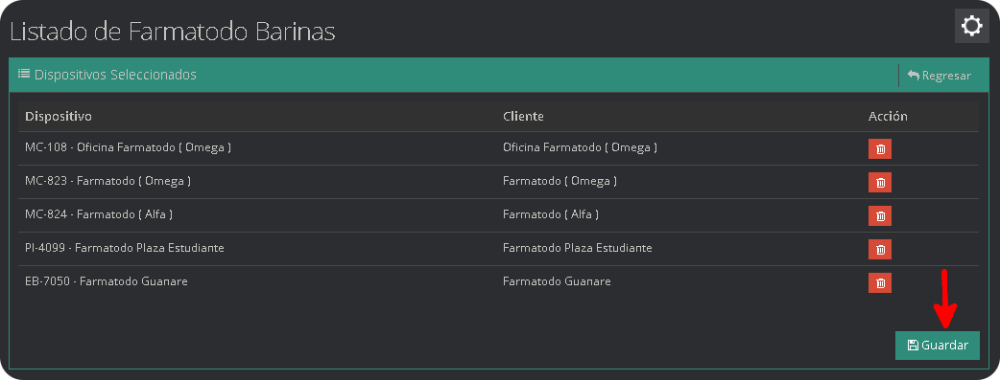

## ¿Como eliminar dispositivos a un Asociado?

* Localice el asociado al cual desea asignarle dispositivos, ubique la opción Abonados y la lista de los dispositivos asociados.

* Seleccionado el asociado al que deseamos eliminarle un dispositivo, se desplegara una lista con todo los dispositivos asignados a ese asociado.

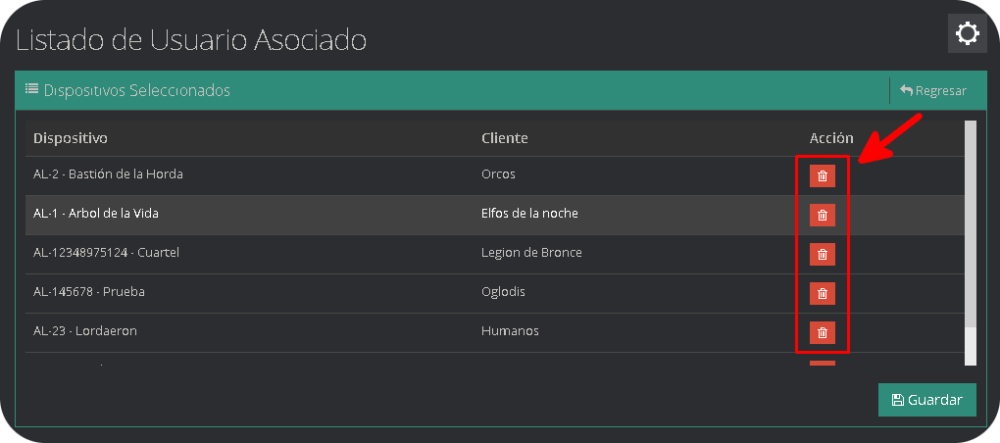

* Para eliminarlo solo tenemos que hacer clic sobre el botón rojo eliminar.

## Acceder como Asociado

En caso de usar un usuario de asociado, al autenticarse se podran visualizar todos los dispositivos y señales relacionados con esa cuenta. Ademas de listar informacion en su Panel correspondiente de cada dispositivo. Siguiendo este mismo orden, estara disponible una opcion para mapas en donde podra ubicar correctamente sus gps y aplicaciones de trackers

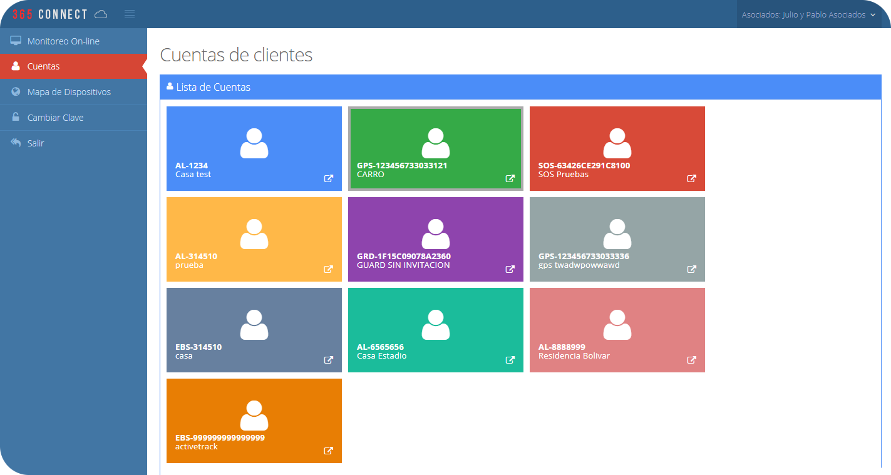