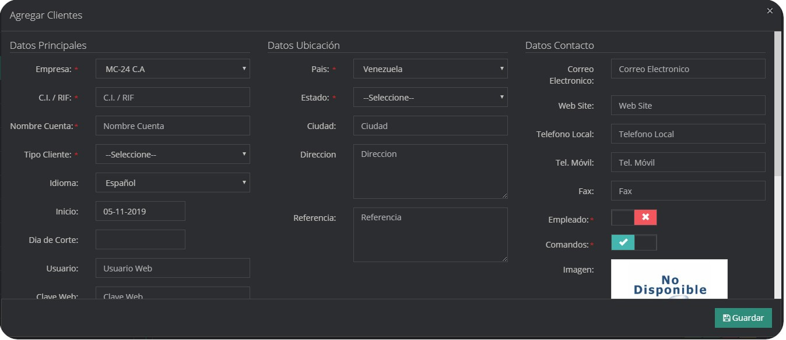
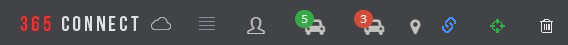

Un cliente es cualquier persona **natural**, **organización** o **empresa** a la cual pertenecen uno o varios dispositivos y que requieren los servicios de monitoreo.

## ¿Cómo crear un nuevo cliente?

- En el menú de administración de Clientes, pulse **Agregar**.

- Se desplegará un formulario que debe llenar con los datos del cliente.

| Campo                 | Descripción                                                                        |
| --------------------- | ---------------------------------------------------------------------------------- |
| `Empresa `            | Seleccione la empresa a la cual pertenece el cliente.                              |
| `C.I. / RIF`          | Documento de identidad o número de identificación del cliente.                     |
| `Nombre Cuenta`       | Nombre del cliente, sea persona u organización.                                    |
| `Tipo Cliente `       | Seleccione el tipo de cliente, por defecto son Natural, Jurídico, Gobierno y Otro. |
| `Idioma `             | Selecciona el idioma que visualizará el cliente al ingresar a la plataforma.       |
| `Día de Corte `       | Día del mes en el cual se efectuará el corte del servicio                          |
| `Usuario      `       | Nombre de Usuario para acceder a la plataforma                                     |
| `Clave Web    `       | Contraseña de usuario para acceder a la plataforma                                 |
| `365Client IOS `      | Habilita/Deshabilita el acceso al cliente desde la aplicación en IOS               |
| `365Client Android`   | Habilita/Deshabilita el acceso al cliente desde la aplicación en Android           |
| `País`                | Selecciona el país de origen                                                       |
| `Estado`              | Selecciona la estado o provincia                                                   |
| `Ciudad `             | Nombre de la ciudad del cliente                                                    |
| `Dirección `          | Localización física del cliente                                                    |
| `Referencia`          | Ayuda para ubicar la dirección del cliente                                         |
| `Correo Electrónico ` | Dirección válida para recepción de Emails                                          |
| `Web Site `           | Dirección web del cliente                                                          |
| `Teléfono Local`      | Número de teléfono fijo del cliente                                                |
| `Tel. Móvil`          | Número de teléfono móvil del cliente                                               |
| `Fax`                 | Dirección fax                                                                      |
| `Empleado`            | Habilita si el cliente es también empleado de la empresa                           |
| `Comandos`            | Habilita para recibir comandos                                                     |
| `Imagen`              | Representación fotográfica del cliente                                             |
| `SMS Status`          | Habilita el servicio de notificaciones SMS                                         |
| `Estatus Email`       | Habilita el servicio de Notificaciones por correo                                  |
| `Estatus Monitoreo`   | Habilita el servicio de Monitoreo                                                  |
| `Estatus Web`         | Habilita el acceso a la pagina web                                                 |

## Menú de Opciones de Cliente

Para acceder a las opciones de clientes para editar, eliminar o ver, diríjase hasta el cliente de interés; a la derecha ubique los botones de colores.

### ¿Cómo editar un cliente?

- Localice el cliente que desea editar, ubique el Menú de opciones

- Seleccione el botón Editar cliente, de color verde.

- Hacer las modificaciones dentro del formulario y presione el botón Guardar

### ¿Cómo eliminar un cliente?

- Para eliminar un cliente primero debes eliminar todos sus dispositivos, yendo al panel del cliente y eliminando todos los dispositivos asociados al cliente que desea eliminar.

:::warning Importante
Si intentas eliminar un cliente con dispositivos registrados se mostrara el mensaje "No se puede eliminar el cliente porque existen dispositivos asociados a el".
:::

- Localice el cliente que desea eliminar, ubique el Menú de opciones.

- Seleccione el botón eliminar cliente, de color rojo.

- Confirme que desea eliminar el cliente e ingrese las credenciales de su cuenta.

- Una vez introducida las credenciales te volvera a preguntar si realmente deseas eliminar el cliente.

### ¿Cómo ver los detalles de un cliente?

- Localice el cliente que desea ver, ubique el Menú de opciones

- Seleccione el botón Panel Cliente, de color verde.

- En una nueva pestaña podrá visualizar, la información detallada del cliente

## Panel Cliente

De la misma forma que el resto de la plataforma, el Panel de Cliente se divide en pestañas para visualizar y configurar elementos de un cliente.

### ¿Como Acceder a las aplicaciones por Codigo QR?

Se puede iniciar sesión en dispositivos 365Guard y 365SOS escaneando un código QR, de esta manera no se necesitan introducir los datos de acceso, este codigo QR se encuentra ubicado en el panel cliente a la izquierda del boton editar cliente, y permite seleccionar en cual de los dispositivos de ese cliente se quiere acceder.

Haciendo clic en el boton se desplegara una ventana con el codigo QR que necesitamos para acceder,el cual nos mostrara todos los dispositivos a los que podemos ingresar.

## Dispositivos

Permite visualizar y acceder a los dispositivos asociados, además, desde esta opción también se pueden agregar más dispositivos al cliente.

:::warning Importante
También es posible visualizar los dispositivos como un listado, para ello podemos hacer clic en el interruptor.
:::

:::tip Nota
[Más Información: sobre dispositivos.](dispositivos)
:::

## Usuarios

:::warning Importante
Si te refieres a usuarios de la empresa que manejan la plataformna es aqui. [ Usuarios](../365connectPro/usuarios.md)
:::

Los usuarios de un cliente, también son llamados subusuarios, son las personas que tendrán un nombre de usuario y contraseña para acceder a los dispositivos del cliente. Esta pestaña también cuenta con un menu de opciones donde es posible agregar, eliminar y modificar los sub-usuarios.

### ¿Cómo agregar un Usuario?

- En la pestaña de Usuarios, pulse Agregar.

- Se abrirá una ventana emergente donde deberá llenar los datos del formulario.

| Campo               | Descripción                                                                |
| ------------------- | -------------------------------------------------------------------------- |
| `Nombre`            | Nombre del sub-usuario                                                     |
| `Apellido`          | Apellido del sub-usuario                                                   |
| `E-mail`            | Dirección de Correo Electrónico                                            |
| `Idioma `           | Selecciona el idioma que visualizará el usuario al entrar en la plataforma |
| `Estatus `          | Habilita/Deshabilita este usuario                                          |
| `Usuario      `     | Nombre de Usuario para acceder a la plataforma                             |
| `Clave Web    `     | Contraseña de acceso a la plataforma                                       |
| `Comandos   `       | Habilita/Deshabilita el envío de comandos                                  |
| `365Client IOS `    | Habilita/Deshabilita el acceso al cliente desde la aplicación en IOS       |
| `365Client Android` | Habilita/Deshabilita el acceso al cliente desde la aplicación en Android   |

:::warning Importante
Una vez creado el usuario, debemos asignarle todos o algunos dispositivos.
:::

### ¿Cómo asignar dispositivos a un usuario?

- En la pestaña de Usuarios, ubicamos el usuario al cual se le van a asignar dispositivos; Y hacemos clic en la palabra `Asignados()`, el número dentro del paréntesis indica cuantos dispositivos tiene asignados.

- Se desplegará una ventana donde se listan todos los dispositivos del cliente, junto a cada uno hay una casilla de selección, deberá marcar los dispositivos que desea asignar.

- Presione el botón guardar para almacenar los dispositivos asignados.

### Acceder como Usuario de Cliente

Al ingresar al sistema con credenciales de un usuario de cliente se mostrará la vista de panel de cliente con todos los dispositivos asignados, este usuario puede navegar entre todas las pestañas del cliente, y entre cada dispositivo pero no puede agregar o editar informacion de los dispositivos.

## Geocercas

Se puede configurar un área geográfica, para determinar cuando un dispositivo asociado entre o salga de una geocerca. Es posible agregar, editar y eliminar las geocercas de un cliente.

### ¿Como agregar una Geocerca?

- En el mapa de la Pestaña Geocercas, utilice el mapa para ubicar la zona donde creará la geocerca.

:::warning Importante
Haga clic y deslice el puntero para mover el mapa; O la rueda del ratón para acercar o alejar la vista.
:::

- Luego de ubicar la zona, presione el botón Agregar

- Al hacer clic, aparecerán un recuadro con los campos que debemos ingresar para crear la Geocerca.

| Campo                    | Descripción                                                                          |
| ------------------------ | ------------------------------------------------------------------------------------ |
| `Nombre`                 | Nombre de la geocerca                                                                |
| `Color`                  | Componente para seleccionar el color de la geocerca                                  |
| `Dispositivos Asignados` | Marque la casilla de los dispositivos asociados a la geocerca                        |
| `Adentro`                | Marque la casilla para generar un evento cuando el dispositivo ingrese a la geocerca |
| `Afuera`                 | Marque la casilla para generar un evento cuando el dispositivo Salga de la geocerca  |

- Ahora vamos a dibujar la geocerca, para tal función existen tres botones en el mapa.

- El Botón con forma de pentágono sirve para dibujar una geocerca poligonal de cualquier cantidad de vértices.

- El botón con forma de Cuadro sirve para dibujar una geocerca en forma de Cuadrado.

- El botón con forma de circulo permite dibujar una geocerca con forma Circular.

- Para finalizar, haga clic en el botón Guardar.

## Marcadores

Un Marcador es un punto de interés que es visible para cualquiera de los dispositivos de ese cliente, está vinculado a un icono que lo identifica, desde aquí es posible agregar, eliminar y modificar marcadores.

## Notificaciones

En la pestaña de notificaciones se pueden ver un listado con todos los tipos de notificaciones que puede recibir un cliente , tiene la opción de agregar, modificar las notificaciones con el botón editar y borrar las mismas con el botón eliminar.

| Tipos de notificaciones | Descripción                                                                                            |
| :---------------------- | :----------------------------------------------------------------------------------------------------- |
| `SMS por señal`         | Envía un mensaje de texto cada vez que un dispositivo genera una señal.                                |
| `Email por señal`       | Envía un correo electrónico cada vez que una señal es generada.                                        |
| `Email Reporte`         | Genera un reporte de las señales generadas, y lo enviá de forma periódica (diario, semanal o mensual). |
| `Notificaciones Push`   | Envía una notificación push directamente a la aplicación 365Client.                                    |

| Campo                | Descripción                                                                                                                                                                   |
| -------------------- | ----------------------------------------------------------------------------------------------------------------------------------------------------------------------------- |
| `Descripción `       | Nombre de la notificación                                                                                                                                                     |
| `Dispositivo`        | Seleccione el dispositivo al que pertenece la notificación                                                                                                                    |
| `Tipos`              | Selecciona el tipo de notificación                                                                                                                                            |
| `Destinatario `      | Correo electrónico o Número de Teléfono a donde se envía la notificación                                                                                                      |
| `Recurrencia `       | Cada cuantos días se va a enviar la notificación, la frecuencia de envío del reporte                                                                                          |
| `Planes `            | Configuración que depende del protocolo del dispositivo en la cual se detallan que eventos serán tomadas en cuenta, puede crear planes personalizados en el módulo parámetros |
| `Eventos del plan  ` | Muestra los eventos del plan                                                                                                                                                  |
| `Estatus`            | Indica si la notificación está activa, si no lo está no se enviará ningún aviso                                                                                               |

## Etiquetas

Acá se pueden asignar al cliente etiquetas para clasificar al cliente.

## Mapa de dispositivos

Esta opción despliega una nueva pestaña y permite visualizar en el mapa los dispositivos del cliente , en tiempo real.

## Barra de tareas

En la parte superior de la ventana se presentan una lista de iconos.

### Descripcion de barra de tareas

| Icono                                                  | Detalle                                                |
| :----------------------------------------------------- | :----------------------------------------------------- |
|  | **Ir al panel del cliente**                            |
|  | **Dispositivos Conectados**                            |
|  | **Dispositivos Desconectados**                         |
|  | **Agrupar/Desagrupar Puntos**                          |
|  | **Enlace temporal para visualización de dispositivos** |
|  | **Mi posición**                                        |
|  | **Limpiar Mapa**                                       |

## Panel del Dispositivo

En el panel de dispositivo podemos observar la informacion detellada de cada zona y usuario, asi como las notificaciones que tiene creadas, los contactos registrados, los horarios establecidos, los sms enviados, los correos enviados a las diferentes personas en la plataforma, el historial de señales, las notas fijas y temporales creadas para los clientes, entre otros, pero las pestañas que se muestran cambian dependiendo del tipo de dispositivo, mas adelante entraremos en detalles sobre el panel de dipositivo.

## Acceder como Cliente

Al ingresar al sistema con credenciales de cliente se mostrará directamente el panel cliente, con vista a los datos en la parte superior y a los dispositivos en la parte inferior. Las funciones disponibles están limitadas al mapa de dispositivos, usuarios, geocercas, marcadores y soporte.En caso de que el Cliente tenga solo dispositivos pertenecientes a Geolocalizacion y de pocisionamiento entonces entrara directamente a la vista de mapas, donde podra identificar directamente la ubicacion de cada uno de ellos y sus diferentes reportes de rutas.

### Soporte

El modulo de soporte a clientes permite enviar un mensaje a la empresa, puede ser un requerimiento, consulta, queja o sugerencia. Esta información es enviada al personal responsable de atender su solicitud.

| Campo                 | Descripción                                                           |
| --------------------- | --------------------------------------------------------------------- |
| `Categoria`           | Motivo o tema del mensaje                                             |
| `Telefono`            | Un número de teléfono para que el personal se comunique               |
| `Descripción`         | Apartado para detallar su requerimiento, consulta, queja o sugerencia |
| `Correo Electronico ` | Dirección de correo para que el personal se comunique                 |
| `Prioridad`           | Nivel de urgencia del requerimiento                                   |

