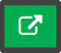
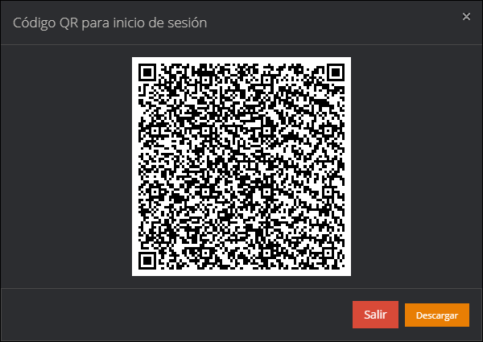
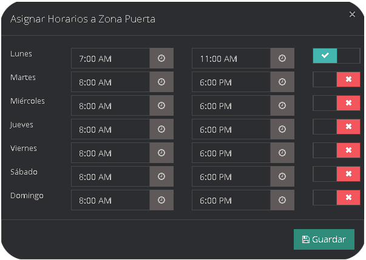
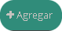
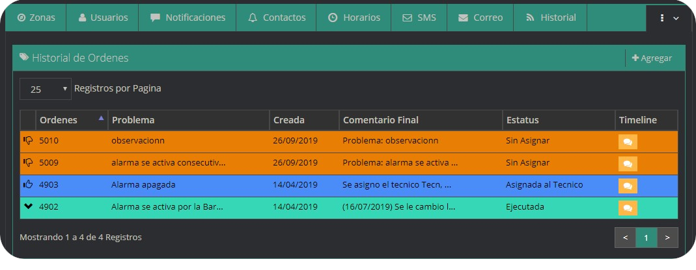
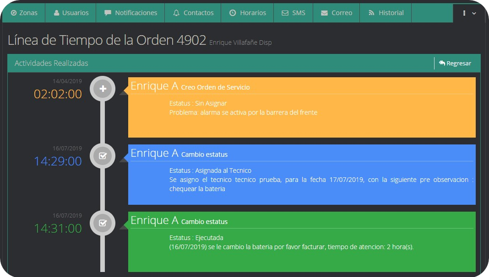
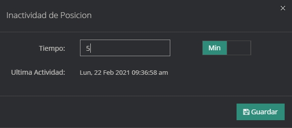
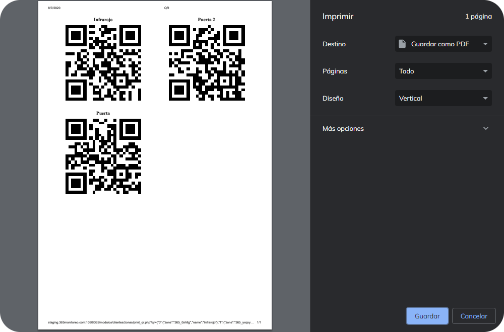
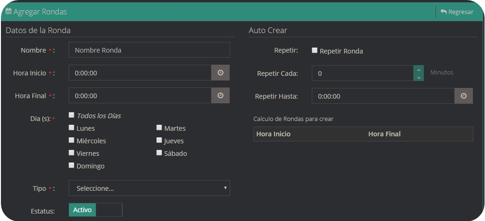

Los dispositivos son todos aquellos aparatos electrónicos que emiten y reciben una señal que contienen información para ser identificada, rastreada y monitoreada. La plataforma trabaja con paneles de alarmas, bastones, equipo GPS los cuales están asociados normalmente una casa, un local comercial o un vehículo particular, ademas también cuentan con aplicaciones móviles como lo son 365Guard, 365SOSapp las cuales pueden estar asociados a una computadora,una tablet o un smartphone.

## Busqueda Avanzada de Dispositivos

El botón de búsqueda de avanzada se encuentra localizada en la parte superior derecha de la ventana, para mostrar las opciones de la búsqueda avanzada, hay que hacer clic en el botón mismo.

Luego se mostraran todas las opciones que posee la búsqueda avanzada.

|Campo|Descripción  |
|----------------|-----------|
|`CI\RIF Cliente`| Cedula de Identidad o Rif del cliente|
|`Teléfono`|Teléfono del dispositivo|
|`Correo Electrónico`|Correo electrónico del dispositivo|
|`Usuario Web Cliente`| Usuario web del cliente al cual pertenece el dispositivo|
|`SIM`|SIM del dispositivo|
|`Ciudad`| Ciudad del Dispositivo|
|`Dirección`| Dirección del dispositivo|
|`Búsqueda telefonica por usuario y contactos`|Búsqueda por numero de teléfono de contactos o usuarios.|

## ¿Cómo crear un Dispositivo?
* En el menu de administración de Dispositivos, pulse **Agregar**.

* Seleccione el tipo de dispositivo en la ventana emergente.

* Se desplegará un formulario que debe llenar con los datos del dispositivo.

|Campo|Descripción  |
|----------------|-------------------------------------------------------------------|
|`Cliente `        |Busca el cliente al que va a pertenecer el dispositivo                |
|`ID. Usuario`      |Selector para el prefijo del cliente y el código del dispositivo    |
|`Nombre Cuenta`   |Descripción del dispositivo                     |
|`Tipo de Cuenta `   |Selecciona el tipo de cliente                                      |
|`Marca disp. `         |Selecciona la marca del dispositivo                        |
|`Modelo disp. `   |Selecciona el modelo del dispositivo                                      |
|`Protocolo      `   |Elije el protocolo de comunicaciones del dispositivo                   |
|`Clave master   `    |Palabra secreta para confirmar llamadas                    |
|`Instalador`   |Selecciona el miembro del personal que realizó la instalación         |
|`SIM`| Numero de SIM del dispositivo (opcional)      |

## Servicios

En el modulo de dispositivos tenemos la columna de servicios en esta se pueden activar o desactivar todos los servicios que posee cada uno de los dispositivos, como lo son el Estatus General, Estatus Monitoreo, Estatus Email, Estatus SMS, y Esatus push tanto individualmente o todos al mismo tiempo, con tan solamente un check simple.

### ¿Cómo crear una Central de Alarmas?
* En el menu de administración de Dispositivos, pulse **Agregar**.

* Seleccione la opción *Central de Alarma* de en la ventana emergente.

* Se desplegará un formulario que debe llenar con los datos del dispositivo.

|Datos Principales|Descripción|
|:---|:---|
|`Cliente`|Seleccione el cliente al que desea asignar el dispositivo creado.  (Si el dispositivo se crea desde el cliente, el mismo ya esta seleccionado).|
|`ID. Usuario` |Para crear un panel de alarmas generalmente se utiliza el prefijo **"AL"** seguido del código de cliente que desea asignar. También puede asignarle prefijos personalizados. [**Ver más...**](parametros#como-crear-un-prefijo)|
|`Dispositivo`| Debe seleccionar el dispositivo, por ejemplo Central de Alarma, Equipo GPS, Bastón, 365Guard App o 365SOS App. |
|`Nombre Cuenta`| Nombre referencial para el dispositivo, por ejemplo Farmacia Universal.|
|`Tipo de Cuenta`|Seleccione el tipo de cuenta, por ejemplo: Residencial, Comercial, Industria, Gobierno, Apartamento, Centro Comercial, Exonerado. |
|`Marca Disp`|  Debe seleccionar el fabricante de la central de alarmas, por ejemplo DSC, Paradox, PIMA, etc. Si su marca no existe puede crearlo en el módulo parámetros. [**Ver más...**](parametros#como-agregar-un-dispositivo-marca)|
|`Modelo Disp`| Seleccione el modelo del panel de alarmas. Si su modelo no existe puede crearlo en el módulo parámetros. [**Ver más...**](parametros#como-agregar-un-dispositivo-modelo)|
|`Protocolo `| Indique el protocolo con el que trabajará la central de Alarmas.|
|`Clave Master`| Clave general configurada a la alarma. | 
|`Instalador`| Seleccione el técnico encargado de hacer la instalación del dispositivo. |
|`SIM`| Sim card de la alarma (Solo si la alarma funciona con sim card). |
|`Inicio`| Fecha que fue creado el dispositivo. |
|`Vence cada`| Cantidad de tiempo en la que vence el alquiler del dispositivo.|
|`Código Secundario`| Identificador opcional para el dispositivo.|
|`Correo Electrónico`| Correo electrónico del encargado del local.|
|`Comandos Desde`| Si el interruptor está activado, los comandos se enviaran desde el servidor. Al desactivarlo se enviaran desde el teléfono en el que este instalado la aplicación 365Client. | 
|`Serial del dispositivo`| Número Serial del dispositivo EBS, se utiliza para el envio de comandos TCP|
|**Datos Ubicación**| **Descripción** |
|`País`|País en el que se encuentra la central de alarma.|
|`Estado`|Estado en el que se encuentra la central de alarma.|
|`Ciudad`|Ciudad en el que se encuentra la central de alarma.|
|`Dirección`|Dirección donde se encuentra la central de alarma. |
|`Referencia`|Lugar o Local de referencia con la central de alarma. |
|`Punto/Tag`|Punto QR asignado a la central de alarma [**Ver más...**](dispositivos#cómo-asignarle-un-punto-qr-a-una-central-de-alarma-para-patrullaje) |
|`Zona Horaria`|Zona horaria en su localización. |
|**Datos Contacto**|**Descripción**|
|`Teléfono Local`|Numero de teléfono local.|
|`Tel. Movil`|Número de teléfono celular.|
|`Fax`|Numero de fax.|
|`Imagen`|Imagen del contacto.|
|**Servicios**|**Descripción**|
|`Estatus General`|Permite visualizar si el cliente cumple con todos los servicios|
|`SMS Status`|Permite enviar mensajes de texto a los usuarios del dispositivo|
|`Status Email`|Permite enviar correos electrónicos a los usuarios del dispositivo|
|`Estatus Monitoreo`|Permite monitorear las señales producidas por el dispositivo|
|`Estatus Push`|Permite que el dispositivo envíe notificaciónes push |

### ¿Cómo crear un Equipo GPS?
* En el menu de administración de Dispositivos, pulse **Agregar**.

* Seleccione la opción *Equipo GPS* de en la ventana emergente.

* Se desplegará un formulario que debe llenar con los datos del dispositivo.

|Datos Principales|Descripción|
|:---|:---|
|`Cliente`|Seleccione el cliente al que desea asignar el dispositivo creado.  (Si el dispositivo se crea desde el cliente, el mismo ya esta seleccionado).|
|`ID. Usuario` |Para crear un panel de alarmas generalmente se utiliza el prefijo **"GPS"** seguido del código de cliente que desea asignar. También puede asignarle prefijos personalizados, puede crear estos prefijos en el módulo parámetros.|
|`Dispositivo`| Debe seleccionar el dispositivo, por ejemplo Central de Alarma, Equipo GPS, Bastón, 365Guard App o 365SOS App. |
|`Nombre Cuenta`| Nombre referencial para el dispositivo, por ejemplo Farmacia Universal.|
|`Tipo de Cuenta`|Seleccione el tipo de cuenta, por ejemplo Residencial, Comercial, Industria, Gobierno, Apartamento, Centro Comercial, Exonerado. |
|`Marca Disp`|  Debe seleccionar el fabricante de la central de alarmas, por ejemplo DSC, Paradox, PIMA, etc.|
|`Modelo Disp`| Seleccione el modelo del panel de alarmas, si su modelo no existe puede crearlo en el módulo parámetros.|
|`Protocolo `| Indique el protocolo con el que trabajará la central de Alarmas.|
|`Clave Master`| Clave general configurada a la alarma. | 
|`Instalador`| Seleccione el técnico encargado de hacer la instalación del dispositivo. |
|`SIM`| Sim card de la alarma (Solo si la alarma funciona con sim card). |
|`Inicio`| Fecha que fue creado el dispositivo. |
|`Vence cada`| Cantidad de tiempo en la que vence el alquiler del dispositivo.|
|`Código Secundario`| Identificador opcional para el dispositivo.|
|`Correo Electrónico`| Correo electrónico del encargado del local.|
|`Comandos Desde`| Si el interruptor está activado, los comandos se enviaran desde el servidor. Al desactivarlo se enviaran desde el teléfono en el que este instalado la aplicación 365Client. |
|**Datos Ubicacion**| **Descripción** |
|`País`|País en el que se encuentra la central de alarma.|
|`Estado`|Estado en el que se encuentra la central de alarma.|
|`Ciudad`|Ciudad en el que se encuentra la central de alarma.|
|`Dirección`|Dirección donde se encuentra la central de alarma. |
|`Referencia`|Lugar o Local de referencia con la central de alarma. |
|`Zona Horaria`|Zona horaria en la que localizado. |
|**Datos Contacto**|**Descripción**|
|`Teléfono Local`|Numero de teléfono local.|
|`Tel. Movil`|Número de teléfono celular.|
|`Imagen`|Imagen del contacto.|
|`Fax`|Numero de fax.|
|**Datos del Vehiculo**| **Descripción** |
|`Placa`|Número o código de matrícula.|
|`Color del Vehiculo`|Color de la pintura.|
|`Marca del Vehiculo`|Nombre del Fabricante.|
|`Modelo del Vehiculo`|Denominación del vehiculo|
|`Serial de Carroceria`|Identificador único de la Carroceria|
|`Serial del Motor`|Identificador único del motor |
|`Año`|Año de fabricación del vehiculo|
|**Servicios**|**Descripción**|
|`Estatus General`|Permite visualizar si el cliente cumple con todos los servicios|
|`SMS Status`|Permite enviar mensajes de texto a los usuarios del dispositivo|
|`Status Mail`|Permite enviar correos electrónicos a los usuarios del dispositivo|
|`Estatus Monitoreo`|Permite monitorear las señales producidas por el dispositivo|
|`Estatus Push`|Permite que el dispositivo envié notificaciónes push |

### ¿Cómo crear un Bastón o 365Guard App?

* En el menu de administración de Dispositivos, pulse **Agregar**.

* Seleccione la opción *Bastón* de en la ventana emergente.

* Se desplegará un formulario que debe llenar con los datos del dispositivo.

|Datos Principales|Descripción|
|:---|:---|
|`Cliente`|Seleccione el cliente al que desea asignar el dispositivo creado.  (Si el dispositivo se crea desde el cliente, el mismo ya esta seleccionado).|
|`ID. Usuario` |Para crear un panel de alarmas generalmente se utiliza el prefijo **"GPS"** seguido del código de cliente que desea asignar. También puede asignarle prefijos personalizados, puede crear estos prefijos en el módulo parámetros.|
|`Dispositivo`| Debe seleccionar el dispositivo, por ejemplo Central de Alarma, Equipo GPS, Bastón, 365Guard App o 365SOS App. |
|`Nombre Cuenta`| Nombre referencial para el dispositivo, por ejemplo Farmacia Universal.|
|`Tipo de Cuenta`|Seleccione el tipo de cuenta, por ejemplo Residencial, Comercial, Industria, Gobierno, Apartamento, Centro Comercial, Exonerado. |
|`Marca Disp`|  Debe seleccionar el fabricante de la central de alarmas, por ejemplo DSC, Paradox, PIMA, etc.|
|`Modelo Disp`| Seleccione el modelo del panel de alarmas, si su modelo no existe puede crearlo en el módulo parámetros.|
|`Protocolo `| Indique el protocolo con el que trabajará la central de Alarmas.|
|`Clave Master`| Clave general configurada a la alarma. | 
|`Instalador`| Seleccione el técnico encargado de hacer la instalación del dispositivo. |
|`SIM`| Sim card de la alarma (Solo si la alarma funciona con sim card). |
|`Inicio`| Fecha que fue creado el dispositivo. |
|`Vence cada`| Cantidad de tiempo en la que vence el alquiler del dispositivo.|
|`Código Secundario`| Identificador opcional para el dispositivo.|
|`Correo Electrónico`| Correo electrónico del encargado del local.|
|**Datos Ubicación**| **Descripción** |
|`País`|País en el que se encuentra la central de alarma.|
|`Estado`|Estado en el que se encuentra la central de alarma.|
|`Ciudad`|Ciudad en el que se encuentra la central de alarma.|
|`Dirección`|Dirección donde se encuentra la central de alarma. |
|`Referencia`|Lugar o Local de referencia con la central de alarma. |
|`Latitud`|Coordenada geográfica latitudinal.|
|`Longitud`|Coordenada geográfica longitudinal.|
|`Punto/Tag`|Sitio con punto QR.|
|`Llaves`|Numero de llave del local o Descripción de la llave|
|`Zona Horaria`|Zona horaria en la que localizado. |
|**Datos Contacto**|**Descripción**|
|`Teléfono Local`|Numero de teléfono local.|
|`Tel. Movil`|Número de teléfono celular.|
|`Imagen`|Imagen del contacto.|
|`Fax`|Numero de fax.|
|**Servicios**|**Descripción**|
|`Estatus General`|Permite visualizar si el cliente cumple con todos los servicios|
|`SMS Status`|Permite enviar mensajes de texto a los usuarios del dispositivo|
|`Status Mail`|Permite enviar correos electrónicos a los usuarios del dispositivo|
|`Estatus Monitoreo`|Permite monitorear las señales producidas por el dispositivo|
|`Estatus Push`|Permite que el dispositivo envié notificaciónes push |

### ¿Cómo crear un 365SOS App?

* En el menu de administración de Dispositivos, pulse **Agregar**.

* Seleccione la opción *365SOS App* de en la ventana emergente.

* Se desplegará un formulario que debe llenar con los datos del dispositivo.

|Datos Principales|Descripción|
|:---|:---|
|`Cliente`|Seleccione el cliente al que desea asignar el dispositivo creado.  (Si el dispositivo se crea desde el cliente, el mismo ya esta seleccionado).|
|`ID. Usuario` |Para crear un panel de alarmas generalmente se utiliza el prefijo **"SOS"** seguido del código de cliente que desea asignar. También puede asignarle prefijos personalizados, puede crear estos prefijos en el módulo parámetros.|
|`Dispositivo`| Debe seleccionar el dispositivo, por ejemplo Central de Alarma, Equipo GPS, Bastón, 365Guard App o 365SOS App. |
|`Nombre Cuenta`| Nombre referencial para el dispositivo, por ejemplo Farmacia Universal.|
|`Tipo de Cuenta`|Seleccione el tipo de cuenta, por ejemplo Residencial, Comercial, Industria, Gobierno, Apartamento, Centro Comercial, Exonerado. |
|`Marca Disp`|  Debe seleccionar el fabricante de la central de alarmas, por ejemplo DSC, Paradox, PIMA, etc.|
|`Modelo Disp`| Seleccione el modelo del panel de alarmas, si su modelo no existe puede crearlo en el módulo parámetros.|
|`Protocolo `| Indique el protocolo con el que trabajará la central de Alarmas.|
|`Clave Master`| Clave general configurada a la alarma. | 
|`Instalador`| Seleccione el técnico encargado de hacer la instalación del dispositivo. |
|`Unidad de Vel`| Unidad de medida (por ejemplo KMH, MPH, Nudos / knots)|
|`Vel. Máxima`| Velocidad máxima|
|`SIM`| Sim card de la alarma (Solo si la alarma funciona con sim card). |
|`Inicio`| Fecha que fue creado el dispositivo. |
|`Vence cada`| Cantidad de tiempo en la que vence el alquiler del dispositivo.|
|`Código Secundario`| Identificador opcional para el dispositivo.|
|`Correo Electrónico`| Correo electrónico del encargado del local.|
|`Comandos Desde`| Si el interruptor está activado, los comandos se enviaran desde el servidor. Al desactivarlo se enviaran desde el teléfono en el que este instalado la aplicación 365Client. |
|**Datos Ubicación**| **Descripción** |
|`Pais`|Pais en el que se encuentra la central de alarma.|
|`Estado`|Estado en el que se encuentra la central de alarma.|
|`Ciudad`|Ciudad en el que se encuentra la central de alarma.|
|`Dirección`|Dirección donde se encuentra la central de alarma. |
|`Referencia`|Lugar o Local de referencia con la central de alarma. |
|`Latitud`|Coordenada geográfica latitudinal.|
|`Longitud`|Coordenada geográfica longitudinal.|
|`Punto/Tag`|Sitio con punto QR.|
|`Llaves`|Numero de llave del local o Descripción de la llave|
|`Zona Horaria`|Zona horaria en la que localizado. |
|**Datos Contacto**|**Descripción**|
|`Teléfono Local`|Numero de teléfono local.|
|`Tel. Movil`|Número de teléfono celular.|
|`Imagen`|Imagen del contacto.|
|`Fax`|Numero de fax.|
|**Servicios**|**Descripción**|
|`Estatus General`|Permite visualizar si el cliente cumple con todos los servicios|
|`SMS Status`|Permite enviar mensajes de texto a los usuarios del dispositivo|
|`Status Mail`|Permite enviar correos electrónicos a los usuarios del dispositivo|
|`Estatus Monitoreo`|Permite monitorear las señales producidas por el dispositivo|
|`Estatus Push`|Permite que el dispositivo envié notificaciones push |

## Menu de Opciones de Dispositivos
Para acceder a las opciones de dispositivos para editar, eliminar o ver, diríjase hasta el cliente de interés; a la derecha ubique los botónes de colores.

### ¿Cómo editar un Dispositivo?
* Localice el dispositivo que desea editar, ubique el Menu de opciones.

* Seleccione el botón Editar cliente, de color azul.

* Se despliega el Panel de dispositivos en una nueva pestaña.

* En la parte superior derecha encontrará la opción **Editar dispositivo**

* Se desplegará un formulario, realice todas las modificaciones y presione el botón Guardar

## **Panel Dispositivo: Central de Alarma**
----------------------------

 
El Panel Dispositivo se divide en pestañas para visualizar y configurar elementos de un Dispositivo, y puede mostrar distintas opciones según el tipo de dispositivo al que estamos accediendo. Las centrales de alarmas cuenta con las pestañas de Zonas, Usuarios, Notificaciones, Contactos, Horarios, SMS, Correo, Historial, Notas, Ubicación, Cámaras, Ordenes, Eventos Monitoreo, Eventos Inactivos, Particiones y Etiquetas. 

En la barra superior del panel dispositivos esta compuesta por la configuración de inactividad del sistema y Enviar comandos.

### ¿Como acceder con las aplicaciones por codigo QR?

El acceso por QR en todas nuestras aplicaciones son diferentes, pero una vez encontrada la opcion de acceder por codigo qr en la app deseada, el siguiente paso es desplegar nuestro codigo QR el cual se encuentra ubicado en el panel dispositivo a la izquierda del boton editar dispositivo.

Haciendo clic en el boton se desplegara una ventana en el codigo QR que necesitamos para acceder especificamente en el dispositivo en el que estamos posicionados.

### Inactividad de sistema
La inactividad del sistema, cuando está activada, genera un evento de Inactividad del sistema si no se han recibido señales durante cierto tiempo. 

### ¿Como configurar la inactividad de sistema?

* Ubicar el icono de inactividad del sistema en la parte superior.

* Se desplegará un formulario, debe usar el selector de Horas o minutos e introducir el tiempo en número. Haga clic en guardar.

* Una vez activado, el icono cambiará de color. 

:::warning[Importante]
Si configura la inactividad del sistema durante un intervalo de tiempo muy corto, por ejemplo 2 minutos, se generará el evento inactividad del sistema cada 2 minutos si no se recibe comunicación con el dispositivo.
:::

### ¿Como enviar comandos desde panel dispositivos?

* Ubicar el icono de Enviar comando en la parte superior.

* Seleccione el tipo de comando, dependiendo de su dispositivo puede elegir ente comandos TCP, GPRS Y SMS.

* Complete los argumentos adicionales, si existe alguno.

* Presione Enviar

:::warning[Importante]
Para que el envío de comandos es necesario realizar algunas configuraciones adicionales, por ejemplo para el envío de comandos SMS se necesita tener correctamente configurado un modem SMS. Para el envio de comandos TCP debe tener el abierto puerto para el autoprocesado de señales, y el puerto de comunicaciones del OSM Server (Por defecto el 9000).
:::

### ¿Cómo asignarle un Punto QR a una Central de Alarma para patrullaje?

Primero debemos crear los puntos QR de los sitios por los que deseamos que haga su ronda o recorrido, estos puntos tienen un codigo unico o ID el cual podemos utilizar y asignarselo a una central de alarma.

>Nota:
>Para crear un punto QR ver [**¿Cómo agregar un punto QR nuevo?**](dispositivos#cómo-agregar-un-punto-qr-nuevo).

Una vez sepamos el codigo del punto se asigna a la central de alarma que se desea patrullar, esto lo hacemos en el formulario de editar dispositivo, en la seccion de datos de ubicacion, en el campo Punto/Tag le asignamos el ID o el codigo unico, mostrado en la seccion anterior

Una vez el guardia lea el punto qr con el codigo asignados a la central de alarma se generara un evento con el codigo E365_IS el cual indica que el patrullero paso por el sitio, o esta en el sitio, ademas de adjuntos e incidencias creadas al momento de leer el punt QR, esto se puede apreciar en historial tanto de la central de alarma como en el historial del guardia 

>Nota:
>Para visualizar que eventos se generan en una Central de Alarma con Punto/Tag dirigirse a [**Eventos generados en el historial de un panel de alarmas**](365-guard-app#eventos-generados-en-el-historial-de-un-panel-de-alarmas).

En el historial del guardia se puede apreciar el evento lectura qr normal y el evento E365_RA que significa que leyo un punto qr asociado a una cuenta.

## Zonas

Las zonas son áreas en un sistema de alarmas que se dividen para proteger cada una de las áreas de trabajo (Por ejemplo: El garaje, la sala, el patio, etc). En este apartado se crean y administran las Zonas, se le asigna la id, una descripción, la ubicación, una o más imágenes y si esta zona pertenece a una o varias particiones. 

### ¿Cómo configurar una Zona?
* Haga clic en la opción `Agregar Zona o Punto`.

* Se abrirá una ventana donde debe llenar los datos de la zona, para finalizar presione el botón guardar.

|Campo                |Descripción                                                     |
|----------------|-------------------------------------------------------------------|
|`Cod. Zona `  |Código de la zona en el panel de alarmas|
|`Descripción`      |Nombre de la zona|
|`Ubicación`   |Descripción de la Ubicación|
|`Partición`   |Extensión o extensiones a la que pertenece la zona|
|`Imagen` |Archivo de imagen relacionado con la zona|

### ¿Cómo asignar cámaras a una Zona?
* Localice la zona a la que deseé asignar una cámara, seleccione el botón `Asignar Cámara`.

* Marque la casilla de la cámara que desea asignar o las múltiples cámaras que desea asignar y presione el botón `Guardar`. 

### ¿Cómo asignar horario a una Zona?

Es posible configurar una zona para que procese automáticamente cualquier señal generada en ella, en un intervalo de tiempo. Es una manera de ignorar los eventos que se generan a ciertas horas. 

* En el administrador de Zonas, ubique el botón `Asignar Horario`.

* Se desplegará una ventana para configurar los Horarios de esa zona.

* Una vez desplegada la ventana se activa el check del dia el cual se quiere configurar un horario, se elige una hora de inicio del horario y una hora de finalizaron del horario, para que todas las señales generadas dentro de este horarios sean auto-procesadas.

## Usuarios
Se refiere a las personas que tienen acceso al panel de alarmas, se asigna el código de Usuario definido en la central de alarmas, el parentesco, nombre y apellido, una imagen referencial y también a cuales particiones tiene acceso el usuario.

### ¿Cómo agregar un Usuario?
* En la pestaña de usuarios, pulse el botón `Agregar`.

* Se desplegará un formulario para llenar los datos del usuario.

|Campo                              |Descripción                                                              |
|-----------------------------------|-------------------------------------------------------------------|
|`Cod. Usuario `                    | ID numérica asignada al usuario en el panel de alarmas   |
|`Parentesco`                       | Tipo de Relación que existe con la persona de contacto |
|`Nombre`                            | Nombre del Usuario                |
|`Apellido`                          | Apellido del Usuario|
|`Partición`           | Marcar a que particiones pertenece el contacto, puede ser todas o solo algunas      |
|`Rif`           | Documento de identificación del contacto      |
|`Clave`           | Palabra de seguridad o santo y seña, que se puede usar cuando se contacta con la persona  |
|`Tel. Móvil`           | Número de Teléfono celular     |
|`E-mail`           | Dirección de correo electrónico      |

## Notificaciones
Desde este apartado podemos configurar los avisos de eventos a través de correo electrónico, mensajes de texto (SMS) o notificaciónes push desde la aplicación 365Client. [Más información](clientes#notificaciónes).

### ¿Cómo agregar un Notificación?
* En la pestaña de Notificaciones, pulse el botón `Agregar`.

* Se desplegará un formulario para llenar los datos del usuario.

|Campo                              |Descripción                                                        |
|-----------------------------------|-------------------------------------------------------------------|
|`Descripción `                    | Nombre de la notificación   |
|`Tipos`                       | Seleccione el tipo de notificación que desea agregar |
|`Planes`                            | Seleccione un plan acorde al protocolo del dispositivo |
|`Estatus`                          | Activar o Desactivar la notificación en especifico|
|`Eventos del plan`           | Muestra los eventos que contiene el plan seleccionado    |

## Contactos
Esta pestaña permite listar y definir números de contacto en caso de Emergencia, y relacionarlos con una o más particiones.

### ¿Cómo agregar un Contacto?
* En la pestaña de contactos, haga clic en la opción **Agregar**.

* Deberá llenar el formulario para agregar un contacto.

|Campo                |Descripción                                                              |
|----------------|-------------------------------------------------------------------|
|`Nombre `        |Nombre de la Persona que será agregada como contacto |
|`Parentesco`      |Tipo de Relación que existe con la persona de contacto|
|`Teléfono`   |Número telefónico     |
|`Clave `   |Palabra de seguridad o santo y seña, que se puede usar cuando se contacta con la persona|
|`Prioridad`         |Grado de importancia que tiene la persona en caso de un evento. (P.E. prioridad 1 es siempre la más importante)|
|`Partición`   |Marcar a que particiones pertenece el contacto, puede ser todas o solo algunas             |

## Horarios
La definición de horario permite monitorear eventos adicionales relacionados con las aperturas y cierres del dispositivo. 

|Campo                              |Descripción                                                              |
|-----------------------------------|-------------------------------------------------------------------|
|`Hora de Apertura `                | Hora ideal en la cual va a realizarse la apertura    |
|`Tolerancia`                       | Es el tiempo extra que se asigna, se adiciona antes y despues de la hora de apertura |
|`Hora de Cierre`                   | Hora ideal para realizar el cierre                 |
|`Dia (s)`                          | El o los días validos para el horario que esta configurando                |
|`Habilitar/Deshabilitar`           | activa o desactiva los eventos de apertura o cierre generados por el sistema  |

### Eventos de Apertura
* **Apertura Normal**:
En el ejemplo anterior, se define la apertura a las 8:00AM y la tolerancia de apertura 30 minutos; En tal sentido la apertura es valida media hora antes de las 8 AM y media hora después, es decir, entre las 7:30 y 8:30 de la mañana, durante este período, si el cliente realiza la apertura no se va a generar ningún evento monitoreable.

* **Dispositivo sin Abrir**:
Si el cliente no realizó la apertura en el horario establecido, se va a generar un evento monitoreable indicando que el dispositivo no abrió. En el ejemplo, este evento se genera unos segundos luego de las 8:30 AM

* **Apertura Tarde**:
Este evento se genera cuando se realiza la apertura en el dispositivo entre las dos horas siguientes luego de el horario de apertura.

* **Apertura Temprana**:
Este evento se genera cuando se realiza la apertura en el dispositivo entre las dos horas Anteriores al horario de apertura.

* **Apertura fuera de horario**:
Ocurre cuando se realiza una apertura en el dispositivo luego de más de dos horas desde el horario configurado para apertura.

### Eventos de Cierre
* **Cierre Normal**:
En el ejemplo anterior, se define el cierre a las 6:00PM y la tolerancia de 30 minutos; En tal sentido la apertura es valida entre las 5:30 y 6:30 de la Tarde, durante este período, si el cliente realiza un cierre no se va a generar ningún evento monitoreable.

* **Dispositivo no ha cerrado**:
Si el cliente no realizó una apertura y se cumple el plazo hasta el cierre normal, se va a generar un evento monitoreable indicando que el dispositivo no cerró. En el ejemplo, este evento se genera unos segundos luego de las 6:30 AM, siempre y cuando se halla realizado una apertura previamente ese mismo dia.

* **Cierre Tarde**:
Este evento se genera cuando se realiza el cierre en el dispositivo entre las dos horas siguientes luego de el horario de cierre.

* **Cierre Temprana**:
Este evento se genera cuando se realiza el cierre en el dispositivo entre las dos horas Anteriores al horario de cierre.

* **Cierre fuera de horario**:
Ocurre cuando se realiza el cierre el dispositivo luego de más de dos horas desde el horario configurado para cierre.

## SMS
Muestra los mensajes de texto enviados, que se relacionan con el dispositivo.

## Correo
Muestra los Emails enviados como parte de una notificación.

## Historial
Lista las ultimas señales generadas por el dispositivo, es posible filtrar por fecha o por la categoría de la señal.

### ¿Cómo utilizar la búsqueda avanzada?
* En la pestaña historial, haga clic en la opción **Búsqueda Avanzada**.

* Aparecerán Nuevas opciones, puede seleccionar el intervalo de fechas, o la categoría de las señales.

* Para finalizar, selecciones el botón buscar para obtener los resultados.

* También puede seleccionar el botón **Enviar reporte al correo del cliente** para mandar los resultados al email.

### ¿Cómo generar un archivo de reportes?
* Para generar un reporte en formato PDF o Excel, sencillamente ubicamos los botónes correspondientes en la pestaña Historial. 

## Notas
El administrador de notas permite configurar una observación que puede visualizar el operador en el modulo de monitoreo. Se utiliza para agregar información adicional sobre el dispositivo o los usuarios del mismo.

### ¿Cómo agregar una Nota Fija?
* En la Pestaña nota fija, escribimos el texto de la nota y presionamos el botón **Guardar** para almacenar la nota.

### ¿Cómo agregar una Nota Temporal?
* En la pestaña Nota temporal, elegimos desde cuando estará activa la nota temporal, y cuando dejara de tener validez. Para ello usamos los campos **Desde** y **Hasta**.

* Por ultimo haga clic en el botón guardar.

## Ubicación
Muestra la posición geográfica del dispositivo, si el dispositivo envía posición continuamente la interfaz será distinta.

Generalmente estos dispositivos son paneles de alarmas, podemos establecer la ubicación del panel o visualizar la ruta para llegar desde la empresa hasta la posición del dispositivo (Cómo Llegar).

### ¿Cómo establecer la ubicación del dispositivo?

* Con ayuda del mapa ubicamos la dirección donde se encuentra el dispositivo y hacemos clic para marcar el punto.
* Una vez marcado, presionamos el botón **Guardar Ubicación**.

### Opción Cómo Llegar
* Haga clic al botón **Cómo llegar** en la pestaña Ubicación, se mostrara la ruta desde la empresa hasta el dispositivo.

## Cámaras
Desde este apartado es posible agregar y visualizar Cámaras de seguridad (IP/Dominio o RTS) y vincularlas al dispositivo.

### ¿Cómo agregar cámaras?
* En la pestaña cámaras, haga clic en la opción **Agregar**.

* Se desplegará un formulario que deberá llenar con los datos

* Despues se agrega el numero de camaras y una descripcion del sitio donde se encuentra cada camara.

|Campo                |Descripción                                                              |
|----------------|-------------------------------------------------------------------|
|`Modo de Registro `  |Protocolo por el cual se va a conectar a la cámara|
|`Descripción`      |Nombre del dispositivo|
|`Tipo`   |Selector de tipo, puede ser DVR, NVR o Cámara IP|
|`IP/DNS`   |Dirección IP o DNS donde esta alojada la cámara|
|`Puerto`         |Número de puerto|
|`Usuario`   |Nombre de acceso a la cámara|
|`Contraseña`|Clave de autentificación para acceder a la cámara|

### ¿Cómo visualizar las cámaras?

* Para vizualizar las camaras hacemos clic en el boton de mas ubicado al inicio de las camaras creadas.

* Despues se desplegaran las camaras disponibles para ver.

* Luego hacemos clic en el boton de camara, que queremos visualizar y se nos abrira una ventana de VLC con el video de la camara.

> Nota: Es importante recordar que para poder visualizar las camaras, es necesario tener instalado el VLC 32bits, ademas descargar y ejecutar el plugin de camaras que proporciona la pestaña de camaras al entrar en ella.

## Ordenes
Muestra el historial de las ordenes de servicio asociadas al dispositivo.

### ¿Cómo ver las Ordenes en detalle?
* En la pestaña Ordenes, ubicamos el icono **Timeline** de color amarillo.

* Aparecerá la linea de tiempo con los detalles de la orden.

## Eventos Monitoreo

Permite establecer cuando un evento es monitoreable o no, sólo para ese dispositivo; eventos excluyentes se establece que cualquier evento sea no monitoreable para ese dispositivo. Switch de eventos permite intercambiar un evento generado por otro. Eventos cronómetro son eventos que cuando se generan y no son procesados en un periodo de tiempo designado cambiará dicho evento por uno de otro tipo elegido con anticipación.

>**Nota:** Esta sección se utiliza en los casos que se requiera que algún evento funcione de forma diferente para un determinado dispositivo, se cuenta con varias opciones para modificar el comportamiento de los eventos.

### Eventos Incluyentes

Este modulo se utiliza cuando el cliente necesita que se monitoreé un evento que normalmente no es monitoreable. Por ejemplo, el cliente quiere ser avisado cada vez que se realice una apertura; Mediante esta funcionalidad es posible seleccionar un evento y hacerlo monitoreable unicamente para ese dispositivo.

### ¿Cómo configurar un Evento Incluyentes?
* En la pestaña de eventos incluyentes, haga clic en el campo de búsqueda.

* Escriba el nombre del evento y haga clic para seleccionarlo.

* Por ultimo presione el botón **Guardar**

### Eventos Excluyentes
Se utiliza cuando un cliente no quiere ser notificado sobre cierta señal. Por ejemplo, el cliente no quiere que lo llamen cuando se genera una Falla de Electricidad; En este apartado es posible configurar un evento para que no sea monitoreable únicamente en determinado dispositivo.

### ¿Cómo configurar un Evento Excluyente?
* En la pestaña de eventos excluyentes, haga clic en el campo de búsqueda.

* Escriba el nombre del evento y haga clic para seleccionarlo.

* Por ultimo presione el botón **Guardar**

### Switch de Eventos
Es una función que permite recibir un evento e intercambiarlo por otro. Por ejemplo, Un cliente configura un botón de pánico para que al ser presionado se genere otro evento; el `Evento Anterior` en este caso es el evento de Pánico que va a generar la alarma, y el `Evento Nuevo` es el evento por el cual va a ser cambiado.

### ¿Cómo configurar el Switch de Eventos?
* En la pestaña de switch de eventos, haga clic en el campo **Buscar evento anterior**.

* Ingrese el nombre del **evento nuevo** por el cual lo queremos cambiar y seleccione el **usario/zona** de cada evento y luego presionamos el boton **agregar**.

* Una vez configurado todo, presionamos **guardar**.

## Eventos Cronometrados
Un evento cronometrado es un evento que depende de otro evento, cuando el evento dependiente no se recibe, durante un cierto periodo de tiempo, el evento que se configure sera generado. Por ejemplo, un cliente configura un evento de pánico, para que cuando no llegue este evento y se pasen 5 minutos se genere otro evento, por decir un evento medico. Para hacer esto tenemos que seleccionar el `protocolo` y el `evento  anterior` que deseamos cronometrar, elegir el periodo de tiempo que debemos para que se genere el `nuevo evento`, después elegimos el `protocolo` y el `nuevo evento` que se desea generar mientras el `evento anterior` no se genere.

### ¿Cómo configurar el Eventos Cronometrados?

* En la pestaña de eventos cronometrados, haga clic en los campos **Seleccione protocolo**, **Buscar evento**, **Zona/Usuario** y elija un valor en cada uno de ellos ademas, seleccione el tiempo **cronometrado** que dura en generar el evento que se disparar cuando no llegue el primer evento.

* Una vez seleccionados los valores de los campos en la primera fila seleccione los valores de la **segunda fila** y haga clic en el botón **agregar**.

* Una vez hecho esto se mostrara la configuración del evento cronometrado.

## Eventos Inactivos
En esta pestaña se pueden visualizar y agregar los eventos que se quiere que no produzcan una señal por un tiempo determinado, por cuestiones de comodidad tanto para los clientes como la empresa. Su uso se destaca cuando existe por ejemplo, una falla en un panel de alarmas que genera una señal errónea.

### ¿Cómo agregar un evento inactivo?
* En la pestaña de Eventos inactivos ubicamos la opción `Agregar`.

* Se desplegará un formulario que debe llenar para configurar el evento inactivo.

|Campo                |Descripción                                                     |
|----------------|-------------------------------------------------------------------|
|`Evento `  |Nombre del evento|
|`Zona`      |Número de zona en el panel de alarmas|
|`Usuario`   |Nombre del usuario|
|`Expiración`   |Fecha de expiración|
|`Tipo` |Razón del evento inactivo|
|`Observación`   |Descripción adicional|

## Particiones
En este segmento se puede crear y editar las particiones de una central de alarmas.

### ¿Como crear una Partición?
* Dentro de la pestaña partición, haga clic en el botón `Agregar`.

* Se desplegará un formulario donde deberá llenar los datos.

|Campo                              |Descripción                                                              |
|-----------------------------------|-------------------------------------------------------------------|
|`Código `                | Identificador numérico de la partición   |
|`Nombre`                       | Nombre de la partición |

### Etiquetas
En este apartado es posible ver las etiquetas asignadas a un dispositivo, además de asignar nuevas etiquetas o eliminar las existentes.

:::warning[Importante]
Las etiquetas deben crearse en el módulo parámetros, etiquetas.
:::

#### ¿Cómo asignar una etiqueta?
* En la pestaña de etiquetas, haga clic en la opción `Seleccionar etiqueta` y seleccionamos el nombre de la etiqueta que deseamos asignar.

* Haga clic en el botón guardar para almacenar la etiqueta.

## **Panel Dispositivo: Equipo GPS**
----------------------------
El Panel Dispositivo de un GPS se divide en la pestañas de Mapas, Notificaciones, Geocercas, Contactos, SMS, Correo, Historial, Notas, Ordenes, Eventos Monitoreo, Eventos Inactivos, Mantenimiento y Etiquetas.

En la barra superior del panel dispositivos esta compuesta por la configuración de inactividad de posición, inactividad del sistema y Enviar comandos.

### ¿Como acceder con las aplicaciones por codigo QR?

El acceso por QR en todas nuestras aplicaciones son diferentes, pero una vez encontrada la opcion de acceder por codigo qr en la app deseada, el siguiente paso es desplegar nuestro codigo QR el cual se encuentra ubicado en el panel dispositivo a la izquierda del boton editar dispositivo.

Haciendo clic en el boton se desplegara una ventana con el codigo QR que necesitamos para acceder especificamente en el dispositivo en el que estamos posicionados.

### Inactividad de posición

La inactividad del posición, cuando está activada, genera un evento si no se han recibido señales con posicionamiento durante cierto tiempo. 

### ¿Como configurar la inactividad de posición?

* Ubicar el icono de config. inactividad del posición en la parte superior.

* Se desplegará un formulario, debe usar el selector de Horas o minutos e introducir el tiempo en número. Haga clic en guardar.

* Una vez activado, el icono cambiará de color. 

### Inactividad de sistema
La inactividad del sistema, cuando está activada, genera un evento de Inactividad del sistema si no se han recibido señales durante cierto tiempo. 

### ¿Como configurar la inactividad de sistema?

* Ubicar el icono de inactividad del sistema en la parte superior.

* Se desplegará un formulario, debe usar el selector de Horas o minutos e introducir el tiempo en número. Haga clic en guardar.

* Una vez activado, el icono cambiará de color. 

### ¿Como enviar comandos desde panel dispositivos?

* Ubicar el icono de Enviar comando en la parte superior.

* Seleccione el tipo de comando, dependiendo de su dispositivo puede elegir ente comandos TCP, GPRS Y SMS.

* Complete los argumentos adicionales, si existe alguno.

* Presione Enviar

## Mapas

Muestra la posición geográfica del dispositivo, si el dispositivo envía posición continuamente la interfaz será distinta.

### ¿Cómo filtrar la ubicación del Dispositivo?
* En la pestaña de ubicación podemos seleccionar la fecha en la cual deseamos buscar.

* También podemos seleccionar si queremos visualizar la **Ruta** del dispositivo, las **Paradas** o los excesos de velocidad. Asi mismo podemos generar un reporte de tipo excel con los datos anteriores.

## Notificaciones
Desde este apartado podemos configurar los avisos de eventos a través de correo electrónico, mensajes de texto (SMS) o notificaciónes push desde la aplicación 365Client. [Más información](clientes#notificaciónes).

## Geocercas
Una geocerca es un perímetro virtual que puede asignarse a un dispositivo para controlar eventos de entrada y salida de una área geográfica. Este apartado muestra las geocercas y permite Agregar y administrar Geocercas con respecto a los dispositivos asignados a ella. 
>[Más información: sobre geocercas.](clientes#geocercas)

## Contactos
Esta pestaña permite listar y definir números de contacto en caso de Emergencia, y relacionarlos con una o más particiones.

### ¿Cómo agregar un Contacto?
* En la pestaña de contactos, haga clic en la opción **Agregar**.

* Deberá llenar el formulario para agregar un contacto.

|Campo                |Descripción                                                              |
|----------------|-------------------------------------------------------------------|
|`Nombre `        |Nombre de la Persona que será agregada como contacto |
|`Parentesco`      |Tipo de Relación que existe con la persona de contacto|
|`Teléfono`   |Número telefónico     |
|`Clave `   |Palabra de seguridad o santo y seña, que se puede usar cuando se contacta con la persona|
|`Prioridad`         |Grado de importancia que tiene la persona en caso de un evento. (P.E. prioridad 1 es siempre la más importante)|
|`Partición`   |Marcar a que particiones pertenece el contacto, puede ser todas o solo algunas             |

## SMS
Muestra los mensajes de texto enviados, que se relacionan con el dispositivo.

## Correo
Muestra los Emails enviados como parte de una notificación.

## Historial
Lista las ultimas señales generadas por el dispositivo, es posible filtrar por fecha o por la categoría de la señal.

### ¿Cómo utilizar la búsqueda avanzada?
* En la pestaña historial, haga clic en la opción **Búsqueda Avanzada**.

* Aparecerán Nuevas opciones, puede seleccionar el intervalo de fechas, o la categoría de las señales.

* Para finalizar, selecciones el botón buscar para obtener los resultados.

* También puede seleccionar el botón **Enviar reporte al correo del cliente** para mandar los resultados al email.

### ¿Cómo generar un archivo de reportes?
* Para generar un reporte en formato PDF o Excel, sencillamente ubicamos los botónes correspondientes en la pestaña Historial. 

## Notas
El administrador de notas permite configurar una observación que puede visualizar el operador en el modulo de monitoreo. Se utiliza para agregar información adicional sobre el dispositivo o los usuarios del mismo.

### ¿Cómo agregar una Nota Fija?
* En la Pestaña nota fija, escribimos el texto de la nota y presionamos el botón **Guardar** para almacenar la nota.

### ¿Cómo agregar una Nota Temporal?
* En la pestaña Nota temporal, elegimos desde cuando estará activa la nota temporal, y cuando dejara de tener validez. Para ello usamos los campos **Desde** y **Hasta**.

* Por ultimo haga clic en el botón guardar.

## Eventos Monitoreo

Permite establecer cuando un evento es monitoreable o no, sólo para ese dispositivos; eventos excluyentes se establece que cualquier evento sea no monitoreable para ese dispositivo. Switch de eventos permite intercambiar un evento generado por otro. Eventos cronómetro son eventos que cuando se generan y no son procesados en un periodo de tiempo designado cambiará dicho evento por uno de otro tipo elegido con anticipación.

>**Nota:** Esta sección se utiliza en los casos que se requiera que algún evento funcione de forma diferente para un determinado dispositivo, se cuenta con varias opciones para modificar el comportamiento de los eventos.

### Eventos Incluyentes

Este modulo se utiliza cuando el cliente necesita que se monitoreé un evento que normalmente no es monitoreable. Por ejemplo, el cliente quiere ser avisado cada vez que se realice una apertura; Mediante esta funcionalidad es posible seleccionar un evento y hacerlo monitoreable unicamente para ese dispositivo.

### ¿Cómo configurar un Evento Incluyente?
* En la pestaña de eventos incluyentes, haga clic en el campo de búsqueda.

* Escriba el nombre del evento y haga clic para seleccionarlo.

* Por ultimo presione el botón **Guardar**

* En el menu de administración de Dispositivos, pulse **Agregar**.

### Eventos Excluyentes
Se utiliza cuando un cliente no quiere ser notificado sobre cierta señal. Por ejemplo, el cliente no quiere que lo llamen cuando se genera una Falla de Electricidad; En este apartado es posible configurar un evento para que no sea monitoreable únicamente en determinado dispositivo.

### ¿Cómo configurar un Evento Excluyente?
* En la pestaña de eventos excluyentes, haga clic en el campo de búsqueda.

* Escriba el nombre del evento y haga clic para seleccionarlo.

* Por ultimo presione el botón **Guardar**

### Switch de Eventos
Es una función que permite recibir un evento e intercambiarlo por otro. Por ejemplo, Un cliente configura un botón de pánico para que al ser presionado se genere otro evento; el `Evento Anterior` en este caso es el evento de Pánico que va a generar la alarma, y el `Evento Nuevo` es el evento por el cual va a ser cambiado.

### ¿Cómo configurar el Switch de Eventos?
* En la pestaña de switch de eventos, haga clic en el campo **Buscar evento anterior**.

* Ingrese el nombre del **evento nuevo** por el cual lo queremos cambiar y seleccionamos el **usario/zona** de cada evento y luego presionamos el botón **agregar**.

* Una vez configurado todo, presionamos **guardar**.

## Eventos Cronometrados
Un evento cronometrado es un evento que depende de otro evento, cuando el evento dependiente no se recibe, durante un cierto periodo de tiempo, el evento que se configure sera generado. Por ejemplo, un cliente configura un evento de pánico, para que cuando no llegue este evento y se pasen 5 minutos se genere otro evento, por decir un evento medico. Para hacer esto tenemos que seleccionar el `protocolo` y el `evento  anterior` que deseamos cronometrar, elegir el periodo de tiempo que debemos para que se genere el `nuevo evento`, después elegimos el `protocolo` y el `nuevo evento` que se desea generar mientras el `evento anterior` no se genere.

### ¿Cómo configurar el Eventos Cronometrados?

* En la pestaña de eventos cronometrados, haga clic en los campos **Seleccione protocolo**, **Buscar evento**, **Zona/Usuario** y elija un valor en cada uno de ellos ademas, seleccione el tiempo **cronometrado** que dura en generar el evento que se disparar cuando no llegue el primer evento.

* Una vez seleccionados los valores de los campos en la primera fila seleccione los valores de la **segunda fila** y haga clic en el botón **agregar**.

* Una vez hecho esto se mostrara la configuración del evento cronometrado.

## Eventos Inactivos
En esta pestaña se pueden visualizar y agregar los eventos que se quiere que no produzcan una señal por un tiempo determinado, por cuestiones de comodidad tanto para los clientes como la empresa. Su uso se destaca cuando existe por ejemplo, una falla en un panel de alarmas que genera una señal errónea.

### ¿Cómo agregar un evento inactivo?
* En la pestaña de Eventos inactivos ubicamos la opción `Agregar`.

* Se desplegará un formulario que debe llenar para configurar el evento inactivo.

|Campo                |Descripción                                                     |
|----------------|-------------------------------------------------------------------|
|`Evento `  |Nombre del evento|
|`Zona`      |Número de zona en el panel de alarmas|
|`Usuario`   |Nombre del usuario|
|`Expiración`   |Fecha de expiración|
|`Tipo` |Razón del evento inactivo|
|`Observación`   |Descripción adicional|

## Mantenimiento
Se utiliza para generar un evento que le recuerde al cliente hacer el mantenimiento del vehiculo en general o a una parte del  mismo, el cual llega al historial del dispositivo.

### ¿Cómo agregar Mantenimiento del Vehículo?

* En la pestaña mantenimiento, pulse el botón agregar `Agregar`.

* Se desplegará un formulario, el cual se llenara con los siguientes datos, Nombre del mantenimiento o el que prefiera el cliente, el odometro actual del vehiculo se refiere al kilometraje actual del vehiculo. 

* Luego tenemos la seccion ubicada a la izquierda se tienen las **Frecuencias**, siendo **el intervalo odometro** la casilla para ingresar cada cuanto kilometraje desea hacer el mantenimiento del vehiculo, igualmente el campo de **intervalo de dias** se refiere a cada cuantos dias se le de sea hacer el mantenimiento al automovil, en otras palabras la frecuencia se puede configurar por distancia o por tiempo calculado en dias.

:::warning[Importante] 
Al configurar el intervalo de dias  en la frecuencia, no hay porque configurar el intervalo odometro, se configura uno u otro, no ambos.
:::

* Despues en la seccion de **Ultimo Servicio** hacemos referencia a en que kilometraje fue el ultimo mantenimiento del vehiculo o una parte especifica del mismo, en el campo **ultimo servicio (Distancia)** y el campo **ultimo servicio (fecha)** se refiere a que en que fecha fue hecho el ultimo servicio, en otras palabras el ultimo servicio se puede configurar por distancia o por tiempo calculado con una fecha en especifico.

* Pulse el botón `Guardar` para almacenar los datos.

|Campo                   |Descripción                      |
|------------------------|---------------------------------|
|`Nombre `               | Descripción del Mantenimiento   |
|`Odometro Actual`       | Kilometraje actual del vehiculo |
| **Frecuencias**         |**Definicion**                               |
|`Intervalo Odometro `   | Cada cuantos Km realizar el mantenimiento   |
|`Intervalo de dias`     | Cada cuantos dias realizar el mantenimiento |
|**Ultimo Servicio**          |**Definicion**                                         |
|`ultimo servicio (Distancia)`| Kilometraje en el que se realizo el ultimo mantenimiento|
|`ultimo servicio (fecha)`    | Fecha en la que se realizo el ultimo mantenimiento    |

### ¿Como configurar un mantenimiento en un Vehiculo?

### Grafica del mantimiento

En la siguiente grafica se explica como funciona el mantenimiento al momento de registrar los datos necesarios.

## Etiquetas
En este apartado es posible ver las etiquetas asignadas a un dispositivo, además de asignar nuevas etiquetas o eliminar las existentes.

:::warning[Importante]
Las etiquetas deben crearse en el módulo parámetros, etiquetas.
:::

### ¿Cómo asignar una etiqueta?
* En la pestaña de etiquetas, haga clic en la opción `Seleccionar etiqueta` y seleccionamos el nombre de la etiqueta que deseamos asignar.

* Haga clic en el botón guardar para almacenar la etiqueta.

## **Panel Dispositivo: Bastón de Rondas, ActiveTrack y 365Guard App**
----------------------------
El Panel Dispositivo de Bastones y 365Guard se divide en la pestañas de Mapas, Puntos, Rondas, Notificaciones, Geocercas, Contactos, SMS, Correo, Historial, Notas, Ordenes, Eventos Monitoreo, Eventos Inactivos, Preferencias, Guardias y Etiquetas.

En la barra superior del panel dispositivos esta compuesta por el indicador de la señal, indicador de bateria, nombre del dispositivo, la configuración de inactividad de sistema, y Enviar comandos. Un baston al pasar mas de 1 hora sin transmitir un evento sin pocision y sin la carga de la bateria, cambia de estado mostrando la bateria y la señal de la siguiente forma.

### Señal
En algunos dispositivos se muestra un indicador con el nivel de intensidad de la señal

### Bateria
Bastones y dispositivos AppGuard tambien muestran un indicador del nivel de bateria.

### Nombre del dispositivo
Los dispositivos AppGuard muestran un indicador con el modelo de dispositivo movil inteligente.

### ¿Como acceder con las aplicaciones por codigo QR?

El acceso por QR en todas nuestras aplicaciones son diferentes, pero una vez encontrada la opcion de acceder por codigo qr en la app deseada, el siguiente paso es desplegar nuestro codigo QR el cual se encuentra ubicado en el panel dispositivo a la izquierda del boton editar dispositivo.

Haciendo clic en el boton se desplegara una ventana en el codigo QR que necesitamos para acceder especificamente en el dispositivo en el que estamos posicionados.

### Inactividad de posición
La inactividad del posición, cuando está activada, genera un evento si no se han recibido señales con posicionamiento durante cierto tiempo. 

### ¿Como configurar la inactividad de posición?
* Ubicar el icono de config. inactividad del posición en la parte superior.

* Se desplegará un formulario, debe usar el selector de Horas o minutos e introducir el tiempo en número. Haga clic en guardar.

* Una vez activado, el icono cambiará de color. 

### Inactividad de sistema
La inactividad del sistema, cuando está activada, genera un evento de Inactividad del sistema si no se han recibido señales durante cierto tiempo. 

### ¿Como configurar la inactividad de sistema?

* Ubicar el icono de inactividad del sistema en la parte superior.

* Se desplegará un formulario, debe usar el selector de Horas o minutos e introducir el tiempo en número. Haga clic en guardar.

* Una vez activado, el icono cambiará de color. 

### ¿Como enviar comandos desde panel dispositivos?
* Ubicar el icono de Enviar comando en la parte superior.

* Seleccione el tipo de comando, dependiendo de su dispositivo puede elegir ente comandos TCP, GPRS Y SMS.

* Complete los argumentos adicionales, si existe alguno.

* Presione Enviar

## Mapas

Muestra la posición geográfica del dispositivo, si el dispositivo envía posición continuamente la interfaz será distinta.

### ¿Cómo filtrar la ubicación del dispositivo?
* En la pestaña de ubicación podemos seleccionar la fecha en la cual deseamos buscar.

* También podemos seleccionar si queremos visualizar la **Ruta** del dispositivo, las **Paradas** o los excesos de velocidad. Asi mismo podemos generar un reporte de tipo excel con los datos anteriores.

## Puntos
Los puntos se utilizan para establecer lugares de interés que el guardia debe visitar, estan asociados a una coordenada GPS y puede contener tareas que se deben completar en el sitio. Desde el administrador de puntos se pueden crear, editar y añadir puntos QR y NFC.

### ¿Cómo agregar un punto QR nuevo?

* En la pestaña de Puntos, seleccione la opción `Agregar Punto QR`.

* La plataforma generará un Código QR, deberá llenar el resto de campos.

* Para finalizar, presione el botón `Guardar`

|Campo                              |Descripción                                                              |
|-----------------------------------|-------------------------------------------------------------------|
|`Descripción `                | Nombre descriptivo del punto QR |
|`Ubicación`      | Dirección donde está ubicado el punto QR |
|`Latitud`| Coordenada geográfica latitudinal   |
|`Longitud`| Coordenada geográfica longitudinal |
|`Tareas`| Identificador numérico de la partición   |

:::warning[Importante]
Es posible asignar la latitud y longitud desde la aplicación 365Guard al momento de leer el qr y no estar geoferenciado .
:::

### ¿Cómo agregar un punto QR Existente?
Esta función asigna un punto QR de un dispositivo a otro, en los casos en que uno o más dispositivos compartan puntos QR en común.

* Haga clic en el botón `Agregar Punto QR existente`.

* En la ventana emergente seleccionamos el cliente y el dispositivo del cual vamos a copiar los puntos QR.

* Seleccione el Punto QR a importar y agregué la descripción del mismo.

* Por ultimo, presione el botón `Guardar`.

### ¿Cómo asignar una cámara a un punto QR?

* Localice el punto QR al que dese asignar una cámara.

* Haga clic sobre el botón `Asignar Cámara`.

* Marque la casilla de la cámara.

* Presione el botón `Guardar`. 

### ¿Cómo imprimir un código QR?

* Haga clic en el icono `Imprimir Código QR`

* En la ventana emergente, seleccione el botón `Descargar`.

* Ubique el archivo de imagen, y proceda a imprimirla.

### ¿Cómo imprimir multiples códigos QR?

* Haga clic en el boton `Impresion QR`

* En la ventana emergente se mostraran todos los puntos disponibles.

* Seleccionamos los puntos que queremos imprimir y luego damos clic en aceptar.

* Luego se nos desplegara una ventana adicional con todos los puntos ordenados.

* Hacemos clic en guardar, y tendremos nuestros archivo PDF listo, para imprimirlo en cualquier momento con nuestros puntos qr.

### ¿Cómo agregar un punto NFC nuevo?

* En la pestaña de Puntos, seleccione la opción `Agregar Punto NFC`.

* La plataforma generará una plantilla con , deberá llenar el resto de campos.

* Para finalizar, presione el botón `Guardar`.

|Campo                              |Descripción                                                              |
|-----------------------------------|-------------------------------------------------------------------|
|`Cod. Punto `                | Codigo hexadecimal del punto NFC |
|`Descripción `                | Nombre descriptivo del punto NFC|
|`Ubicación`      | Dirección donde está ubicado el punto NFC |
|`Latitud`| Coordenada geográfica latitudinal   |
|`Longitud`| Coordenada geográfica longitudinal |
|`Tareas`| Identificador numérico de la partición   |
|`Imagen 1`| Imagen de la ubicacion del punto  NFC   |

## Rondas
Una ronda corresponde a un recorrido que debe realizar un guardia a través de algunos puntos QR, y que debe completarse en un intervalo determinado. El orden del recorrido puede ser secuencial o no secuencial.

### ¿Cómo crear una ronda?
* En la pestaña de rondas, haga clic en el botón `Agregar`.
* Ingrese los datos de la ronda.
* Seleccione el tipo de ronda.

Ronda Secuencial: Mostrará en la app el siguiente punto que se debe leer, segun la secuencia establecida. Aún así, permite completar la ronda en cualquier orden, pero generará un evento de "Salto de Punto".

* Asigne los puntos a la ronda, para ello debe deslizar los puntos de izquierda a derecha; desde Puntos Creados a Puntos asignados a la ronda.

* Para completar el proceso, haga clic en el botón `Guardar`.

|Campo                              |Descripción                                                              |
|-----------------------------------|-------------------------------------------------------------------|
|`Nombre ` | Nombre de la Ronda |
|`Hora de Inicio`| Hora de inicio de la Ronda |
|`Hora final`| Hora final de la Ronda   |
|`Dia(s)`| Marque los Dias de la semana en los cuales funcionará la ronda |
|`Tipo`| Seleccione el tipo de ronda |
|`Estatus`| Switch para activar o desactivar la Ronda |
|`Puntos Creados`| Lista de puntos creados |
|`Puntos Asignados a la Ronda`| Lista de puntos asignados |

:::warning[Importante]
El menú de rondas cuenta con la opción autocrear, que facilita la creacion de rondas semejantes.
:::

### ¿Cómo usar la opción autocrear?
* Marque la casilla `Repetir ronda`.
* En el campo `Repetir Cada` seleccione cada cuantos minutos se va a repetir la ronda (esto puede interpretarse como un tiempo de descanso para el guardia).
* En el campo `Repetir hasta`, ingrese la hora en la cual terminarán las rondas; el sistema generará automáticamente las rondas hasta llegar a la hora final.

* Presiona el botón `Guardar`

## Notificaciones
Desde este apartado podemos configurar los avisos de eventos a través de correo electrónico, mensajes de texto (SMS) o notificaciónes push desde la aplicación 365Client. [Más información](clientes#notificaciónes).

## Geocercas
Una geocerca es un perímetro virtual que puede asignarse a un dispositivo para controlar eventos de entrada y salida de una área geográfica. Este apartado muestra las geocercas y permite Agregar y administrar Geocercas con respecto a los dispositivos asignados a ella. 
>[Más información: sobre geocercas.](clientes#geocercas)

## Contactos
Esta pestaña permite listar y definir números de contacto en caso de Emergencia, y relacionarlos con una o más particiones.

### ¿Cómo agregar un Contacto?
* En la pestaña de contactos, haga clic en la opción **Agregar**.

* Deberá llenar el formulario para agregar un contacto.

|Campo                |Descripción                                                              |
|----------------|-------------------------------------------------------------------|
|`Nombre `        |Nombre de la Persona que será agregada como contacto |
|`Parentesco`      |Tipo de Relación que existe con la persona de contacto|
|`Teléfono`   |Número telefónico     |
|`Clave `   |Palabra de seguridad o santo y seña, que se puede usar cuando se contacta con la persona|
|`Prioridad`         |Grado de importancia que tiene la persona en caso de un evento. (P.E. prioridad 1 es siempre la más importante)|
|`Partición`   |Marcar a que particiones pertenece el contacto, puede ser todas o solo algunas             |

## SMS
Muestra los mensajes de texto enviados, que se relacionan con el dispositivo.

## Correo
Muestra los Emails enviados como parte de una notificación.

## Historial
Lista las ultimas señales generadas por el dispositivo, es posible filtrar por fecha o por la categoría de la señal.

### ¿Cómo utilizar la búsqueda avanzada?
* En la pestaña historial, haga clic en la opción **Búsqueda Avanzada**.

* Aparecerán Nuevas opciones, puede seleccionar el intervalo de fechas, o la categoría de las señales.

* Para finalizar, selecciones el botón buscar para obtener los resultados.

* También puede seleccionar el botón **Enviar reporte al correo del cliente** para mandar los resultados al email.

### ¿Cómo generar un archivo de reportes?
* Para generar un reporte en formato PDF o Excel, sencillamente ubicamos los botónes correspondientes en la pestaña Historial. 

## Notas
El administrador de notas permite configurar una observación que puede visualizar el operador en el modulo de monitoreo. Se utiliza para agregar información adicional sobre el dispositivo o los usuarios del mismo.

### ¿Cómo agregar una Nota Fija?
* En la Pestaña nota fija, escribimos el texto de la nota y presionamos el botón **Guardar** para almacenar la nota.

### ¿Cómo agregar una Nota Temporal?
* En la pestaña Nota temporal, elegimos desde cuando estará activa la nota temporal, y cuando dejara de tener validez. Para ello usamos los campos **Desde** y **Hasta**.

* Por ultimo haga clic en el botón guardar.

## Cámaras
Desde este apartado es posible agregar y visualizar Cámaras de seguridad (IP/Dominio o RTS) y vincularlas al dispositivo.

### ¿Cómo agregar cámaras?
* En la pestaña cámaras, haga clic en la opción **Agregar**.

* Se desplegará un formulario que deberá llenar con los datos

* Despues se agrega el numero de camaras y una descripcion del sitio donde se encuentra cada camara.

|Campo                |Descripción                                                              |
|----------------|-------------------------------------------------------------------|
|`Modo de Registro `  |Protocolo por el cual se va a conectar a la cámara|
|`Descripción`      |Nombre del dispositivo|
|`Tipo`   |Selector de tipo, puede ser DVR, NVR o Cámara IP|
|`IP/DNS`   |Dirección IP o DNS donde esta alojada la cámara|
|`Puerto`         |Número de puerto|
|`Usuario`   |Nombre de acceso a la cámara|
|`Contraseña`|Clave de autentificación para acceder a la cámara|

### ¿Cómo visualizar las cámaras?

* Para vizualizar las camaras hacemos clic en el boton de mas ubicado al inicio de las camaras creadas.

* Despues se desplegaran las camaras disponibles para ver.

* Luego hacemos clic en el boton de camara, que queremos visualizar y se nos abrira una ventana de VLC con el video de la camara.

> Nota: Es importante recordar que para poder visualizar las camaras, es necesario tener instalado el VLC 32bits, ademas descargar y ejecutar el plugin de camaras que proporciona la pestaña de camaras al entrar en ella.

## Ordenes
Muestra el historial de las ordenes de servicio asociadas al dispositivo.

### ¿Cómo ver las Ordenes en detalle?
* En la pestaña Ordenes, ubicamos el icono **Timeline** de color amarillo.

* Aparecerá la linea de tiempo con los detalles de la orden.

## Eventos Monitoreo
Permite establecer cuando un evento es monitoreable o no, sólo para ese dispositivos; eventos excluyentes se establece que cualquier evento sea no monitoreable para ese dispositivo. Switch de eventos permite intercambiar un evento generado por otro. Eventos cronómetro son eventos que cuando se generan y no son procesados en un periodo de tiempo designado cambiará dicho evento por uno de otro tipo elegido con anticipación.

Esta sección se utiliza en los casos que se requiera que algún evento funcione de forma diferente para un determinado dispositivo, se cuenta con varias opciones para modificar el comportamiento de los eventos.

### Eventos Incluyentes
Este modulo se utiliza cuando el cliente necesita que se monitoreé un evento que normalmente no es monitoreable. Por ejemplo, el cliente quiere ser avisado cada vez que se realice una apertura; Mediante esta funcionalidad es posible seleccionar un evento y hacerlo monitoreable unicamente para ese dispositivo.

### ¿Cómo configurar un Evento Incluyente?
* En la pestaña de eventos incluyentes, haga clic en el campo de búsqueda.

* Escriba el nombre del evento y haga clic para seleccionarlo.

* Por ultimo presione el botón **Guardar**

### Eventos Excluyentes
Se utiliza cuando un cliente no quiere ser notificado sobre cierta señal. Por ejemplo, el cliente no quiere que lo llamen cuando se genera una Falla de Electricidad; En este apartado es posible configurar un evento para que no sea monitoreable únicamente en determinado dispositivo.

### ¿Cómo configurar un Evento Excluyente?
* En la pestaña de eventos excluyentes, haga clic en el campo de búsqueda.

* Escriba el nombre del evento y haga clic para seleccionarlo.

* Por ultimo presione el botón **Guardar**

### Switch de Eventos
Es una función que permite recibir un evento e intercambiarlo por otro. Por ejemplo, Un cliente configura un botón de pánico para que al ser presionado se genere otro evento; el `Evento Anterior` en este caso es el evento de Pánico que va a generar la alarma, y el `Evento Nuevo` es el evento por el cual va a ser cambiado.

### ¿Cómo configurar el Switch de Eventos?
* En la pestaña de switch de eventos, haga clic en el campo **Buscar evento anterior**.

* Ingrese el nombre del **evento nuevo** por el cual lo queremos cambiar y seleccinamos el **usario/zona** de cada evento y luego presionamos el boton **agregar**.

* Una vez configudaro todo, presionamos **guardar**.

## Eventos Cronometrados
Un evento cronometrado es un evento que depende de otro evento, cuando el evento dependiente no se recibe, durante un cierto periodo de tiempo, el evento que se configure sera generado. Por ejemplo, un cliente configura un evento de pánico, para que cuando no llegue este evento y se pasen 5 minutos se genere otro evento, por decir un evento medico. Para hacer esto tenemos que seleccionar el `protocolo` y el `evento  anterior` que deseamos cronometrar, elegir el periodo de tiempo que debemos para que se genere el `nuevo evento`, después elegimos el `protocolo` y el `nuevo evento` que se desea generar mientras el `evento anterior` no se genere.

### ¿Cómo configurar el Eventos Cronometrados?

* En la pestaña de eventos cronometados, haga clic en los campos **Seleccione protocolo**, **Buscar evento**, **Zona/Usuario** y eliga un valor en cada uno de ellos ademas, seleccione el tiempo **cronometrado** que dura en generar el evento que se disparar cuando no llegue el primer evento.

* Una vez seleccionados los valores de los campos en la primera fila seleccione los valores de la **segunda fila** y haga clic en el boton **agregar**.

* Una vez hecho esto se mostrara la configuaracion del evento cronometrado.

## Eventos Inactivos
En esta pestaña se pueden visualizar y agregar los eventos que se quiere que no produzcan una señal por un tiempo determinado, por cuestiones de comodidad tanto para los clientes como la empresa. Su uso se destaca cuando existe por ejemplo, una falla en un panel de alarmas que genera una señal errónea.

### ¿Cómo agregar un evento inactivo?
* En la pestaña de Eventos inactivos ubicamos la opción `Agregar`.

* Se desplegará un formulario que debe llenar para configurar el evento inactivo.

|Campo                |Descripción                                                     |
|----------------|-------------------------------------------------------------------|
|`Evento `  |Nombre del evento|
|`Zona`      |Número de zona en el panel de alarmas|
|`Usuario`   |Nombre del usuario|
|`Expiración`   |Fecha de expiración|
|`Tipo` |Razón del evento inactivo|
|`Observación`   |Descripción adicional|

## Preferencias
La pestaña de preferencias sirve para configurar parámetros adicionales respecto al dispositivo, como la frecuencia de rastreo, modo debug, Distancia de rastreo y números de respaldo SMS.

|Campo                              |Descripción                                                              |
|-----------------------------------|-------------------------------------------------------------------|
|`Rastreo` | Habilita o deshabilita el rastreo del dispositivo |
|`Frecuencia de Rastreo`| Cada cuantos segundos se rastrea al dispositivo |
|`Distancia de Rastreo`| Cada cuantos metros se rastrea al dispositivo cuando este se desplace|
|`Resplado por SMS`| Enviar información por sms |

### ¿Cómo cerrar sesión desde la web?
* En el módulo de preferencias, diríjase al `Administrador de Sesión`.
* Haga clic en el botón `Cerrar Sesión`.

### ¿Cómo establecer el modo debug?
* En el Administrador de aplicación debug, active el interruptor debug.
* Presione el botón `Guardar`.

>Importante
>Puede ver el Registro de la aplicación a través del botón `Ver Log`.

## Etiquetas
En este apartado es posible ver las etiquetas asignadas a un dispositivo, además de asignar nuevas etiquetas o eliminar las existentes.

:::warning[Importante]
Las etiquetas deben crearse en el módulo parámetros, etiquetas.
:::

### ¿Cómo asignar una etiqueta?
* En la pestaña de etiquetas, haga clic en la opción `Seleccionar etiqueta` y seleccionamos el nombre de la etiqueta que deseamos asignar.

* Haga clic en el botón guardar para almacenar la etiqueta.

## Guardia
El módulo de administración de guardias, permite llevar un registro de los vigilantes, cuenta con campos como Nombre, apellido, teléfono y dirección.

### ¿Cómo agregar un Guardia?

Para agregar un guardia le damos clic en el boton agregar. 

Luego se nos desplegara un formulario con todos los datos necesarios para registrar un guardia.

* Luego simplemente damos clic en guardar y se mostrara el guardia agregado en la seccion de administrador de guardias.

## **Panel Dispositivo: 365SOS App**
----------------------------
El Panel Dispositivo de 365SOS se divide en la pestañas de Mapas, Notificaciones, Geocercas, Contactos, SMS, Correo, Historial, Notas, Ordenes, Eventos Monitoreo, Eventos Inactivos, Preferencias, Modo Perdida y Etiquetas.

En la barra superior del panel dispositivos esta compuesta por la inactividad de posición, inactividad de sistema, y Enviar comandos.

### ¿Como Acceder a las aplicaciones por Codigo QR?

Se puede iniciar sesión en dispositivos 365Guard y 365SOS escaneando un código QR, de esta manera no se necesitan introducir los datos de acceso, este codigo QR se encuentra ubicado en el panel dispositivo a la izquierda del boton editar dispositivo, y a diferencia del codigo de panel cliente, éste solo garantiza el acceso para un dispositivo especifico.

Haciendo clic en el boton se desplegara una ventana en el codigo QR que necesitamos para acceder especificamente en el dispositivo en el que estamos posicionados.

### Inactividad de posición

La inactividad del posición, cuando está activada, genera un evento si no se han recibido señales con posicionamiento durante cierto tiempo. 

### ¿Como configurar la inactividad de posición?

* Ubicar el icono de config. inactividad del posición en la parte superior.

* Se desplegará un formulario, debe usar el selector de Horas o minutos e introducir el tiempo en número. Haga clic en guardar.

* Una vez activado, el icono cambiará de color. 

### Inactividad de sistema
La inactividad del sistema, cuando está activada, genera un evento de Inactividad del sistema si no se han recibido señales durante cierto tiempo. 

### ¿Como configurar la inactividad de sistema?

* Ubicar el icono de inactividad del sistema en la parte superior.

* Se desplegará un formulario, debe usar el selector de Horas o minutos e introducir el tiempo en número. Haga clic en guardar.

* Una vez activado, el icono cambiará de color. 

## Mapas

Muestra la posición geografica del dispositivo, si el dispositivo envía posición continuamente la interfaz será distinta.

## Notificaciones
Desde este apartado podemos configurar los avisos de eventos a través de correo electrónico, mensajes de texto (SMS) o notificaciónes push desde la aplicación 365Client. [Más información](clientes#notificaciónes).

## Geocercas
Una geocerca es un perímetro virtual que puede asignarse a un dispositivo para controlar eventos de entrada y salida de una área geográfica. Este apartado muestra las geocercas y permite Agregar y administrar Geocercas con respecto a los dispositivos asignados a ella. 
>[Más información: sobre geocercas.](clientes#geocercas)

## Contactos
Esta pestaña permite listar y definir números de contacto en caso de Emergencia, y relacionarlos con una o más particiones.

### ¿Cómo agregar un Contacto?
* En la pestaña de contactos, haga clic en la opción **Agregar**.

* Deberá llenar el formulario para agregar un contacto.

|Campo                |Descripción                                                              |
|----------------|-------------------------------------------------------------------|
|`Nombre `        |Nombre de la Persona que será agregada como contacto |
|`Parentesco`      |Tipo de Relación que existe con la persona de contacto|
|`Teléfono`   |Número telefónico     |
|`Clave `   |Palabra de seguridad o santo y seña, que se puede usar cuando se contacta con la persona|
|`Prioridad`         |Grado de importancia que tiene la persona en caso de un evento. (P.E. prioridad 1 es siempre la más importante)|
|`Partición`   |Marcar a que particiones pertenece el contacto, puede ser todas o solo algunas             |

## SMS
Muestra los mensajes de texto enviados, que se relacionan con el dispositivo.

## Correo
Muestra los Emails enviados como parte de una notificación.

## Historial
Lista las ultimas señales generadas por el dispositivo, es posible filtrar por fecha o por la categoría de la señal.

### ¿Cómo utilizar la búsqueda avanzada?
* En la pestaña historial, haga clic en la opción **Búsqueda Avanzada**.

* Aparecerán Nuevas opciones, puede seleccionar el intervalo de fechas, o la categoría de las señales.

* Para finalizar, selecciones el botón buscar para obtener los resultados.

* También puede seleccionar el botón **Enviar reporte al correo del cliente** para mandar los resultados al email.

### ¿Cómo generar un archivo de reportes?
* Para generar un reporte en formato PDF o Excel, sencillamente ubicamos los botónes correspondientes en la pestaña Historial. 

## Notas
El administrador de notas permite configurar una observación que puede visualizar el operador en el modulo de monitoreo. Se utiliza para agregar información adicional sobre el dispositivo o los usuarios del mismo.

### ¿Cómo agregar una Nota Fija?
* En la Pestaña nota fija, escribimos el texto de la nota y presionamos el botón **Guardar** para almacenar la nota.

### ¿Cómo agregar una Nota Temporal?
* En la pestaña Nota temporal, elegimos desde cuando estará activa la nota temporal, y cuando dejara de tener validez. Para ello usamos los campos **Desde** y **Hasta**.

* Por ultimo haga clic en el botón guardar.

## Cámaras
Desde este apartado es posible agregar y visualizar Cámaras de seguridad (IP/Dominio o RTS) y vincularlas al dispositivo.

### ¿Cómo agregar cámaras?
* En la pestaña cámaras, haga clic en la opción **Agregar**.

* Se desplegará un formulario que deberá llenar con los datos

* Despues se agrega el numero de camaras y una descripcion del sitio donde se encuentra cada camara.

|Campo                |Descripción                                                              |
|----------------|-------------------------------------------------------------------|
|`Modo de Registro `  |Protocolo por el cual se va a conectar a la cámara|
|`Descripción`      |Nombre del dispositivo|
|`Tipo`   |Selector de tipo, puede ser DVR, NVR o Cámara IP|
|`IP/DNS`   |Dirección IP o DNS donde esta alojada la cámara|
|`Puerto`         |Número de puerto|
|`Usuario`   |Nombre de acceso a la cámara|
|`Contraseña`|Clave de autentificación para acceder a la cámara|

### ¿Cómo visualizar las cámaras?

* Para vizualizar las camaras hacemos clic en el boton de mas ubicado al inicio de las camaras creadas.

* Despues se desplegaran las camaras disponibles para ver.

* Luego hacemos clic en el boton de camara, que queremos visualizar y se nos abrira una ventana de VLC con el video de la camara.

> Nota: Es importante recordar que para poder visualizar las camaras, es necesario tener instalado el VLC 32bits, ademas descargar y ejecutar el plugin de camaras que proporciona la pestaña de camaras al entrar en ella.

## Ordenes
Muestra el historial de las ordenes de servicio asociadas al dispositivo.

### ¿Cómo ver las Ordenes en detalle?
* En la pestaña Ordenes, ubicamos el icono **Timeline** de color amarillo.

* Aparecerá la linea de tiempo con los detalles de la orden.

## Eventos Monitoreo

Permite establecer cuando un evento es monitoreable o no, sólo para ese dispositivo; eventos excluyentes se establece que cualquier evento sea no monitoreable para ese dispositivo. Switch de eventos permite intercambiar un evento generado por otro. Eventos cronómetro son eventos que cuando se generan y no son procesados en un periodo de tiempo designado cambiará dicho evento por uno de otro tipo elegido con anticipación.

Esta sección se utiliza en los casos que se requiera que algún evento funcione de forma diferente para un determinado dispositivo, se cuenta con varias opciones para modificar el comportamiento de los eventos.

### Eventos Incluyentes
Este modulo se utiliza cuando el cliente necesita que se monitoreé un evento que normalmente no es monitoreable. Por ejemplo, el cliente quiere ser avisado cada vez que se realice una apertura; Mediante esta funcionalidad es posible seleccionar un evento y hacerlo monitoreable unicamente para ese dispositivo.

#### ¿Cómo configurar un Evento Incluyente?
* En la pestaña de eventos incluyentes, haga clic en el campo de búsqueda.

* Escriba el nombre del evento y haga clic para seleccionarlo.

* Por ultimo presione el botón **Guardar**

### Eventos Excluyentes
Se utiliza cuando un cliente no quiere ser notificado sobre cierta señal. Por ejemplo, el cliente no quiere que lo llamen cuando se genera una Falla de Electricidad; En este apartado es posible configurar un evento para que no sea monitoreable únicamente en determinado dispositivo.

#### ¿Cómo configurar un Evento Excluyente?
* En la pestaña de eventos excluyentes, haga clic en el campo de búsqueda.

* Escriba el nombre del evento y haga clic para seleccionarlo.

* Por ultimo presione el botón **Guardar**

### Switch de Eventos
Es una función que permite recibir un evento e intercambiarlo por otro. Por ejemplo, Un cliente configura un botón de pánico para que al ser presionado se genere otro evento; el `Evento Anterior` en este caso es el evento de Pánico que va a generar la alarma, y el `Evento Nuevo` es el evento por el cual va a ser cambiado.

#### ¿Cómo configurar el Switch de Eventos?
* En la pestaña de switch de eventos, haga clic en el campo **Buscar evento anterior**.

* Ingrese el nombre del **evento nuevo** por el cual lo queremos cambiar y seleccinamos el **usario/zona** de cada evento y luego presionamos el boton **agregar**.

* Una vez configudaro todo, presionamos **guardar**.

## Eventos Cronometrados
Un evento cronometrado es un evento que depende de otro evento, cuando el evento dependiente no se recibe, durante un cierto periodo de tiempo, el evento que se configure sera generado. Por ejemplo, un cliente configura un evento de pánico, para que cuando no llegue este evento y se pasen 5 minutos se genere otro evento, por decir un evento medico. Para hacer esto tenemos que seleccionar el `protocolo` y el `evento  anterior` que deseamos cronometrar, elegir el periodo de tiempo que debemos para que se genere el `nuevo evento`, después elegimos el `protocolo` y el `nuevo evento` que se desea generar mientras el `evento anterior` no se genere.

### ¿Cómo configurar el Eventos Cronometrados?

* En la pestaña de eventos cronometados, haga clic en los campos **Seleccione protocolo**, **Buscar evento**, **Zona/Usuario** y eliga un valor en cada uno de ellos ademas, seleccione el tiempo **cronometrado** que dura en generar el evento que se disparar cuando no llegue el primer evento.

* Una vez seleccionados los valores de los campos en la primera fila seleccione los valores de la **segunda fila** y haga clic en el boton **agregar**.

* Una vez hecho esto se mostrara la configuaracion del evento cronometrado.

### Eventos Inactivos
En esta pestaña se pueden visualizar y agregar los eventos que se quiere que no produzcan una señal por un tiempo determinado, por cuestiones de comodidad tanto para los clientes como la empresa. Su uso se destaca cuando existe por ejemplo, una falla en un panel de alarmas que genera una señal errónea.

#### ¿Cómo agregar un evento inactivo?
* En la pestaña de Eventos inactivos ubicamos la opción `Agregar`.

* Se desplegará un formulario que debe llenar para configurar el evento inactivo.

|Campo                |Descripción                                                     |
|----------------|-------------------------------------------------------------------|
|`Evento `  |Nombre del evento|
|`Zona`      |Número de zona en el panel de alarmas|
|`Usuario`   |Nombre del usuario|
|`Expiración`   |Fecha de expiración|
|`Tipo` |Razón del evento inactivo|
|`Observación`   |Descripción adicional|

## Preferencias
La pestaña de preferencias sirve para configurar parámetros adicionales respecto al dispositivo, como la frecuencia de rastreo, Distancia de rastreo, números de respaldo SMS, Numeros de emergencia y el paquete de botónes.

|Campo                              |Descripción                                                              |
|-----------------------------------|-------------------------------------------------------------------|
|`Rastreo` | Habilita o deshabilita el rastreo del dispositivo |
|`Frecuencia de Rastreo`| Cada cuantos segundos se rastrea al dispositivo |
|`Distancia de Rastreo`| Cada cuantos metros se rastrea al dispositivo cuando este se desplace|
|`Resplado por SMS`| Enviar información por sms |
|`Numero Respaldo SMS`|Numero para sms|
|`Llamada de Emergencia`|Numero de llamada de emergencia|
|`Paquetes`|Seleccione el paquete a utilizar|

## Modo Perdida

La pestañada de modo perdida sirve para configurar parametros de localizacion del dispositivo y para tomar una foto desde la camara del teléfono, o tomarle un screenshot a la pantalla del teléfono.

## Etiquetas
En este apartado es posible ver las etiquetas asignadas a un dispositivo, además de asignar nuevas etiquetas o eliminar las existentes.

:::warning[Importante]
Las etiquetas deben crearse en el módulo parámetros, etiquetas.
:::

### ¿Cómo asignar una etiqueta?
* En la pestaña de etiquetas, haga clic en la opción `Seleccionar etiqueta` y seleccionamos el nombre de la etiqueta que deseamos asignar.

* Haga clic en el botón guardar para almacenar la etiqueta.

