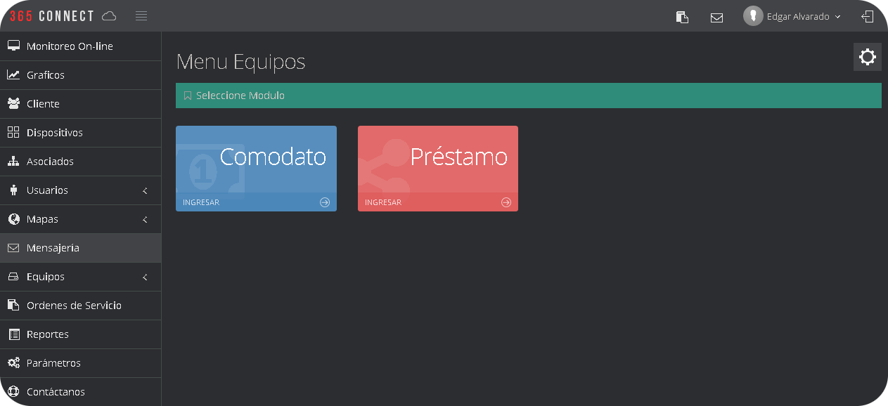
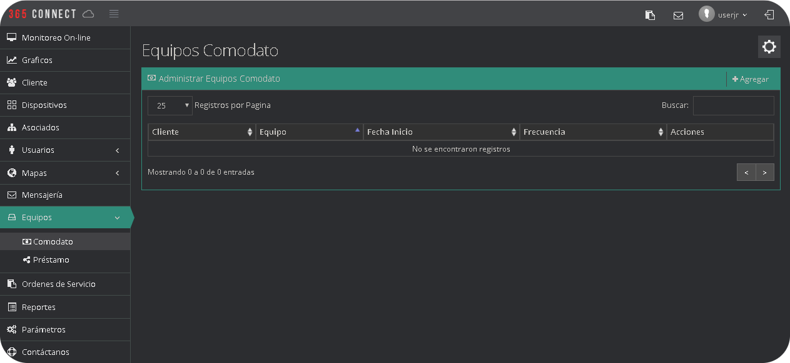
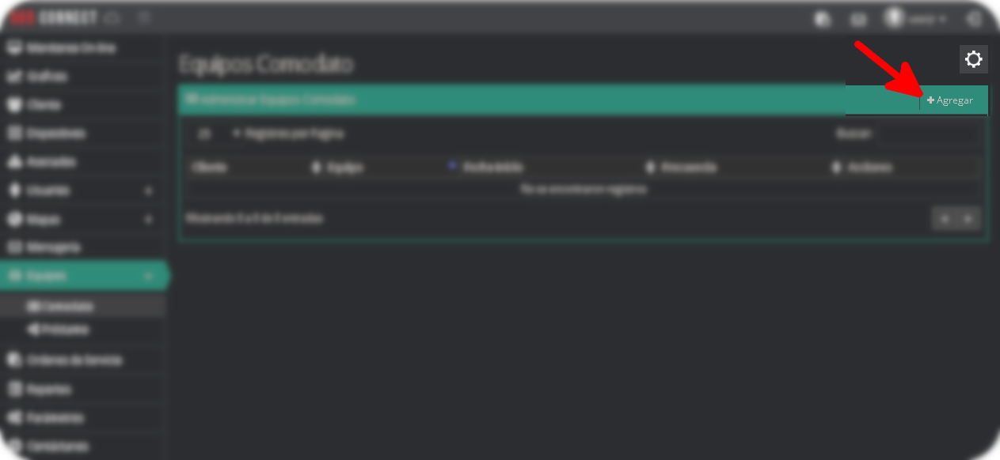
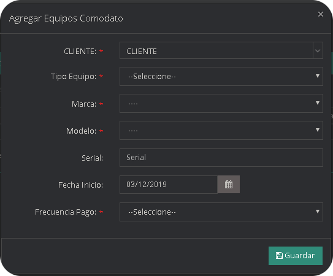
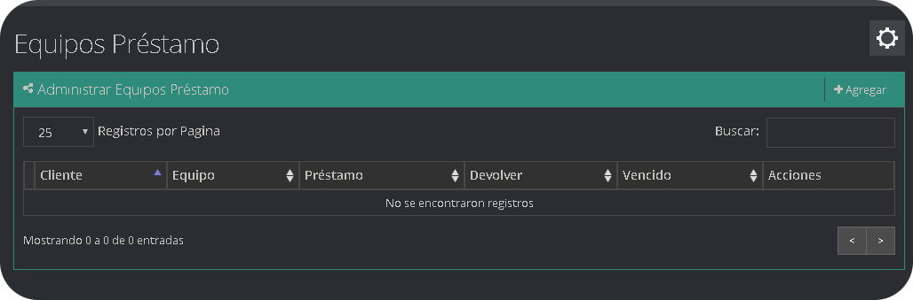
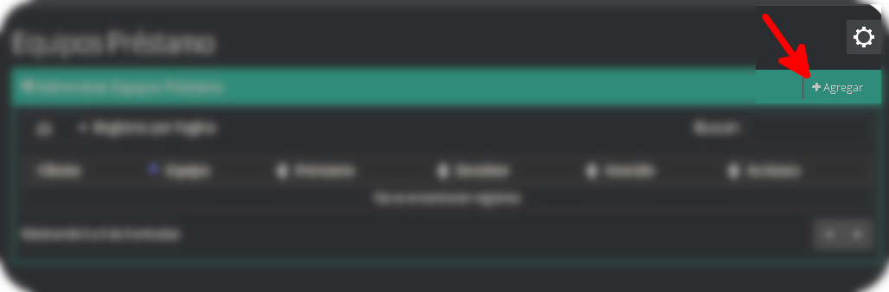
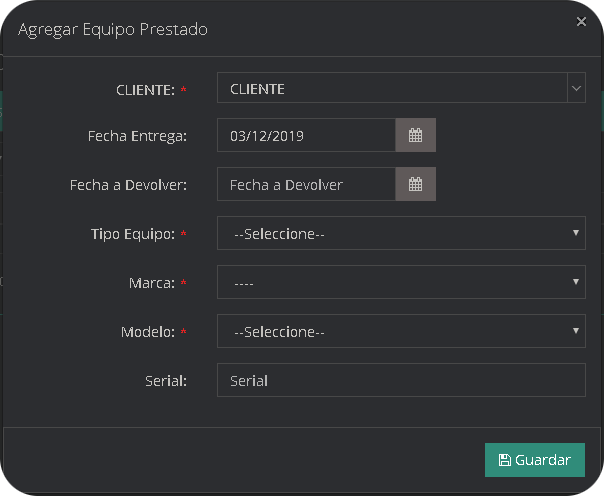

Es un modulo diseñado exclusivamente para el préstamo de equipos y/o de dinero, entre los clientes de la empresa.

## Equipos Comodato
Se refiere a cualquier equipo que la empresa da en condición de comodato a sus clientes.

### ¿Cómo registrar un equipo en comodato?
* Ingresa al modulo equipos en comodato

* Seleccione la opción agregar

* Se desplegará un formulario para llenar los campos

|Campo                |Descripción                                                              |
|----------------|-------------------------------------------------------------------|
|`Cliente `        |selector del cliente a quien se entregará el equipo               |
|`Tipo de Equipo`      |selector del tipo de equipo que se dará en comodato|
|`Marca`   |compañia que fabrica el equipo|
|`Modelo`   |selector del modelo de equipo|
|`Serial `         |numero identificador del equipo|
|`Fecha de inicio `         |fecha en la que se entregó el equipo|
|`Frecuencia de pago `         |cada cuanto tiempo el cliente va a pagar|

## Equipos Préstamo
Son equipos que se entregan al cliente en condición de préstamo y se diferencia del cómodato porque posee la fecha en que el cliente debe realizar la devolución del equipo.

### ¿Cómo Agregar un equipo en Préstamo?

* Seleccione la opción agregar

* Se desplegará un formulario para llenar los campos

|Campo                |Descripción                                                              |
|----------------|-------------------------------------------------------------------|
|`Cliente `        |selector del cliente a quien se entregará el equipo               |
|`Fecha Entrega`   |Fecha de entrega del equipo|
|`Fecha a Devolver`   |Fecha a Devolver el equipo|
|`Tipo de Equipo`      |selector del tipo de equipo que se dará en comodato|
|`Marca`   |compañia que fabrica el equipo|
|`Modelo`   |selector del modelo de equipo|
|`Serial `         |numero identificador del equipo|

