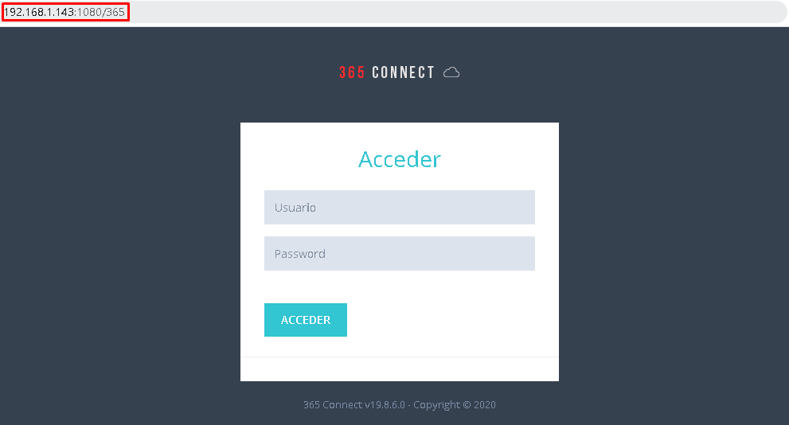
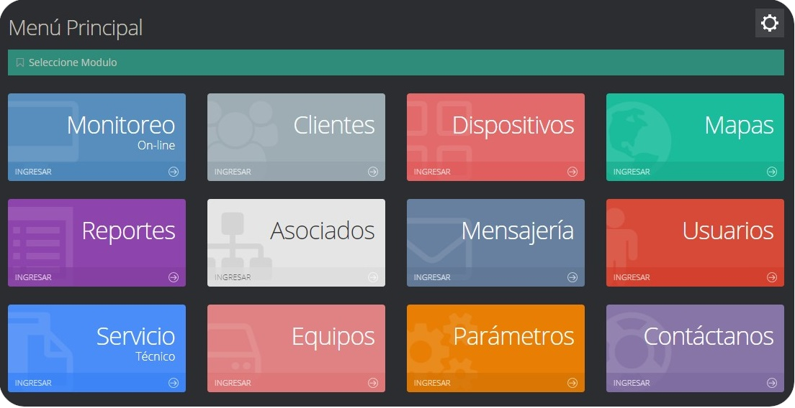
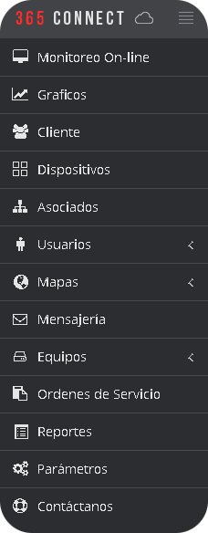
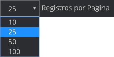
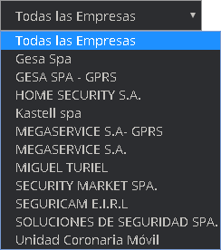
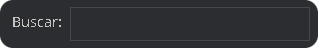

La plataforma 365connect Pro es un software para la gestión y automatización de una central de monitoreo, que integra alarmas, CCTV,  vehículos, personas, mascotas, guardias, patrullas de reacción y supervisión. Este documento pretende ser una guía o un manual para los usuarios de 365connect Pro , en su contenido podremos mostrar los aspectos más esenciales, junto con las diferentes opciones y funciones que posee el software, así mismo se pretende servir como un instrumento de ayuda complementaria a los diferentes clientes, para que así, puedan tener un mayor acercamiento a la plataforma web y aprendan a usarla de una
manera correcta.

El manual se constituye en una guía del paso a paso que debe seguir el usuario para desarrollar cada una de las funciones implementadas en la plataforma web de monitoreo principal, desarrollado por 365Connect Software. Los temas que se encuentran en este documento brindan el conocimiento básico necesario sobre el sistema, lo que contiene, junto con las funciones que se pueden realizar en él.

## Requerimientos para Equipos con fines de Monitoreo y uso de la plataforma web

### Mínimo:
* Sistema Operativo: Windows 7 o Superior, Cualquier Distribución GNU/Linux
* Procesador: Dual Core a 2+ GHz
* Memoria: 2 GB de RAM
* Navegador web actualizado

## Requerimientos para Servidores

### Mínimo:
* Sistema Operativo: Windows 7 x64 bits, Windows Server 2012 o Superior
* Procesador: i5 Quad Core de tercera generación
* Memoria: 8 GB de RAM

## Ingreso al Sistema
Como se mencionó en la introducción Software 365Connect Pro es una plataforma Web, por tanto es posible acceder a ella desde cualquier dispositivo que disponga de un navegador actualizado. Eso incluye pero no se limita a Computadoras (Sistema Operativo Windows, GNU/Linux y MacOS), Teléfonos Inteligentes, Tablets, etc. En la Barra de Direcciones de su navegador elegido ingrese la dirección de acceso a 365Connect Pro:

- Para acceder desde dentro del servidor `localhost:1080/365`.
- Para acceder desde un computador ubicado en la misma red interna que el servidor `192.168.x.x:1080/365`.
- Para acceder desde cualquier lugar del mundo utilice la dirección DNS configurada para su servidor.

### Ingreso de Tipos de Usuarios al Sistema

* [**Acceder como Clientes**](clientes#acceder-como-cliente)

* [**Acceder como Usuario de Empresa**](usuarios#acceder-como-usuario-de-empresa)

* [**Acceder como Asociado**](asociados#acceder-como-asociado)

* [**Acceder como Usuario de un Cliente**](clientes#acceder-como-usuario-de-cliente)

### Selección de Módulos 
Al ingresar a la plataforma, se observa un menú con los diferentes módulos que agrupan las funciones del software de acuerdo a su origen.  Se puede acceder a través de los módulos desde la página principal.
 

o desde la barra de la izquierda.

**Monitoreo Online:** En este módulo se visualizan todas las señales que son recibidas por la plataforma, este es el módulo que utilizan en gran medida los operadores de monitoreo.

**Gráficos:** Presenta información importante en forma de diagramas, este módulo es muy importante para la toma de decisiones de la empresa de monitoreo.

**Cliente:** Permite administrar todas las funciones relativas a los clientes cómo agregar, editar, eliminar, ver en un mapa todos los dispositivos asociados a un cliente, configurar los sub-usuarios, geocercas, notificaciones, etc.

**Dispositivos:** Agrupa todos los dispositivos (Panel de Alarmas, GPS, Bastones, 365Guard y 365SOS) permite, además de administrar todas las funciones relativas a los dispositivos, buscar de forma exhaustiva los dispositivos a través de diversos parámetros.

**Asociados:** Muestra todos los asociados registrados en la plataforma, desde este apartado se agregan, editan o eliminan los asociados, además, se le asignan los abonados correspondientes.

**Usuarios:** El modulo de usuarios se divide en dos sub-módulos, en el sub-módulo Usuarios se realizan todas las actividades relacionadas a los usuarios de la plataforma, los usuarios son generalmente personal de la empresa. El sub-módulo Tipo Usuarios administra los diversos Roles o el nivel de accesos que tiene el personal, la plataforma cuenta con algunos roles predefinidos, pero es posible agregar más de acuerdo a las necesidades y requerimientos.

**Mapas:** Como su nombre indica, permite visualizar en un mapa los dispositivos en tiempo real, trazar el recorrido que están realizando, la velocidad a la que se desplazan, etc.

**Mensajería:** En este módulo se pueden enviar Notificaciones de tipo SMS, Correo Electrónico y Push; Se puede enviar a gran cantidad de dispositivos.

**Equipos:** Este modulo esta diseñado exclusivamente para el préstamo de equipos y/o de dinero, entre los clientes de la empresa.

**Ordenes de Servicio:** El modulo ordenes de servicio esta creado específicamente para atender las ordenes de servicio técnico, las cuales son creadas por un operador o un administrador, pero solicitadas por un cliente mediante un correo electrónico o vía telefónica. En este modulo se muestran las notificaciones generales, las notificaciones mencionadas que son las notificaciones en donde se pueden mencionar al técnico o algún otro trabajador y las notificaciones privadas que son las que hace con la intención de que solo puedan ser vistas por los dos usuarios que interactúa (técnico y operador).

**Reportes:** Este modulo esta diseñado para que los usuarios pertenecientes a la empresa puedan cuantificar y obtener a un registro desde los tipos de señales recibidas en la plataforma, los estatus de los dispositivos, el registro de acciones de usuarios hasta los gps sin comunicar. 

**Parámetros:** En el módulo Parámetros se establecen todas las opciones de configuración empresariales.

**Contactanos:** Permite comunicarse con la empresa que posee el software. 

# Componentes frecuentes en la plataforma

Los componentes frecuentes son herramientas que nos permiten visualizar mejor los elementos de la platafomra de una mejor forma o mas especifica, la informacion contenido en un modulo o seccion del mismo.

## Registro por Pagina  
Muestra el numero máximo de registros que se mostraran por pagina dependiendo del modulo en que se encuentre el usuario,  este numero por defecto es de 25.

   
 
## Selección de Empresa 
Muestra todas las empresas con la que puede interactuar el usuario en los distintos módulos.

   

## Buscador   
Realiza una búsqueda detallada mediante la información que se muestra en el modulo. 

