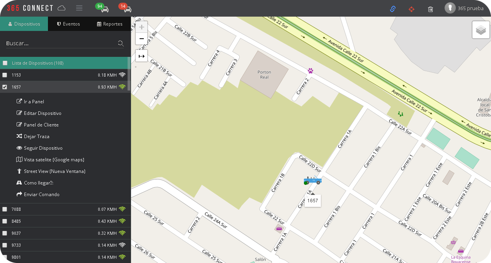
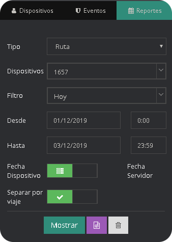

El Modulo Mapas esta compuesto por un mapa general donde se muestran todos los dispositivos GPS pertenecientes a la empresa.

## Dispositivos

En la sección de dispositivos permite visualizar una lista de dispositivos que puede monitorear la empresa, ademas permite visualizar el estado de cada uno de los dispositivos.

|Campo                |Descripción                                                              |
|----------------|-------------------------------------------------------------------|
|`Ir a Panel `        |Abre en una nueva pestaña el Panel de dispositivo              |
|`Editar Dispositivo`      |Despliega un formulario para editar los datos del dispositivo     |
|`Panel de Cliente`   |Permite desplegar el panel de dispositivo en la misma pestaña            |
|`Dejar Traza `   | Muestra una linea en el mapa del recorrido del vehiculo en tiempo real|
|`Seguir Dispositivo `|Despliega una ventana que sigue los movimientos del dispositivo en el mapa.                   |
|`Vista Satélite (Google maps) `|Abre una pestaña que muestra la vista satelital desde google maps                     |
|`Street View (Nueva Pestaña) `|Abre una pestaña que muestra la vista de calle desde google maps                    |
|`¿Como llegar? `|Muestra la posición geográfica del dispositivo|
|`Enviar Comando `|Permite enviar un comando                |

## Eventos

En esta sección se muestra el evento que llega a cada uno de los dispositivos que esta conectado a la plataforma y la hora a la que se recibe el evento.

## Reportes
Se utiliza para generar informes de los dispositivos, filtrando por Ruta, paradas, Exceso de velocidad y geocercas. Ademas de seleccionar entre cualquier intervalo de fechas.

### ¿Como generar un reporte de ruta?

* Selecciona el tipo de reporte en "Ruta".

* Se busca el nombre del dispositivo que desea rastrear.

* Selecciona el tipo de filtro.

* Marcamos La fecha inicial "Desde" y la fecha final "Hasta".

* Elegimos el check de la Fecha Dispositivo y  Fecha Servidor.

* Marcamos la opción "Separar por Viaje". 

