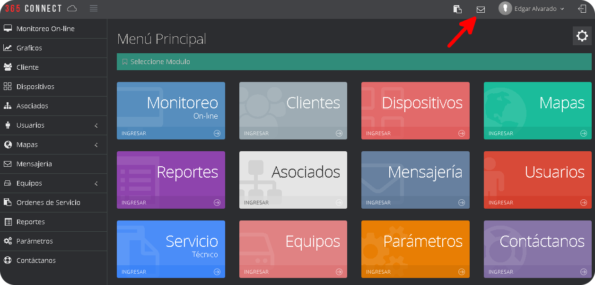
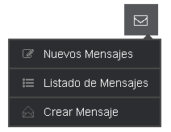
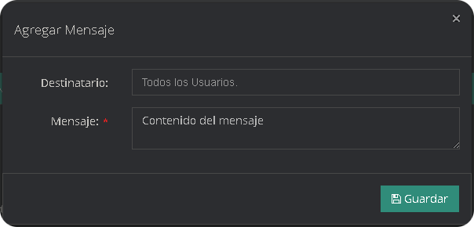
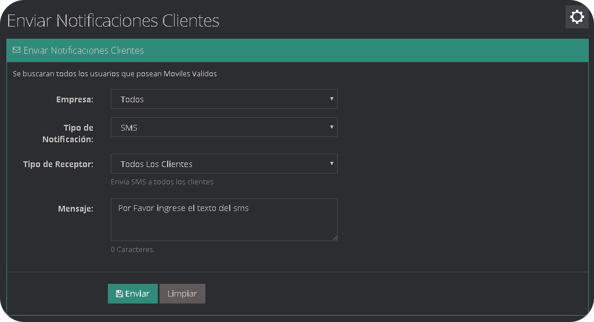
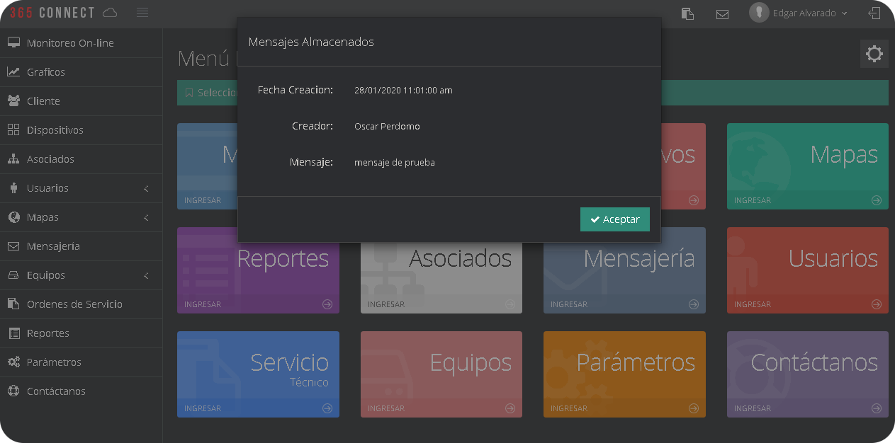
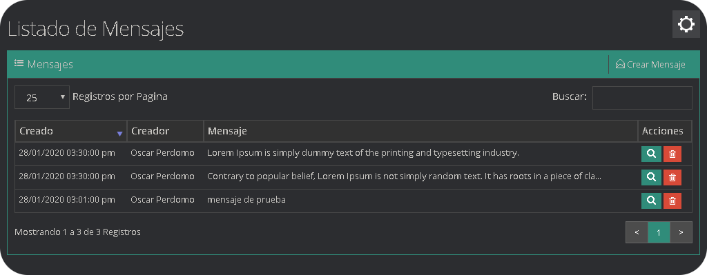

El modulo de mensajería esta diseñado para que los usuarios o trabajadores de la plataforma se comuniquen entre si, ya que una comunicación clara, precisa y constante minimiza los errores en la prestación del servicio, mas aun cuando se maneja datos e información personal que es de vital importancia para el cliente.

## Crear mensaje a Usuarios

* Desde la pagina principal de la plataforma haga clic en el icono Crear Mensaje.

* Se desplegara un pequeño modal con las opciones de mensajería y le damos clic en crear mensaje.

* Se desplegara un pequeño formulario para seleccionar el destinatario y un cuadro de texto para escribir el mensaje.

## Enviar Notificaciones Clientes

* Al entrar al modulo podemos observar un formulario que debemos llenar para enviar el mensaje.

|Campo                |Descripción                                                              |
|----------------|-------------------------------------------------------------------|
|`Empresa `        |nombre de la empresa de la cual se van a tomar los clientes               |
|`Tipo de notificación`      |elige si el mensaje se va a enviar por SMS o correo electrónico     |
|`Asunto correo`   |descripción del mensaje            |
|`Tipo Receptor `   |selecciona a quien se va a enviar el mensaje|
|`Mensaje `         |contenido del mensaje                     |

## ¿Como se Muestra un Mensaje Nuevo?

Al momento de ingresar a la plataforma 365monitoreo.com con nuestras credenciales, en la ventana principal de módulos aparecerá una ventana con la fecha que fue creado el mensaje, el creador del mismo y el contenido del mensaje.

## Listado de Mensajes

En el listado de mensajes se muestran todos los mensajes que a recibido el usuario, la fecha que fue creado el mensaje y la persona que lo creo, ademas se puede observar nuevamente el contenido de los mensajes, asi como eliminar los mismos.

