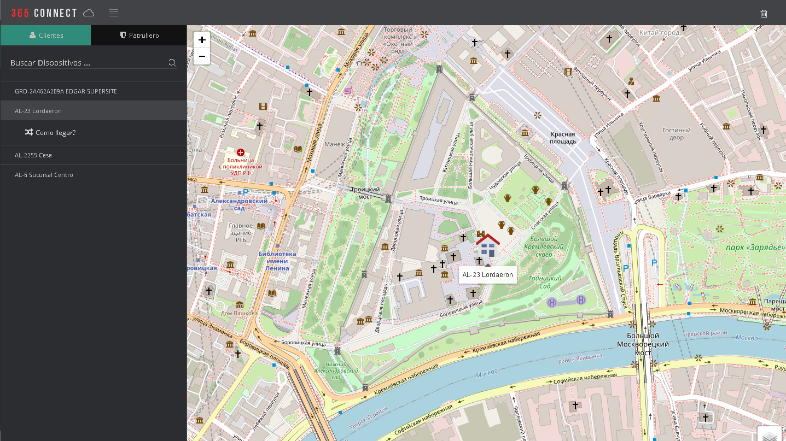
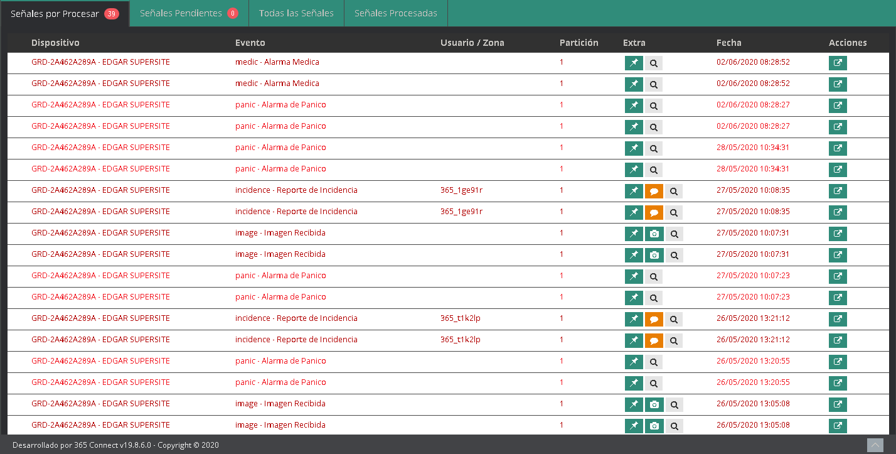
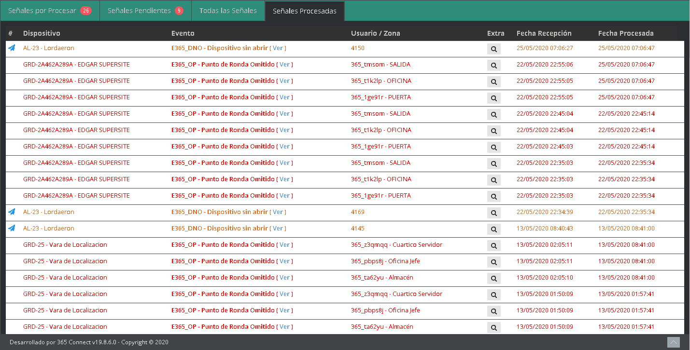
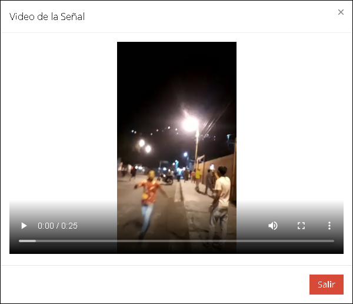
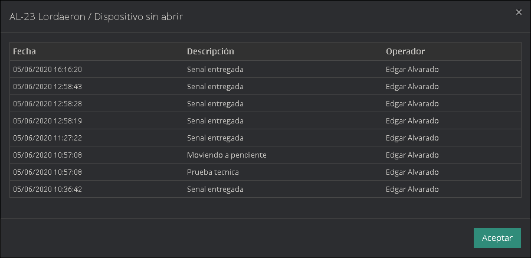

La ventana de monitoreo o el módulo de monitoreo está compuesto por una barra superior la cual contiene las opciones de simular señal, mensajería, crear orden de servicio, pausa, mapa, cierre rápido, sonido, señales pendientes, color del tema, así como también cada una de las pestañas de monitoreo, las cuales son señales por procesar, señales pendientes, señales procesadas y todas las señales, además del chat de soporte técnico.

## Simular Señal

La opción de simular señal te permite simular cualquier evento existente dentro de la plataforma 365, de cualquier dispositivo.

### ¿Cómo Simular una Señal?

- Para generar una señal solo es necesario hacer clic en el botón simular señal y se desplegara un modal, en el cual elegiremos el dispositivo que deseamos seleccionar, el protocolo que maneja ese dispositivo, el tipo de evento que queremos generar, el usuario o la zona que deseamos elegir, la partición deseada y la observación.

- Una vez llenado estos datos hacemos clic en el botón guardar y listo, deberá generarse nuestra señal simulada.

### Ejemplo de Simular Señal

## Mensajería

La opción de mensajería te muestra una lista de opciones, tanto para ver tus mensajes como para crear un mensaje nuevo.

### Ver mensajes

- Al momento de ingresar al módulo de monitoreo el icono de notificación le parece el número de mensajes que tiene sin leer.

- Al hacer clic en el icono de mensajería se desplegara ventana con la fecha que fue creado el mensaje, el creador del mismo y el contenido del mensaje. Para responder el mensaje damos clic en el botón responder y si solo queremos quitar el mensaje le damos en el botón aceptar.

- Luego se nos desplegara otra ventana para responder el mensaje, una vez contestado el mensaje le damos enviar.

### Crear Mensajes

- Para crear un mensaje solo necesitamos hacer clic sobre el lugar en la lista que dice crear mensaje y Se desplegara una pequeña ventana para seleccionar el destinatario y un cuadro de texto para escribir el mensaje.

## Crear orden de servicio

El botón crear orden de servicio despliega una ventana la cual permite crear una orden de servicio técnico.

### ¿Cómo crear orden de servicio ?

- Una vez hagamos clic en el botón de crear orden de servicio, se desplegará una ventana la cual nos pedirá varios datos, los cuales son el dispositivo al cual le deseamos crear la orden, la prioridad de atención que tiene ese dispositivo, el tipo de servicio que requiere y el problema que presenta el dispositivo.

- Una vez llenemos todos estos datos y la orden será creada pero esto no significa que sea atendida inmediatamente. Si requiere mas información sobre la órdenes de servicio puede ir a la sección [ Ordenes.](./ordenes-de-servicio.md#visita-técnica)

## Pausar Monitoreo

La opción de monitoreo en pausa le permite al operador pausar la recepción de señales mientras este está indispuesto y se las pasa a otro operador conectado o aun operador que este menos ocupado.

Aquí podemos ver un claro ejemplo de como se ve el monitoreo pausado, el cual claramente muestra un título que dice "Monitoreo se encuentra en modo PAUSE, Presione aquí para continuar".

## Abrir Mapa

El botón abrir mapa nos muestra un mapa con todos los dispositivos que tienen señales activas en el monitoreo y como cualquier otro mapa de la plataforma nos muestra la opción de buscar dispositivo, como llegar y limpiar mapa.

### Clientes

Esta opción nos permite ver la posición de los dispositivos que tienen señales por procesar dentro del módulo de monitoreo, pueden ser dispositivos GPS, Panel de alarma, aplicaciones de 365 y bastones con posición válida.

- Buscar dispositivo: es un buscador que nos permite filtrar la información de manera más rápida para localizar un dispositivo en específico.

-     Cómo llegar: es una opción que nos permite trazar una ruta desde la ubicación de la central de monitoreo hasta la ubicación donde se encuentra el dispositivo.

- Limpiar Mapa: nos permite limpiar el mapa de los iconos o marcadores, así como también de las rutas trazadas en el mismo.

### Patrulleros

Los patrulleros son empleados de la empresa que se encargan de vigilar a los clientes y/o cumplir rondas asignadas para un cliente o por la misma empresa. En esta pestaña se mostrará la ubicación de todos los patrulleros para que el operador o centralista determine cuál está más cerca del dispositivo que envio la señal.

-     Buscar patrulleros: es un buscador que nos permite filtrar la información de manera más rápida para localizar un patrullero en específico.

- Limpiar Mapa: nos permite limpiar el mapa de los iconos o marcadores.

### ¿Como asignar un patrullero?

1.          Para asignar un patrullero primero tenemos que crear un cliente al cual le debemos crear un dispositivo guard, si tienes dudas como hacer esto puede dirigirse a [Clientes.](./clientes.md#¿cómo-crear-un-nuevo-cliente)

2.  Al momento de crear el cliente podemos directamente asignar a ese cliente como patrullero o después de crear el dispositivo, podemos volver al cliente y editarlo para cambiar del estado empleado.

3. Una vez asignado como empleado, damos clic en guardar y listo.

## Cierre rápido

La opción cierre rápido nos despliega una ventana para como lo dice su nombre permitirnos cerrar, finalizar o procesar varias señales de forma rápida.

### ¿Cómo funciona el cierre rápido?

Como se puede ver en la imagen en la parte superior nos sale el nombre del usuario que esta logeado, el nombre de la empresa a la que pertenece o para la cual trabaja, así como una pestaña que nos dice acción por lote, después podemos ver varios filtros los cuales son las opciones por las cuales podemos filtrar las señales, las cuales son:

- Por Dispositivo

- Por Código Señal

- Por Código de Evento

- Por todas las Señales

Al momento de procesar una señal debemos dejar un comentario podemos hacer uno personalizado o elegir uno entre la lista de comentarios pre-establecidos.

Luego simplemente presionamos el botón de las opciones que queramos elegir, si pasamos las señales a pendientes, en espera, procesar o transferir. Si elegimos la opción transferir se nos desplegara otra ventana más pequeña, en la cual nos mostraran los operadores conectados, junto con el número de señales que tiene por procesar.

Una vez seleccionado el operador hacemos clic en la opción enviar y listo todas las señales seleccionadas le serán transferidas al operador designado.

## Sonido

Esta opción permite activar y desactivar el sonido de las señales por cuestiones de comodidad para el operador.

## Notificacion de Señales pendientes

Este botón permite enumerar el número de señales que faltan por atender en la sección de señales por procesar, ya que se da a entender que si están en otra sección es porque ya fueron atendidas.

## Color del tema

Permite cambiar el color del tema de la plataforma.

Mediante un modal que te muestra los diferentes tipos de tema que existen en la plataforma y los cuales puede utilizar.

## Señales Por Procesar

En la pestaña de señales por procesar llegan todas las señales que necesitan ser atendidas por un operador, estas señales pueden traer o no archivos adjuntos, así mismo las señales se agrupar primero la prioridad del evento, si un evento es prioridad 1 se agrupara primero que un evento de prioridad 2 y así mismo, con el resto de eventos emitidos, y después se agruparan por clientes.

### Cierre Señal

Al hacer doble clic sobre una señal se despliega una ventana, donde se puede procesar una o varias señales, ademas se divide en tres partes.

En la primera parte nos muestran el nombre de la empresa, el prefijo del dispositivo, la cuenta y el nombre del mismo, ademas el numero de particion, la fecha, el evento, el numero de telefono, la direccion, la ciudad, una referencia y el estatus actual del panel de alarmas, la cual, se muestra Armado o Desarmado y Sin Señal en casos donde el dispositivo no sea un panel de alarma.

| **Icono**                                                                             | **Informacion**                                                    |
| ------------------------------------------------------------------------------------- | ------------------------------------------------------------------ |
|           | Muestra la imagenes asociadas a una zona o punto de un dispositivo |
|                    | Muestra las camaras asignadas a una zona o punto de un dispositivo |
|     | Muestra las clave master asignada al panel de alarma               |
|                       | Muestra las llaves asignadas al panel de alarma                    |
|           | Permite enviar sms a los numeros de los usuarios o los contactos   |
|  | Permite enviar correo electronicos a los usuarios                  |
|                       | Permite llamar a los usuarios o los contactos                      |

:::tip Nota
El boton de **Camara** solo estará habilitado si el evento es tipo **Zona/Punto**.
:::
En la segunda parte, se muestra la pestaña de cierre, el cual contiene el historial de la señal y las señales sin procesar. Si quieres mas informacion del resto de pestañas puedes ir a [**Aqui.**](./dispositivos#panel-dispositivo-central-de-alarma)

Y en la tercera parte tenemos la seccion de mensajes predefinidos, comentarios, ademas de los botones de cancelar, pendiente, comentario, espera, transferir y procesar.

|                                  **Boton**                                   | **Informacion**                                                                               |
| :--------------------------------------------------------------------------: | --------------------------------------------------------------------------------------------- |
|        | Permite cerrar el modal de cierre señal                                                       |
|     | Pasa a la pestaña señales pendiente la señal seleccionada                                     |
|  | Permite agregar el comentario hecho en el campo de comentario                                 |
|              | Permite colocar en pendiente la señal durante un periodo de tiempo que el operador selecciona |
|  | Permite transferir señales a otros operadores conectados                                      |
|        | Permite procesar las señales entrantes                                                        |

## Señales Pendientes

En la pestaña de señales pendiente se agrupan cualquier tipo de señales que requiere un tiempo de espera o requieren ser atentidas mas tardes, asi como tambien para las que necesitan una confirmacion de otra entidad encargada de supervisar o reportar alguna situacion desde una zona particular, incluyendo patrulleros o personales dedicadas al area de seguridad.

## Todas Las Señales

En todas las señales llegan como su nombre lo dice todas las señales ya sean estas monitoreables o no, hayan sido recibidas por un operador o no, esta sección sirve para mantener un orden al momento de procesar las señales.

## Señales Procesadas

En esta sección se muestran solos la señales atendidas por todos los operadores registrados en la empresa, asi mismmo tambien podemos observar mas informacion que nos brinda el software como el Nombre del cliente, el evento que se recibio, la fecha y hora que recibida la señal, asi como tambien la fecha y hora que fue procesada la misma.

## Señales Autoprocesables

Algunos eventos pueden ser atendidos por usuarios de la app 365Client, de esta manera los eventos mostrarán información adicional y podran ser procesados de forma autonama. En tal sentido, una señal autoprocesada por el cliente desaparecerá automáticamente de las señales por procesar.

### Señal verificada

Este indicador aparece cuando el usuario de la app 365Client, informa que esa señal no es una falsa alarma.

### La Respuesta secreta fue inválida

Este indicador aparece si el usuario de la app 365Cliente selecciono una clave master errónea.

Para más información consulte [Cómo Autoprocesar Señales desde la app 365Client.](../apps-mobiles/365-client-app.md#autoprocesar-señales)

## Acciones en el Monitoreo

En esta parte podemos observar todas las acciones que podemos realizar en la sección de monitoreo, así como la función de cada uno de los botones y opciones que posee esta sección del software.

### Menú Emergente

Este menú se despliega haciendo clic derecho sobre cualquier señal, el mismo está compuesto por 4 opciones las cuales son:

- **Pasar a Pendientes:** Esta opción del menú cumple la función de transferir señales a pendientes.

- **Mapas:** Despliega la ubicación del dispositivo que emitió la señal.

- **Ir al Panel:** Abre una ventana adicional en la cual se puede ver el panel del dispositivo. Para mayor información de que es el [panel de dispositivos](./clientes.md#panel-del-dispositivo).

- **Crear Orden de servicio:** Crea una orden de servicio como vimos anteriormente en [crear orden de servicio.](./monitoreo.md#crear-orden-de-servicio)

### Botón Ubicación

Una vez presionado el botón abrirá una ventana adicional donde se mostrara la última ubicación del dispositivo, ya sea este un dispositivo móvil o estático.

La ventana cuenta con la posición del dispositivo, una opción de aumentar y disminuir el zoom del mapa, además de una opción para limpiar el mapa.

### Botón Origen Señal

Al presionar el botón de origen señal, nos despliega una ventana adicional que nos muestra un poco de información de la misma.

Esta ventana nos muestra la línea por donde recibe esta señal, y el tipo de dispositivo receptor de la misma.

### Botón Texto

Este botón nos despliega una ventana con el texto enviado por el cliente desde su dispositivo.

### Botón Foto

Este botón nos despliega una ventana con el contenido de la foto, enviado por el cliente desde su dispositivo.

### Botón Video

Este botón nos despliega una ventana con el video enviado por el cliente desde su dispositivo. Así mismo esta ventana tienes la opción de silenciar el video, ponerlo en pantalla completa y otras opciones más.

Como lo son la opción de descargar el video e imagen en imagen que se traduce como minimizar el reproductor para moverlo a cualquier lado de la pantalla.

Aquí podemos ver un ejemplo del modo imagen en imagen y con sus respectivas opciones de reproducción, volver a pantalla normal y salir.

### Botón Audio

Este botón nos despliega una ventana con el audio grabado desde su dispositivo.

### Botón Enviar a Pendientes

Esta opción nos permite seleccionar una señal en específico y pasarla a pendiente, pero antes de realizar la acción nos pide una confirmación en la cual dice "Esta seguro que desea pasar esta señal a pendientes?"

Una vez le damos en OK, la señal pasara a pendientes.

### Opcion Ver

La opción ver despliega una ventana en la cual se puede observar el nombre del dispositivo, la señal seleccionada, junto con la fecha y la hora que entregada la señal, además del nombre del operador que recibió la señal.

## Chat de Monitoreo

El chat de monitoreo se encuentra ubicado en la parte inferior izquierda de la pantalla de monitoreo, este chat será atendido a brevedad posible por uno de los integrantes del grupo de soporte técnico.

Una vez desplegado podrá ponerse en contacto con cualquier agente de soporte técnico, además de acceder a otras opciones.

Como lo son:

- Sonido activado

- Saltar widget

- Final de esta sesión de chat

