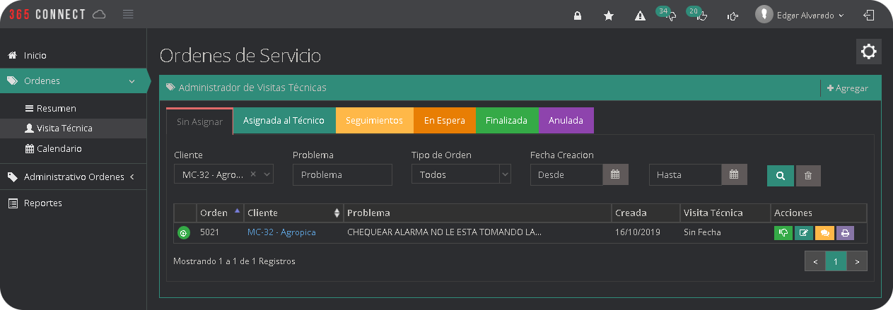
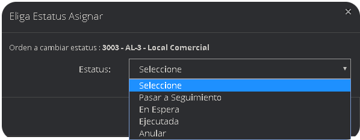
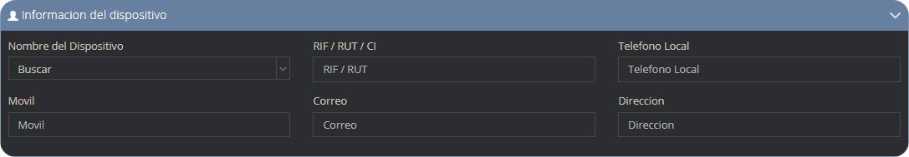
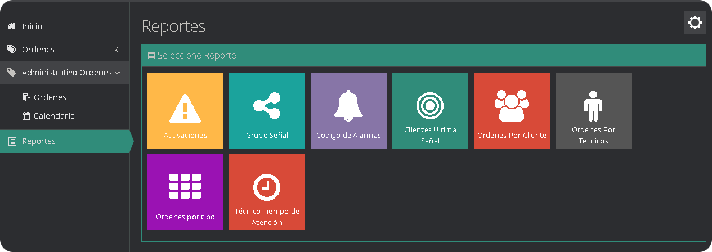

El modulo ordenes de servicio esta creado específicamente para atender las ordenes de servicio técnico, las cuales son creadas por un operador o un administrador, pero solicitadas por un cliente mediante un correo electrónico o vía telefónica. En la ventana de inicio se muestra las notificaciones generales, en la segunda se muestran las notificaciones mencionadas que son las notificaciones en donde se pueden mencionar al técnico o algún otro trabajador y las notificaciones privadas que son las que hace con la intención de que solo puedan ser vistas por los dos usuarios que interactúa(técnico y operador).

## Notificaciones

Las notificaciones se generan cuando una orden de servicio es comentada o cambia de estatus y la misma se dividen en 3 tipos.

### Notificaciones Privadas

Las notificaciones privadas se generan cuando se menciona directamente a una persona en la orden y la notificación junto con el comentario es visible solo para las personas relacionadas. 

### Notificaciones Mencionadas

Las notificaciones mencionadas se generan al mencionar a alguien públicamente n un notificación y es visible para todos los usuarios que puedan acceder a este modulo.

### Notificaciones Generales

Las notificaciones generales abarcan todas las menciones, comentarios y cambios de estatus que se hacen en una orden de servicio y es visible para todos los usuarios que puedan acceder a este modulo.

## ¿Cómo crear una orden de servicio?

* Desde la pagina principal de la plataforma haga clic en el icono Crear Orden de Servicio.

* Se abrirá un formulario donde debe llenar los datos para crear la orden

|Campo                |Descripción                                                              |
|----------------|-------------------------------------------------------------------|
|`Dispositivo `        |seleccione el dispositivo para realizar la orden               |
|`Prioridad`      |nivel de importancia de la orden  |
|`Tipo Servicio`   |selector del dispositivo o servicio que requiere servicio |
|`Problema `   |descripción del inconveniente que presenta el dispositivo |

* Una vez creada la orden de servicio a esta estara en el estado **Sin Asignar** se le necesita asignar un tecnico para que sea atendida, esto lo puede ver mas adelante en la seccion de vista tecnica. A continuacion se le mostraran los diferentes estados que puede tener una orden de servicio.

### Tipos de Estados en Ordenes de Servicio
Estos son todos los estados en que pueden entrar una orden de servicio técnico desde el momento que es creada hasta el momento de ser procesada. 

|ESTADOS|DESCRIPCIÓN|
|:---:|---|
|Sin Asignar|Son todas las ordenes creadas al inicio por cualquier operador y que no están asignadas a un técnico.|
|Asignada al técnico|Son todas las ordenes que ya están asignadas a un técnico especifico, especializado en el tipo de petición.|
|Seguimientos|Son ordenes que fueron atendidas, pero se utiliza para darle seguimiento a la misma y ver la evolución del trabajo.|
|En Espera|Son ordenes que se colocan en pausa por petición tanto del cliente , como por designación del operador.|
|Finalizada|Son las ordenes que ya fueron atendidas y el problema quedo resuelto.|
|Anulada|Son las ordenes que son anuladas por petición de los clientes, como por designación del operador.|

## Resumen
Esta opción muestra por grupos las ordenes **Sin asignar, Asignadas a técnicos, En seguimiento y ejecutadas.**

## Visita Técnica
El administrador de visitas técnicas permite asignar y procesar una orden, además de cambiar el estado de dicha orden.

### ¿Como Asignar un Técnico a una Orden de Servicio?

* Seleccionamos el botón orden sin asignar y se desplegara una ventana que nos mostrara 3 opciones, elegimos la opción asignar al técnico.

* Luego seleccionamos la fecha de atención y la hora, junto con un técnico responsable y un técnico ayudante, ademas de una observación para luego dar clic en el botón guardar.

### ¿Como Asignar un Estatus a una Orden de Servicio?

* Nos ubicamos en el modulo Ordenes de Servicio, en el sub-modulo de vista técnica, en la pestaña Asignadas Al Técnico.

* Seleccionamos el botón Orden Asignada Al Técnico y se desplegara una ventana que nos mostrara 4 opciones, elegimos la opción Ejecutada.

* Luego seleccionamos la fecha que fue ejecutada, el tiempo de duración de la orden en horas o minutos y una observación final para luego dar clic en el botón guardar.

### ¿Como Mencionar a Alguien en una Orden de Servicio?

* Nos ubicamos en el modulo Ordenes de Servicio, en el sub-modulo de vista técnica, en la pestaña donde se encuentre la orden en la que queremos hacer la mencion y hacemos clic en el boton comentarios.

* Una vez en la linea de tiempo de la orden podemos hacer un comentario de 3 formas diferentes general, general con referencia y privado.

:::warning[Importante]
El comentario privado solo lo podran ver los involucrados, la persona que hace el comentario y la persona que mencionan en el mismo.
:::

* Una vez hecho el comentario se actualizaran los mismos y aparecera el nuevo comentario realizado.

### Acciones en Visita Técnica
Estas son todas las acciones que puede realizar un usuario dependiendo de la pestaña en la cual se encuentra ubicada, ademas una imagen del icono de la acción a realizar y una breve descripción de la misma.

|Resumen |Descripción                   
|:----------|:--------------------|
|`Ver Notificación `    |Muestra todos los comentarios realizado en una orden y permite comentarla| 
|**Vista Técnica** |**Descripción**          | 
|`Orden Sin Asignar`    |Permite Asignarle un técnico a una orden  |
|`Orden Asignada Al técnico `|Permite Asignarle un estado a la orden |
|`Orden Seguimiento`   |Permite Cambiarle el estado a la orden |
|`Orden En Espera `    |Permite Cambiarle el estado a la orden|
|`Editar`      |Permite cambiar la información interna que posee la orden  |
|`Comentarios`   |Muestra todos los comentarios realizado en una orden y permite comentarla |
|`Imprimir Orden `   |Muestra un formulario con todos los datos de la orden de servicio y permite imprimirla |
|**Administrativo Ordenes** |**Descripción**         |
|`Orden Ejecutada `    |Son todas la ordenes que fueron finalizadas|
|`Comentarios `      |Muestra todos los comentarios realizado en una orden y permite comentarla |
|**Todas** |**Descripción**                     |
|`Buscar `   |Permite buscar las ordenes de un cliente en especifico, por problema, por el tipo de orden, y por la fecha de creación de la orden |
|`Limpiar Buscador `   |Permite limpiar todos los datos de la búsqueda|

## Visita Recurrente

El administrador de visita recurrente nos permite crear ordenes, las cuales tienen una frecuencia de tiempo determinada para volverse a ejecutar. Su funcion principal es automatizar el proceso de creación de ordenes de servicios para mantener una supervisión o actividad recurrente en un dispositivo sin necesidad de que un personal acceda manualmente al sistema. En su listado se destaca el asunto de la orden, la proxima fecha de ejecucion y su frecuencia programada.

### ¿Como crear una orden recurrente?

* Hacemos clic en el boton agregar en la parte superior izquierda de la pantalla, despues se mostrara un formulario con todos los diferentes datos que necesitamos llenar, los primeros son los **Datos iniciales**, los cuales estan compuestos por la fecha de solicitud y prioridad de solicitud.

* Los siguientes datos pertenecen a la **informacion del dispositivo**, que contienen el nombre del dispositivo, el RIF/RUT/CI, el telefono local, el movil, el correo electronico y la direccion del dispositivo.

* La siguiente informacion a suministrar seria los **Datos del problema**,  donde se especifica que es lo que esta fallando y como esta afectando al cliente de manera negativa, estos datos estan compuestos por el asunto, el tipo de orden y el problema.

* Por ultimo vendria la seccion de **Programacion** de la orden, el cual nos permitira configurar cada cuanto tiempo queremos que se ejecute una orden recurrente, asi como definir cuando se inicia, la recurrencia con la que se creara la orden, ademas si se ejecutara una sola vez, diariamente, mensualmente o anualmente, asi como tambien hasta que fecha se ejecutara esta orden.

* Una vez completado todos los datos simplemente haces clic en el boton de guardar y se creara la orden recurrente. Al ejecutarse una orden recurrente se creara un registro automatico de la actividad con el numero de orden, el nombre del cliente, el problema, la fecha de creacion, la visita tecnica y las acciones que se pueden realizar al momento de crear un orden. 

## Calendario

En esta sección se muestran las ordenes sin asignar, las cuales se pueden asignar a un técnico ademas también se muestran las ya asignadas a un técnico, junto con un calendario para establecer la fecha y la hora en la que se atenderá la orden, ademas en el calendario también se muestran los días feriados.

## Administrativo Ordenes
Esta sección permite visualizar las ordenes de servicio técnico dividas en tres pestañas las cuales son por facturar, facturada y pagada.

### Ordenes

En esta sección se pueden procesar las ordenes siendo los estados por facturar, facturada y pagada , ademas se puede comentar las ordenes de servicio y agregar un recordatorio a las ordenes ta facturadas.

### ¿Como Facturar una Orden de Servicio?

* Seleccione el botón orden ejecutada.

* Se desplegara una pequeña ventana y seleccionamos la opción "Facturar".

* Se mostrara un formulario con los datos necesarios para facturar la orden de servicio.

## Calendario

En esta sección se muestra la fecha elegida al momento de agregar un recordatorio en una orden de servicio facturada.

## Reportes

Los reportes de servicio técnico son documentos en los que se pueden cuantificar, el número de activaciones de una señal, clasificar las mismas, el dispositivo especifico de la activación y el cliente al que pertenece dicho dispositivo, también se puede clasificar las ordenes realizadas, y ademas llevar el tiempo de trabajo de cada técnico.

