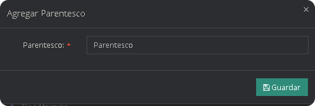
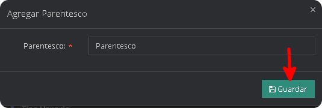
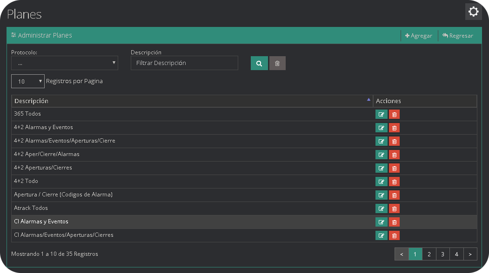
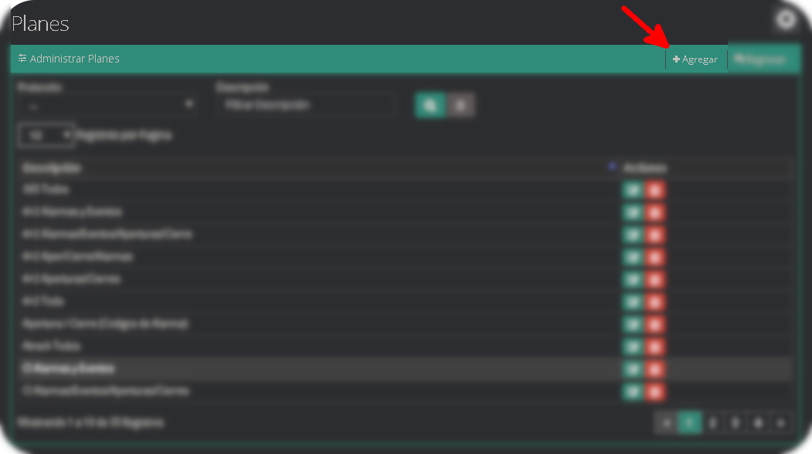
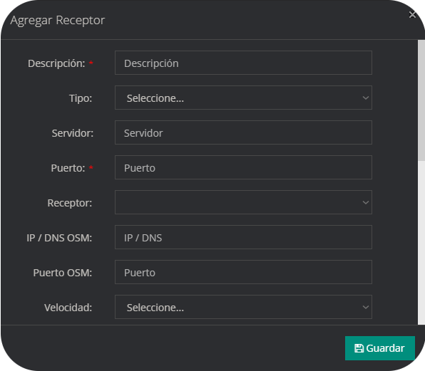
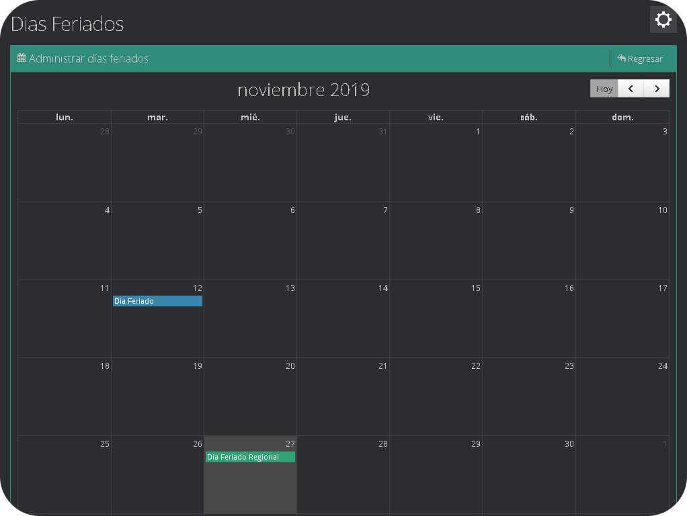
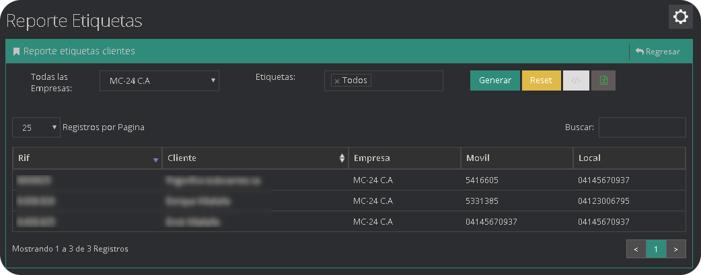

En el módulo Parámetros se establecen todas las opciones de configuración empresariales.

## Empresa

Desde este segmento se administran las empresas desde los tipos de dispositivos que puede agregar, asi como el quien monitoreo a esta empreasa, asi como caracteristicas mas especificas de la misma, como la ubicacion, el nombre, el rif, entre otros datos de contacto, en el contexto de este módulo, una empresa es cualquier ente que tenga clientes o dispositivos y que requiera servicios de monitoreo.

### ¿Cómo crear una Empresa?

- En el menu de administración de Empresa, pulse **Agregar**.

- Se desplegará un formulario que debe llenar con los datos del cliente.

| Campo | Descripción |
| ------------- | -------------- |
| `Nombre`| Nombre de la empresa |
| `RIF` | Documento de registro o numero de identificación de la Empresa |
| `País`  | Nación donde realiza sus actividades la empresa |
| `Estado` | Región del país en la que se encuentra la empresa |
| `Idioma ` | Selecciona el idioma que utiliza el cliente |
| `Zona Horaria` | Región horaria a la que pertenece |
| `Dirección ` | Localización física de la empresa |
| `Teléfono ` | Número de teléfono |
| `Correo` | Dirección valida para recepción de Emails |
| `Pagina Web` | Dirección de pagina web |
| `Latitud` | Coordenada de ubicación de la empresa |
| `Longitud` | Coordenada de ubicación de la empresa |
| `Sonido Pendiente` | Tiempo de activación de Sonido señales pendientes |
| `Hombre Muerto` | Tiempo de activación hombre |
| `Notificación Hombre` | Tiempo para notificar el estatus hombre |
| `Tiempo limite para señales transferidas ` | Tiempo que tiene el operador para aceptar una señal |
| `Tiempo de vencimiento señales pendientes` | Tiempo de vida de una señal pendiente |
| `Correos hombre muerto ` | Correos para notificar el estatus hombre muerto |
| `Tema web` | Tema visual de la empresa |
| `Estatus Monitoreo` | Activa o desactiva el monitoreo de dispositivos, lo cual impide/permite que lleguen señales monitoreables a dicha empresa |
| `Estatus Web` | Activa o desactiva el acceso web, lo cual permite gestionar el acceso de los clientes de esa empresa a la plataforma web |
| `Estatus SMS` | Activa o desactiva el envio de notificaciones sms a los dispositivos de esa empresa |
| `Estatus push` | Activa o desactiva el envio de notificaciones push a los dispositivos de esa empresa |
| `Radio para punto QR` | Distancia radial en la cual es válido escanear un código QR |
| `Empresa Monitorea` | Selector de la empresa que monitorea las señales |
| `Correo SMTP` | Dirección de correo electrónico para SMTP |
| `Clave Correo SMTP` | Contraseña de correo electrónico para SMTP |
| `Servidor SMTP`| Dirección de servidor SMTP|
| `Puerto SMTP` | Puerto para la configuración de SMTP |
| `Llave de Camaras Hikvision`| Clave (Key) del servidor donde esta alojado las camaras de [Hik-Connect](https://www.hik-connect.com/)|
| `Llave Secreta de Camaras Hikvision`| Clave Secreta (Secret) del servidor donde esta alojado las camaras de [Hik-Connect](https://www.hik-connect.com/)|
| `Risco Cloud VuPoint Id`| Id del servidor donde esta alojado la multimedia del protocolo Risco |
| `Risco Cloud VuPoint Password`| Clave del servidor donde esta alojado la multimedia del protocolo Risco |
| `SSL` | Activa o Desactiva el protocolo secure sockets layer |
| `Zona de Servicio` | Permite configurar una geocerca para los dispositivos SOS, para filtrar los eventos que se generen fuera de la geocerca en Eventos externos de la geocerca |
| `Eventos externos de la geocerca` | Permite o bloquea los eventos generados por dispositivos SOS que no se encuentren dentro del area designada en la Zona de Servicio |
| `Amigos en la app 365Sos` | Activa o Desactiva la opción de amigos en la app 365Sos |
| `Mapa en la app 365Sos` | Activa o Desactiva la opción de mapa en la app 365Sos |
| `Logo` | Seleccione el logo que desea visualizar en la empresa |
| `Logo Movil` | Seleccione el logo que desea visualizar en la app 365Sos |

### ¿Cómo agregar prefijos a una Empresa?

Una vez dentro de el modulo parámetros, luego entramos en el sub-modulo empresa y nos dirigimos al final del modal donde dice `Agregar Rango de Clientes`.

Seleccionamos el prefijo que queremos agregar.

En el inicio 0 y en el final 9999999999, para luego simplemente darle clic en agregar.Luego hacemos click en agregar.

:::warning Importante
Para que un prefijo sea visible debemos [**Agregar un Receptor**](./parametros.md#como-agregar-un-receptor) primero y luego [**Crear un Prefijo**](parametros#como-crear-un-prefijo)
:::

### ¿Cómo activar la zona de servicio?

La zona de servicio es una funcionalidad exclusiva de la empresa master y afecta unicamente a dispositivos con la app 365SOS, para activarla hay que utilizar la opción editar empresa, y ubicar el interruptor zona servicio.

Una vez activado aparecerá una nueva opción **Eventos externo de la geocerca** si se deshabilita esta opción solo se recibirán los eventos enviados dentro de la geocerca, en tal sentido, si un dispositivo envía un evento desde una posición geográfica fuera de la zona, entonces este evento sera ignorado por la plataforma.

Posteriormente se debe definir el área la zona de servicio, debe dirigirse al listado de empresas, y ubicar a la empresa master.

Aparecerá el siguiente botón , haga clic para establecer la geocerca.

Se abrirá una nueva ventana, donde se debe mover el mapa hasta encontrar la ubicación deseada.

Para mayor información sobre como dibujar geocercas, visite [¿Cómo agregar una geocerca?](./clientes.md#como-agregar-una-geocerca).

Una vez establecida la zona, presione el botón **guardar**

## Personalizacion SOS

Desde esta seccion se puede personalizar los paquetes de botones, los botones, el formulario de registro, ademas de los terminos y condiciones de uso de los dispositivos 365sos.

### Botones

En la pestaña de botones podemos observar los paquetes y los botones, asi como tambien una previsualizacion de como se mostrara, los cambios que hagamos en la aplicacion 365sos, sin la necesidad de tener un telefono a la mano o de ternerla descargada.

#### ¿Como agregar un paquete de botones?

- Para agregar un paquete de botones nuevo, nos ubicamos en la columna paquetes y hacemos clic en el boton agregar.

- La columna paquetes nos mostrara el campo para agregar el nombre del nuevo paquete.

- Agregado el nombre damos clic en guardar y se nos mostrara el nuevo paquete en la misma columna.

:::warning Importante
El punto verde especifica el paquete por defecto que esta siendo utilizado en los dispositivos 365sos y el paquete por defecto no puede ser modificado mientras este siendo usado.
:::

#### ¿Como clonar un paquete de botones?

- Para clonar un paquete de botones solo necesitamos ubicarnos en el paquete que deseamos seleccionar y presionar el boton clonar

- Luego se creara un nuevo paquete con el mismo nombre del paquete seleccionado y la palabra (clone) en su nombre.

#### ¿Como agregar un boton a un paquete de botones?

- Seleccionamos el paquete en el cual deseamos agregar un nuevo boton, al seleccionar el paquete se subrayara el mismo para saber sobre cual estamos trabajando.

- Luego en la columna de botones, le damos clic al boton agregar.

- Luego se nos desplegara un formulario con todos los campos que tenemos que llenar.

- Una vez llenado los campos el boton se creara, en la columna botones.

### Formulario de registro

En esta pestaña se muestra todos los campos que necesitara llenar un cliente que quiera registrarse en la aplicacion 365sos desde su telefono movil, a traves de la misma app. Hay 3 datos que son obligatorios los cuales son Movil, el cual se refiere al numero de telefono del usuario, el nombre del mismo, el cual elige el mismo usuario y la contraseña la cual es necesaria para hacer el registro. Los demas datos son opcionales y pueden variar.

### Terminos y condiciones de uso

En esta parte cada empresa puede colocar los terminos y condiciones de uso, que mas se le ajusten a sus requerimientos y necesidades, esto solo lo pueden modificar las empresas master y no es posible modificar esto en una sub empresa, lo que este en esta seccion sera lo mismo para el resto de los dispositivos sos sin importar si pertenecen o no a esa emrpesa.

## Configuración de Vehículos

El módulo de Configuración de Vehículos se divide en:

- Marcas, donde están almacenados nombres de fabricantes de vehículos.

### ¿Cómo agregar una Marca de Vehículo?

- En el Módulo, marca de vehículo pulse **Agregar**.

- Se redacta el nombre de la marca del vehículo en el campo descripción.

- Luego se pulsa el botón **Guardar**.

- Modelos, donde se establecen los diferentes modelos de vehículos.

Este apartado solo se utiliza cuando es necesario registrar una nueva Marca o Modelo.

### ¿Cómo agregar un Modelo de Vehículo?

- En el Módulo, modelo de vehículo pulse **Agregar**.

- Se selecciona la marca del vehículo y redactamos el nombre del vehículo en el campo modelo.

- Luego se pulsa el botón **Guardar**.

## Parentescos

En este apartado se registran y almacenan las relaciones de parentesco que pueden existir.

### ¿Cómo agregar un Parentesco?

- En el Módulo, Parentescos pulse **Agregar**.

- Se redacta el tipo de parentesco que se desea crear en el campo parentesco.

- Luego se pulsa el botón **Guardar**.

## Tipo de Dispositivo

El módulo de Tipo de dispositivo se utiliza para administrar los diferentes tipos de dispositivos registrados en la empresa, cuenta con una descripción, un logo, y es posible agregar nuevos, editarlos o eliminarlos.

### ¿Cómo agregar un Tipo de Dispositivo?

- En el Módulo, Tipo de Dispositivo pulse **Agregar**.

- Se selecciona la empresa, el tipo de dispositivo, se redacta la descripción y selecciona un icono para crear el tipo de dispositivo.

- Luego se pulsa el botón **Guardar**.

## Tipo de Cliente

En este Módulo se establecen los tipos de clientes.

### ¿Cómo agregar un Tipo de Cliente?

- En el Módulo, Tipo de Cliente pulse **Agregar**.

- Se selecciona la empresa y se redacta el tipo de cliente que se desea crear en el campo Descripción.

- Luego se pulsa el botón **Guardar**.

## Resoluciones

El administrador de Resoluciones permite listar, crear y modificar los mensajes predefinidos para el cierre de señales en el módulo de monitoreo.

### ¿Como agregar una resolución?

- En el Módulo, pulse **Agregar**.

- Se selecciona la empresa y se redacta el tipo de resolución que se desea crear en el campo mensaje.

- Luego se pulsa el botón **Guardar**.

## Configurar Eventos

### Eventos

El módulo de Administración de eventos, muestra los eventos registrados en la plataforma y esta compuesto por un código, descripción, protocolo, tipo de evento, prioridad y estatus monitoreo. En tal sentido también es posible modificar, eliminar y agregar nuevos eventos.

:::warning Importante
Los eventos configurados con prioridad de 1 a 3 se consideran eventos de emergencia y de 3 a 9 se consideran de no-emergencia.
:::

### ¿Como agregar un evento?

- En el Módulo de Eventos, pulse **Agregar**.

- Se desplegará un formulario que debe llenar con los datos del evento.

| Campo              | Descripción                                                                       |
| ------------------ | --------------------------------------------------------------------------------- |
| `Protocolo`        | Código y formas de comunicación que entiende la plataforma                        |
| `Código`           | Evento especifico del protocolo seleccionado                                      |
| `Descripción`      | Información descriptivo del evento                                                |
| `Tipo Evento `     | Lugar, persona o entidad a la que se le asigna el evento                          |
| `Grupo`            | Código de alarma relacionado al evento                                            |
| `Color`            | Color que se le quiere dar al texto del evento                                    |
| `Background`       | Color que se le quiere dar al relleno del evento                                  |
| `Demo`             | Demostración de como se mostrara el evento con el color del texto y el background |
| `Audio del Evento` | Sonido Configurable del evento                                                    |
| `Prioridad`        | Prioridad con la que se mostrara el evento el Módulo de monitoreo                 |
| `Monitoreo`        | Mostrara si el evento es o no monitoreable en la plataforma                       |
| `Autoprocesar`     | El evento se procesara de forma automática o no                                   |
| `Mensaje`          | Formato del mensaje para las notificaciones SMS, Push y Mail                      |
| `Variables`        | Variables que maneja el mensaje de la plataforma                                  |

- Una vez llenados todos los datos necesarios el evento sera creado.

### Planes

Los planes agrupan un conjunto de eventos de un protocolo determinado para seleccionar que eventos deben ser notificados al cliente. En tal sentido es posible modificar, editar, eliminar y agregar nuevos planes.

### ¿Como agregar un plan?

- En el Módulo de Planes, pulse **Agregar**.

- Se desplegará un formulario que debe llenar con los datos del plan, se deben seleccionar como llenar el plan por eventos y protocolo en especifico o por código de evento. Ademas puede agrupar diferentes eventos o códigos de eventos en un mismo plan.

- Luego de asignar los eventos, damos clic en el botón **Guardar**.

### Código de Alarmas

Agrupa los eventos de acuerdo al tipo de evento, sin importar el protocolo del mismo.

### ¿Como agregar un Código de Alarma?

- En el Módulo de Código de Alarmas, pulse **Agregar**.

- Se desplegará un formulario que debe llenar con los datos de los código de alarma.

| Campo                  | Descripción                          |
| ---------------------- | ------------------------------------ |
| `Código              ` | Identificador único de la señal      |
| `Descripción   `       | Descripción de la señal              |
| `Color   `             | Color de la fuente                   |
| `Background     `      | Color de fondo                       |
| `Demo   `              | Previsualización de la señal         |
| `Audio   `             | Sonido especifico para este señal    |
| `Grupo   `             | Conjunto donde sera añadido la señal |

### Grupo Código de alarmas

Agrupa los código de alarmas de acuerdo a su finalidad.

### ¿Como agregar un Grupo Código de alarmas?

- En el Módulo de Grupo Código de Alarmas, pulse **Agregar**.

- Selecciona el nombre del Grupo en el campo descripción, el color del grupo y luego damos clic en **Guardar**.

## Departamentos

En esta sección permite administrar los departamentos que posee la empresa, lo que incluye visualizar una lista de los departamentos compuesta por el Nombre, el Correo del mismo y las Acciones, las cuales permiten agregar un departamento, editar uno existente y eliminar antiguos departamentos ahora inexistentes.

### ¿Como agregar un Departamento?

- En el Módulo de departamento, pulse **Agregar**.

- Se desplegará un formulario que debe llenar con los datos del departamentos.

| Campo            | Descripción                                     |
| ---------------- | ----------------------------------------------- |
| `Empresa       ` | Empresa a la cual sera agregado el departamento |
| `Nombre   `      | Nombre del departamento                         |
| `Correo   `      | Correo del departamento o persona encargada     |
| `Encargado     ` | Nombre del encargado                            |
| `Teléfono   `    | Teléfono del departamento o del encargado       |

## Motivos Soporte Clientes

Esta sección permite administrar los motivos de soporte, también concede las opciones agregar un motivo, editar los mismos u otros existentes, y eliminar motivos temporales que fueron erradicados con las actualizaciones dadas por el equipo de programación,
además posee los filtros característicos de registro por página y texto explícito.

### ¿Como agregar un Motivo de Soporte?

- En el Módulo de Motivo de Soporte, pulse **Agregar**.

- Se desplegará un formulario que debe llenar con los datos de motivo soporte y **Guardar**.

| Campo             | Descripción                                          |
| ----------------- | ---------------------------------------------------- |
| `Empresa       `  | Empresa a la cual sera agregado el motivo de soporte |
| `Departamento   ` | Seleccione un departamento                           |
| `Descripción   `  | Motivo del soporte                                   |

## Receptores

El administrador de receptores es el módulo en el cual se configuran Los receptores físicos y virtuales.

### ¿Como agregar un Receptor?

- En el Módulo de Receptores, pulse **Agregar**.

- Se desplegará un formulario que debe llenar con los datos del receptor.

### ¿Como crear un Prefijo?

- Una vez rellenada la información del receptor, debemos proceder con la creacion de un prefijo, para ello debemos asignar una linea, el prefijo que deseemos crear y una breve descripción del mismo, por ultimo presionamos **Agregar**.

| Campo              | Descripción                                                     |
| ------------------ | --------------------------------------------------------------- |
| `Descripción`      | Nombre del Receptor                                             |
| `Tipo`             | Forma de Conexión del Servidor                                  |
| `Servidor`         | Dirección IP del Servidor                                       |
| `Puerto`           | Puerto por el cual se Conecta el Software                       |
| `Receptor`         | Marca del Receptor Ingresado                                    |
| `IP / DNS OSM`     | Dirección donde esta el OSM Console                             |
| `Puerto OSM`       | Puerto para el envio de comandos al OSM Console                 |
| `Velocidad`        | Localización Física del cliente                                 |
| `Paridad`          | Método de Validación de Datos                                   |
| `Bits`             | Cantidad de Datos de Transmisión del Receptor                   |
| `ACK`              | Mensaje de comunicación de confirmación de transmisión de datos |
| `Stop Bits`        | Parada de Cantidad de Datos de Transmisión cada Cierto Tiempo   |
| `Estatus`          | Estado del Receptor                                             |
| `Prefijo`          | Numero de Inicio del Dispositivo                                |
| `Tiempo de espera` | Tiempo de espera                                                |
| `Lineas`           | Linea telefonica conectada al receptor                          |

## Días Feriados

Lo compone un calendario desde el cual es posible editar, eliminar y agregar Días feriados.

### ¿Como agregar Dias Feriados?

- Seleccionamos el dia que queremos agregar un dia feriado.

- Se nos abrira un modal con la fecha del dia seleccionado, elegimos si el dia feriado es nacional o regional, seleccionamos el pais donde se encuentra la empresa y una descripcion del dia feriado.

- Luego simplemente hacemos clic en el boton guardar.

Al final deberia mostrarse la descripcion del dia feriado con un sombreado azul, en el dia que fue asignando ese feriado.

:::warning Importante
los dias feriados se veran en el modulo de ordenes de servicios al momento de asignar una actividad, [calendario](./ordenes-de-servicio.md#calendario).

<!--- Link de Hipervinculo dentro del documento --->

:::

## Dispositivos

### Dispositivo Tipo

### ¿Como agregar un Dispositivo Tipo?

- En el Módulo de dispositivo tipo, pulse **Agregar**.

- Se redacta la descripción del tipo y luego damos clic en **Guardar**.

### Dispositivo Sub-Tipo

### ¿Como agregar un Dispositivo Sub-Tipo?

- En el Módulo de Dispositivo Sub-Tipo, pulse **Agregar**.

- Se selecciona la tipo de dispositivo, damos la descripción que querremos al dispositivo y damos clic en **Guardar**.

### Dispositivo Marca

### ¿Como agregar un Dispositivo Marca?

- En el Módulo de Dispositivo Marca, pulse **Agregar**.

- Se redacta la descripción que queramos a la marca y damos clic en **Guardar**.

### Dispositivo Modelo

### ¿Como agregar un Dispositivo Modelo?

- En el Módulo de Dispositivo Modelo, pulse **Agregar**.

- Se desplegara un formulario con todos los campos que tenemos que completar para poder agregar un nuevo dispositivo modelo, introducimos la descripcion del nuevo dispositivo modelo que queremos crear o editar.

- Despues seleccionamos la marca del dispositivo modelo, que queremos crear o que hemos creado previamente.

- Luego seleccionamos un tipo de la lista de tipos de dispositivos creados.

- Se elige el subtipo a crear entre los subtipos existente del modelo.

- y por ultimo seleccionamos el protocolo del modelo que vamos a crear.

- Presionamos el boton de guardar y listo, tenemos un nuevo modelo creado.

| Campo         | Descripción                                                                |
| ------------- | -------------------------------------------------------------------------- |
| `Descripción` | Nombre del modelo                                                          |
| `Marca`       | Marca del modelo                                                           |
| `Tipo`        | Tipos de dispositivos creados                                              |
| `Sub Tipo`    | Subtipos de dispositivos creados                                           |
| `Protocolo`   | Protocolos creados                                                         |
| `String RTSP` | The Real Time Streaming Protocol (Protocolo de transmisión en tiempo real) |

### Dispositivo Manual

### ¿Como agregar un Dispositivo Manual?

- En el Módulo de Dispositivo Manual, pulse **Agregar**.

- Se redacta la descripción, el tipo, el URL y el archivo del manual y damos clic en **Guardar**.

| Campo         | Descripción                                   |
| ------------- | --------------------------------------------- |
| `Descripción` | Nombre del equipo al cual pertenece el manual |
| `Tipo`        | Seleccione un tipo de manual                  |
| `URL`         | Dirección web de la ubicación del manual      |
| `Archivo`     | Documento PDF a guardar                       |

## Mensajes Predefinidos llamadas

En el se establecen los mensajes predefinidos al realizar una llamada desde el módulo de monitoreo.

### ¿Como agregar un Mensajes Predefinidos llamadas?

- En el Módulo de Mensajes Predefinidos llamadas, pulse **Agregar**.

- Se selecciona la empresa, se redacta el mensaje predefinido y damos clic en **Guardar**.

## Modems

Este apartado está compuesto por una lista por los campos siguientes Puerto, Velocidad,Bits, Prioridad, Paridad Stops Bits y Acciones, así mismo disfruta de los filtros característicos como el Registro por Pagina, y la búsqueda de texto explicito, además se
pueden agregar otros puertos para configurar su funcionamiento.

### ¿Como agregar un Modems?

- En el Módulo de Modems, pulse **Agregar**.

- Se redacta el puerto, la velocidad, la paridad, el bits, el stop bits y damos clic en **Guardar**.

| Campo       | Descripción                       |
| ----------- | --------------------------------- |
| `Puerto`    | Puerto utilizado por el módem     |
| `Velocidad` | Seleccione la velocidad del modem |
| `Paridad`   | Seleccione la paridad             |
| `Bits`      | Seleccione el bits                |
| `Stop Bits` | Seleccione el stop bits           |

## Zona Clientes

Al hacer clic en este sección se abre una nueva ventana, la cual permite visualizar un listado de las zonas que atiende o presta servicio la empresa, como se ve en la imagen la zona de barinas, y la zona de sabaneta, además se ve toda el área que abarcan dichas
zonas medidas en km2, además permite agregar nuevas zonas a medida que se vaya ampliando la empresa, modificar las zonas actuales que atienden y/o eliminar parcial o completamente zonas existentes.

### ¿Como agregar un Zona Clientes?

- En el Módulo de Zona Clientes, pulse **Agregar**.

- Se selecciona la empresa, se redacta la nombre de la geocerca, se selecciona el color de la geocerca y damos clic en **Guardar**.

## Respaldo

La opción de respaldo genera un archivo .bak donde se almacena una copia de seguridad de la base de datos.

La base de datos generada se guarda en la carpeta <code> C:\xampp\htdocs\365\backupDB.</code>

## Etiquetas

En el módulo de Etiquetas se agregan, modifican y eliminar las etiquetas que se pueden asignar a Clientes o Dispositivos.

## 365 Config

En este apartado se configuran las direcciones y puertos que utilizan las diferentes tecnologías que componen la plataforma 365Connect Pro.

## Serial

En el se establece el serial del producto.

