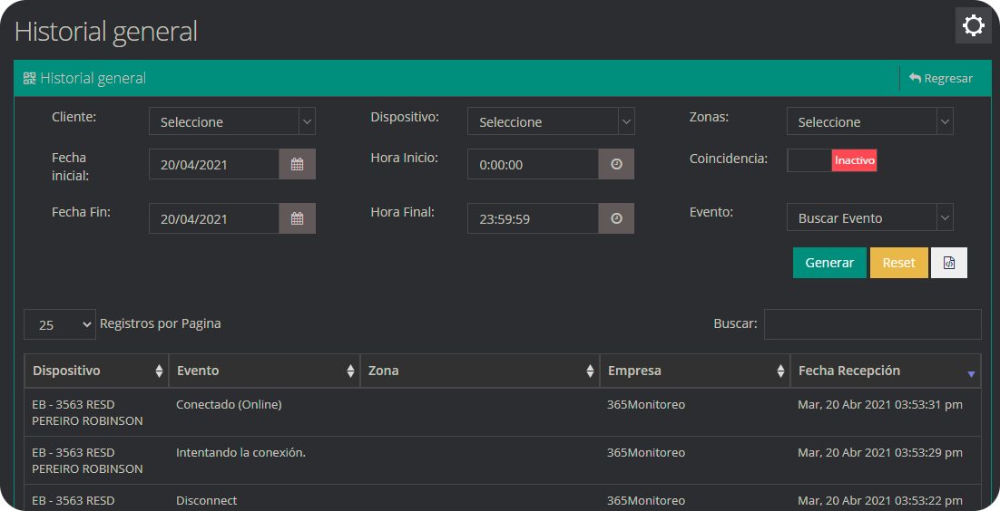

Este modulo esta diseñado para que los usuarios pertenecientes a la empresa puedan cuantificar y obtener a un registro desde los tipos de señales recibidas en la plataforma, los estatus de los dispositivos, el registro de acciones de usuarios hasta los gps sin comunicar. 

Los reportes son informes que organizan y exhiben la información contenida en una base de datos de forma detallada. Su función es aplicar un formato determinado a los datos para mostrarlos por medio de un diseño atractivo y que sea fácil de interpretar por los usuarios

## Activaciones

El sub modulo Activaciones expone los Dispositivos con más activaciones de Eventos, filtrando entre un intervalo de fechas y tipo de dispositivo. Esta compuesto por un segmento que muestra un gráfico de barras con los dispositivos que presentan mayor número de activaciones y una tabla donde se listan con mayor detalle los datos.

### ¿Cómo generar un reporte de activaciones?
* Seleccione la fecha inicial y la fecha final

* Seleccione el tipo de dispositivo del cual desea información sobre activaciones

* Presione el Botón **Generar**, de color verde para visualizar el reporte.

* Puede seleccionar el botón de Excel o PDF para generar un archivo de reportes general de todos los dispositivos.

* Ademas también se puede generar un reporte individual por cada dispositivo.

## Grupo Señal

Exhibe el porcentaje de señales generadas en un tiempo determinado y agrupadas según el tipo de señal. Esta compuesto por un segmento que muestra en forma de gráfica tipo dona el porcentaje de señales generadas.

### ¿Cómo generar un reporte Grupo Señal?
* Seleccione la fecha de inicio y la fecha final

* Presione el botón Buscar para visualizar el reporte.

* En este reporte podemos observar los tipos de señales, el total de activaciones y el numero de activaciones en cada tipo. 

* También podemos filtrar las señales que deseemos visualizar en la grafica al presionar en los
botones de la lista ubicada en la parte izquierda.

## Código de Alarmas

Permite ver los dispositivos con señales filtradas de acuerdo a su código de Señal y grupo de Señal. Está compuesto por una tabla que lista los dispositivos que cumplan con el grupo y código de señal seleccionado.

### ¿Cómo generar un reporte Código de Alarmas?
* Seleccione la fecha de inicio y la hora de inicio

* Seleccione la fecha final y la hora final

* Presione el Botón **Generar**, de color verde para visualizar el reporte. 

## SMS Total por Cliente

El sub modulo SMS Total por Cliente esta compuesto por una ventana en donde se puede contemplar un gráfico del numero de mensajes enviados a cada cliente que esta afiliado a la empresa, solo introduciendo una f echa inicial en el primer campo-calendario,ademas de una fecha final en el segundo.

En la lista que muestra este modulo se puede generar un reporte detallado de cada dispositivo, con el numero al cual se contacto, el mensaje y la fecha que se emitió el mensaje.

## SMS Entrada
Lista los mensajes de texto recibidos por la empresa

## Cliente Notificaciones
Permite observar en detalle las Notificaciones configuradas para todos los dispositivos y es posible filtrar de acuerdo al tipo de notificación, estatus de notificación y la empresa.

## Estatus Panel

El sub modulo Estatus Panel esta constituido por un gráfico en el cual se muestra las apertura y los cierre de todos los locales, para mostrar estos datos es necesario introducir una fecha inicial ademas de una fecha final, para después hacer clic en el botón buscar para visualizar dicha información y con el botón reset se puede limpiar las dos fechas para volver a introducirlas.

## Estatus Dispositivos
Muestra información referente a los dispositivos pertenecientes a una empresa.

## Linea Receptor
Permite observar en detalle por que receptor y linea ingresaron las señales en un tiempo determinado. Este sub módulo muestra una gráfica, y una tabla con el detalle de las señales.

En el detalle de linea se muestra el prefijo junto con el numero del dispositivo,  el alias y la dirección del mismo.

## Dispositivo

Permite observar la cantidad de dispositivos que posee la plataforma, ademas muestra el reporte muestra el nombre del cliente, con el alias, el numero, la empresa y la fecha del ultimo reporte divididos por el tipo de cada uno de ellos y el muestra una tabla con la cantidad de total dispositivos

### ¿Cómo generar un reporte Dispositivo?
* seleccione los parámetros pertinentes o necesarios y le damos clic en **Generar**.

## Ficha Dispositivo

Permite generar el reporte de un dispositivo con los Datos del Dispositivo, los Datos del Servicio, las Zonas, los Usuarios del Sistema, los Contactos, los Horarios, Las Notificaciones y Los Servicios.

### ¿Cómo generar un reporte Ficha Dispositivo?
* Seleccione el dispositivo, las pestañas que deseas mostrar en el reporte y damos clic  en  **Generar**. 

:::warning[Importante]
Se pueden seleccionar todos los dispositivos dentro del reporte Ficha Dispositivo.
:::

## Panel Alarmas sin Coordenadas

Muestra la información de los dispositivos de tipo central de alarma sin coordenadas.

:::warning[Importante]
Se puede asignar la ubicación desde esta sección.
:::

### ¿Cómo asignar una ubicación desde Panel Alarmas sin Coordenadas?

* Haz clic en el boton que tiene un "Pin" como símbolo.

* Se abrira una ventana con un mapa en donde podremos elegir la ubicación del dispositivo con solo dar clic en el lugar
que deseemos, posteriormente hacemos clic en la opción **Guardar Ubicación**

:::warning[Importante]
Puedes hacer **Zoom In** para asignar el lugar con mayor presición.
:::

### ¿Cómo generar un reporte Panel Alarmas sin Coordenadas?
* Seleccione la empresa, se busca por Dispositivo, Alias, Ciudad, Dirección y se generara la búsqueda automáticamente. 

## Cliente sin Imagen

Muestra la información todos los Clientes que no posean imagen.

:::warning[Importante]
Se puede colocar el nombre para una busqueda mas especifica.
:::

### ¿Cómo asignar una imagen desde Cliente sin Imagen?

* Haga clic en el boton de **Agregar Imagen** en el dispositivo al que desee asignar.

* Luego haga clic en **Seleccione Imagen**.

* Seleccione la imagen que desee asignar.

* Por ultimo haga clic en **Guardar** para confirmar.

:::warning[Importante]
Se puede cambiar o remover la imagen asignada en caso de cambiar de opinion.
:::

## Clientes Empresas

Muestra la información general de las empresas conectadas a la plataforma como la Cantidad de clientes. los clientes activos con SMS, cantidad teléfonos SMS, cantidad SMS enviados, clientes con horarios, entre otros.

## Cliente Ultima Señal

Muestra el ultimo evento recibido por el dispositivo, junto con la fecha que recibió el evento, ademas cuantos días tiene sin transmitir y la partición por donde se envió el evento.

### ¿Cómo generar un reporte Cliente Ultima Señal?
* Seleccione el tipo de dispositivos, el tipo de señal, el tiempo, El estatus del monitoreo, Empresa y damos clic  en  **Generar**.

## Dispositivo Ultima Apertura o Cierre

Muestra el ultimo evento de armado o desarmado que recibido el dispositivo, junto con la fecha que lo recibió, los días transcurrido desde que recibió el evento y la partición por la que se envió.

### ¿Cómo generar un reporte Dispositivo Ultima Apertura o Cierre?
* Seleccione el estatus de la alarma, el tipo de cliente, la Empresa y damos clic  en  **Generar**.

## Log de Usuarios

Permite observar información detallada de cada uno de los movimientos de distintos usuarios en la plataforma, ademas de poseer varios tipos de filtros.

### ¿Cómo generar un reporte Log de Usuarios?
* Seleccione la Acción, el Detalle, el Usuario, el Dispositivo, la Empresa, una fecha de inicio y una fecha final, y damos clic  en  **Generar**.

## Historial Detallado del Dispositivo

Genera un reporte detallado de un dispositivo o cliente de cualquier empresa, en un periodo de tiempo, el cual te permite filtrar por grupo o evento, ademas permite observar otros parámetros como detalles del operador, observaciones y categorías, asi mismo filtrarlos de forma ascendente o descendente.

### ¿Cómo generar un Historial Detallado del Dispositivo?
* Seleccione la Empresa, el Tipo de Búsqueda, el Dispositivo, el Grupo de eventos o por eventos, los detalles necesarios, un orden ascendente o descendente y damos clic  en  **Generar**.

## Operadores Monitoreo

Permite generar una gráfica y un listado de las señales procesadas por un operador ya sea por sesiones o por una fecha en específico incluido el tiempo que se tardó en procesarlas, ademas se puede filtrar por empresas el operador, este reporte se genera en excel.

### ¿Cómo generar un reporte de Operadores Monitoreo?
* Seleccione la Empresa, el Operador que deseamos buscar, el Tipo de reporte por sesiones o por fechas, el Grupo de la señal, el Código de la señal, la Diferencia de tiempo entre el momento en que llegó la señal y el que fue procesada y damos clic  en  **Generar**.

## Inicio/Vencimiento Dispositivos

Muestra una lista con el cliente, el dispositivo, el alias, el tipo de dispositivo, fecha de inicio, el tiempo instalado y la empresa. Esta lista se puede filtrar por empresa, por tipo de dispositivo, y tipo de reporte, inicio o vencimiento.

### ¿Cómo generar un reporte de Inicio/Vencimiento Dispositivos?
* Seleccione la Empresa, el Tipo de Dispositivo, el Tipo de reporte, una fecha de inicio junto con una fecha final y damos clic  en  **Generar**.

## GPS sin Comunicar

Genera una lista con los dispositivos, los clientes, el alias, ultimo reporte y el tiempo puede ser filtrado en horas, minutos y segundos, ademas de por empresa.

## Etiquetas Clientes

Este Modulo permite crear y listar etiquetas para los clientes mostrando los datos rif, cliente, empresa, teléfono movil y teléfono local, ademas permite filtrar estas etiquetas por empresa o por el nombre de la etiqueta, siendo posible generar un reporte en excel.

## Etiquetas Dispositivos

Este Modulo permite crear y listar etiquetas para los dispositivos mostrando los datos rif, dispositivo, empresa, teléfono movil y teléfono local, ademas permite filtrar estas etiquetas por empresa o por el nombre de la etiqueta, siendo posible generar un reporte en excel.

## Historial de Comandos

Permite mostrar el historial de comandos de un dispositivo, para eso simplemente seleccionamos el dispositivo.

* Lo primero que haremos es seleccionar el dispositivo del cual queremos ver el historial del comando.

* Despues seleccionamos el usuario que queremos saber que envio comandos, si no seleccionamos un usuario en especifico, por defecto se seleccionaran todos los usuarios de ese dispositivo.

* Luego seleccionamos el nombre del comando que queremos buscar y el tipo de canal por donde se envio, si es GPRS, SMS o TCP, si no se selecciona un comando en especifico se seleccionaran todos los comandos.

* Por ultimo seleccionamos la fecha y la hora entre la que deseamos filtrar.

* Luego simplemente hacemos clic en el boton generar y se nos mostrara el historial con los filtros que utilizamos.

## Historial general

Este Modulo lista el historial de todos los dispositivos pertenecientes a todas las empresas, permite filtrar por evento y un intervalo de fechas. Si selecciona un cliente permite ver señales de todos los dispositivos que pertenezcan a él o especificar la zona donde se producen estos eventos

## Eventos

Permite mostrar reportes relacionados con los eventos.

### Eventos No Definidos

Este reporte permite capturar o guardar eventos no registrado o definidos por nuestra plataforma junto con el código del evento y el protocolo al que pertenece. 

### Eventos Incluyentes/Excluyentes

Este reporte muestra una lista de eventos los cuales están en la sección de eventos incluyentes y excluyentes.

### Switch de Eventos

Este reporte muestra una lista de eventos los cuales están en la sección de switch de eventos.

### Eventos Cronometrados

Este reporte muestra una lista de eventos los cuales están en la sección de eventos cronometrados.

