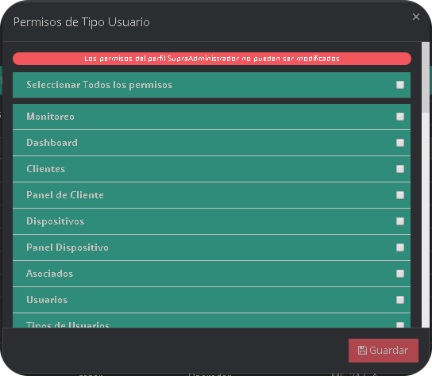
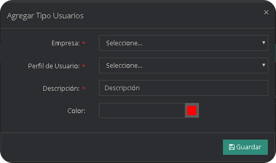
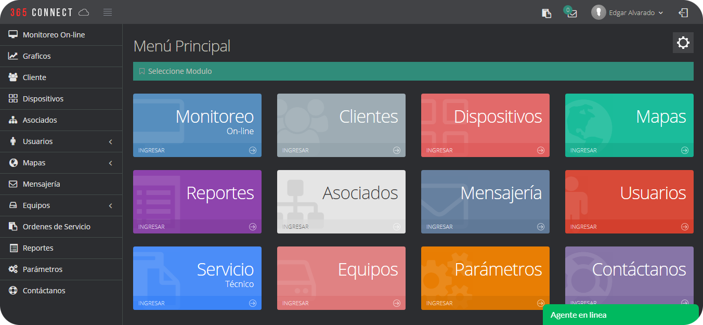

Los usuarios son todos los empleados pertenecientes a la empresa, cada usuario posee un tipo de usuario el cual dependiendo de los permisos asignados puede observar, acceder y editar información en los distintos módulos que posee la plataforma. Al ingresar al modulo de usuarios se presentaran dos sub-módulos el sub-modulo usuarios y el sub-modulo tipos de usuarios.

El sub-modulo Usuarios se compone por una lista donde se muestra el nombre de la persona, el nombre de usuario, el tipo de usuario, la empresa a la que pertenece y el estatus del usuario, el cual solo puede tener dos estados activo e inactivo, si el estado es inactivo el usuario no podrá acceder a la plataforma con ese usuario.

## Menu de Opciones de usuario

Para acceder a las opciones de usuario para editar, eliminar, cambiar o restablecer permisos, diríjase hasta el usuario de interés; a la derecha ubique los botónes de colores.

### ¿Cómo agregar un usuario?
* En el menu de administración de Usuarios, pulse **Agregar**.

* Se desplegará un formulario que debe llenar con los datos del usuario.

|Campo           |Descripción                                                        |
|----------------|-------------------------------------------------------------------|
|`Empresa`        |Nombre de la Empresa a la cual pertenece            |
|`Tipo`      | Selecciona el tipo de usuario     |
|`Cedula`   |Documento de identidad o numero de identificación del usuario     |
|`Nombre `   |Nombre del usuario, sea persona u organización |
|`Idioma `|Seleccione el idioma que visualizara en la plataforma          |
|`Dirección `         |Localización física del cliente       |
|`Correo Electrónico `|Dirección valida para recepción de Emails        |
|`Teléfono Fijo `         |Número de teléfono fijo del usuario|
|`Teléfono Movil `         |Número de teléfono movil del usuario|
|`Usuario`         |Nombre del usuario para acceder a la plataforma|
|`Clave `         |Contraseña del usuario para acceder a la plataforma|
|`Rep. Clave `         |Repetir nuevamente la Contraseña|
|`Relacionar en todas las Ordenes de Servicio`|Relacionar directamente a este usuario con las ordenes de servicio|
|`Notificaciónes Servicio técnico: `         |Mostrar las notificaciónes de servicio técnico mediante SMS o correo electrónico|
|`Acceso Remoto`         |Poder acceder fuera de la red lan a la plataforma|
|`Imagen`         |Representación fotográfica del cliente|

### ¿Cómo editar un usuario?
* Localice el usuario que desea editar, ubique el Menu de opciones

* Seleccione el botón Editar usuario, de color azul.

* Efectué las modificaciones dentro del formulario y presione el botón Guardar

### ¿Cómo eliminar un usuario?
* Localice el usuario que desea eliminar, ubique el Menu de opciones

* Seleccione el botón eliminar usuario, de color rojo.

* Confirme que desea eliminar el usuario.

### ¿Cómo modificar los permisos de un usuario?

La entrega de permisos se hacen mediante una lista, la cual está compuesta por todos los módulos a utilizar, además de las acciones que se pueden realizar en el mismo, junto con una casilla de verificación ubicada en la part e derecha de la acción, así mismo cuando una casilla de verificación este marcado o seleccionado indicara que se le ha otorgado esta acción al usuario como se muestra en la imagen.

* Localice el usuario al que desea modificar los permisos, ubique el Menu de opciones

* Seleccione el botón Permisos, de color aguamarina.

* Se desplegará una lista con todos los permisos que se le puede otorgar a un usuario en específico, se marcan o seleccionan los permisos que se le quieran otorgar y se desmarcan los que se quieran retirar.

### ¿Cómo Restaurar los permisos de un usuario?
* Localice el usuario que desea eliminar, ubique el Menu de opciones

* Seleccione el botón eliminar usuario, de color amarillo.

* Confirme que desea restaurar el usuario.

## Tipos de Usuario

El sub-modulo de Tipos de usuario permite visualizar una lista con los tipos de usuario que existen para configurar cada tipo, además se puede agregar nuevos tipos de usuario, editar el nombre pero no necesariamente la función que cumple, eliminar un tipo existente y modificar el rol que se le asigne o cumple mediante los permisos que s ele otorgan.

Los tipos de usuarios creados por defecto en la plataforma son:

#### Lista de Tipos de Usuarios

|Cantidad|Tipo|
|:--:|:--:|
|1|Master|
|2|Operador|
|3|Administracion|
|4|Tecnico|
|5|Jefe Consola|
|6|Jefe de Departamento Tecnico|

:::tip Nota 
Se pueden agregar mas tipos de usuarios de los que vienen creados por defecto o personalizar los ya creados, asi mismo editar los permisos de los diferentes tipos de usuarios.
:::

## Menu de Opciones de Tipos de Usuario

Para acceder a las opciones de tipos de usuario para editar, eliminar, cambiar o restablecer permisos, diríjase hasta el tipos de usuario de interés; a la derecha ubique los botónes de colores.

### ¿Cómo agregar tipos de usuario?
* En el menu de administración de tipos de usuarios, pulse **Agregar**.

* Se desplegará un formulario donde debe llenar los datos cómo, Perfil de Usuario, Descripción del tipo de Usuario y el color. Presione el botón guardar para almacenar el nuevo tipo de usuario.

|Campo           |Descripción                                                        |
|----------------|-------------------------------------------------------------------|
|`Empresa`|Seleccione la Empresa a la que se le desea agregar el tipo de usuario|
|`Perfil de Usuario`      | Seleccioné un Perfil de Usuario   |
|`Descripción`   |Elija el Nombre del Tipo de Usuario     |
|`Color `   |Seleccione el Color del Tipo de Usuario |

### ¿Cómo editar tipos de usuario?
* Localice el tipo de usuario que desea editar, ubique el Menu de acciones

* Seleccione el botón Editar cliente, de color azul.

* Haga las modificaciones dentro del formulario y presione el botón Guardar

### ¿Cómo eliminar un tipo de usuario?
* Localice el tipo de usuario que desea editar.

* Seleccione el botón eliminar cliente, de color rojo.

* Confirme que desea eliminar el tipo de usuario.

### ¿Cómo asignar permisos a un tipo de usuario?
* Localice el tipo de usuario al que desea asignar los permisos, ubique el Menu de opciones

* Seleccione el botón Permisos, de color aguamarina.

* Se desplegará una lista con todos los permisos , se marcan o seleccionan los permisos que se le quieran otorgar y se desmarcan los que se quieran retirar. 

## Lista de Permisos

### Monitoreo  

* **Señales por Procesar:** Habilita la visualización de la pestaña ubicada en el modulo monitoreo, donde se mostraran las señales entrantes de los dispositivos.
* **Señales Pendientes:** Habilita la visualización de la pestaña ubicada en el modulo monitoreo, donde se mostraran las señales procesadas como pendientes o en espera.
* **Todas las señales:** Habilita la visualización de la pestaña ubicada en el modulo monitoreo, donde se muestran todas las señales monitoreables o no.
* **Señales Procesadas:** Habilita la visualización de la pestaña ubicada en el modulo monitoreo, donde se muestran solo las señales monitoreables.
* **Cierre Señal:** Habilita el acceso para procesar de manera apropiada una determinada cantidad de señales de un mismo origen, según el tipo de señal.
* **Cierre / Señales Seleccionadas:** Permite el acceso al componente de selección de señales.
* **Cierre / Por Cliente:** Permite seleccionar la opción de filtrado de señales por dispositivos, en la pestaña de Acción por lote.
* **Cierre / Por Código de Evento:** Permite seleccionar la opción de filtrado de señales por su código, en la pestaña de Acción por lote.
* **Cierre / Por Código de Señal:** Permite seleccionar la opción de filtrado de señales por el ID del evento o el nombre, en la pestaña de Acción por lote.
* **Cierre/ Todas las Señales:** Permite seleccionar la opción de mostrar todos los tipos de señales.
* **Volumen de Alarma:** Habilita la opción para activar o desactivar el sonido en el monitoreo.
* **Editar Observaciones en Historial de la Señal:** Permite el editar las observaciones creadas automáticamente por el software en el historial de la señal.
* **Simular Señal:** Habilita la opción para simular una señal en el monitoreo.

### Dashboard 

* **Listar dashboard:** Permite observar los modulos en la ventana principal luego de acceder a la plataforma.

### Clientes 

* **Listar Clientes:** Permite observar la lista de clientes.
* **Crear Clientes:** Permite agregar clientes.
* **Editar Clientes:** Permite editar clientes.
* **Eliminar Clientes:** Permite eliminar clientes.
* **Crear Login Clientes:** Permite editar el login y la clave del cliente.
* **Cambiar Estatus:** Habilita la opción de cambiar el estatus web del cliente.

### Panel de Cliente

* **Usuarios / Listar:** Permite listar usuarios en el panel clientes.
* **Usuarios / Agregar:** Permite agregar usuarios en el panel clientes.
* **Usuarios / Editar:** Permite editar usuarios en el panel clientes.
* **Usuarios / Eliminar:** Permite eliminar usuarios en el panel clientes.
* **Geocercas / Listar:** Permite listar geocercas en el panel clientes.
* **Geocercas / Agregar:** Permite agregar geocercas en el panel clientes.
* **Geocercas / Editar:** Permite editar geocercas en el panel clientes.
* **Geocercas / Eliminar:** Permite eliminar geocercas usuarios en el panel clientes.
* **Marcadores / Listar:** Permite listar marcadores en el panel clientes.
* **Marcadores / Agregar:** Permite agregar marcadores en el panel clientes.
* **Marcadores / Editar:** Permite editar marcadores en el panel clientes. 
* **Marcadores / Eliminar:** Permite eliminar marcadores en el panel clientes.
* **Usuarios / Cambiar Permisos:** Permite editar los permisos de usuarios del panel clientes.
* **Usuarios / Cambiar Dispositivos Asignados:** Permite editar los dispositivos asignados al usuario del panel clientes.
* **Etiquetas / Asignar:** Permite asignar etiquetas en el panel clientes. 
* **Etiquetas / Remover:** Permite remover etiquetas del panel clientes. 
* **Etiquetas / Listar:** Permite Listar etiquetas en el panel clientes. 
* **Notificaciónes / Listar:** Permite Listar las notificaciónes en el panel clientes. 
* **Notificaciónes / Agregar:** Permite agregar las notificaciónes en el panel clientes. 
* **Notificaciónes / Editar:** Permite editar las notificaciónes en el panel clientes.
* **Notificaciónes / Eliminar:** Permite eliminar las notificaciónes en el panel clientes.

### Dispositivos

* **Listado de Dispositivos:** Permite observar la lista de dispositivo, en el panel cliente y en el modulo dispositivos.
* **Crear Dispositivo:** Permite agregar dispositivo.
* **Cambiar Estatus:** Permite modificar los diferentes estatus de los dispositivos.
* **Panel del Dispositivo:** Permite mostrar el panel de dispositivo, en las pestañas del panel cliente.
* **Eliminar Dispositivo:** Permite habilitar la opción eliminar en el panel de dispositivo, en las pestañas dle panel cliente. 
* **Enviar Comando:** Permite enviar comandos en el panel de dispositivos.

### Panel Dispositivo

* **Editar Dispositivo:** Permite habilitar el botón de editar en el modulo de dispositivos en la pestaña de dispositivo.
* **Zonas / Listar:**  Permite mostrar la lista de Zonas en la pestaña zonas existente en el panel del dispositivo. 
* **Zonas / Agregar:** Permite habilitar el botón de agregar zonas nuevas.
* **Zonas / Editar:** Permite habilitar el botón de editar zonas.
* **Zonas / Horario:** Permite habilitar el botón de agregar un horario en una zona.
* **Zonas / Descargar PanicPc:** Permite habilitar el botón para descargar el panicPc.
* **Zonas / Imprimir QR:** Permite habilitar el botón para imprimir códigos QR.
* **Zonas / Eliminar:** Permite habilitar el botón de eliminar zonas.
* **Usuarios / Listar:** Permite mostrar la lista de usuarios en la pestaña usuarios existente en el panel del dispositivo.
* **Usuarios / Agregar:** Permite habilitar el botón de agregar usuarios.
* **Usuarios / Editar:** Permite habilitar el botón de editar usuarios.
* **Usuarios / Eliminar:** Permite habilitar el botón de eliminar usuarios.
* **Contactos / Listar:** Permite mostrar la lista de contactos en la pestaña contactos existente en el panel del dispositivo.
* **Contactos / Agregar:** Permite habilitar el botón de agregar usuarios.
* **Contactos / Editar:** Permite habilitar el botón de editar usuarios.
* **Contactos / Eliminar:** Permite habilitar el botón de eliminar usuarios.
* **SMS:** Permite habilitar la pestaña de mensajes de texto en el panel de dispositivo.
* **Señales:** Permite habilitar la pestaña de Historial, en el panel de dispositivo.
* **Ubicación:** Permite habilitar la pestaña de Ubicación en el panel dispositivo.
* **Ubicación / Guardar:** Permite habilitar el botón guardar ubicación en la pestaña mapa, en el panel de dispositivo.
:::tip Nota 
Para quitar la pestaña Mapa completamente hay que desactivar todos los permisos pertenecientes a esa pestaña.
:::
* **Cámaras / Listar:**  Permite mostrar la lista de cámaras en la pestaña cámaras existente en el panel del dispositivo.
* **Cámaras / Agregar:** Permite habilitar el botón de agregar usuarios.
* **Cámaras / Editar:** Permite habilitar el botón de editar usuarios.
* **Cámaras / Eliminar:** Permite habilitar el botón de eliminar usuarios.
* **Cámaras / Ver:** Permite observar la vista de las cámaras en la pestaña cámaras existente en el panel del dispositivo.
* **Notas:** habilitar la pestaña de notas en el panel de dispositivo. 
* **Ordenes / Listar:** Permite mostrar la lista de ordenes de servicio en la pestaña ordenes existente en el panel del dispositivo.
* **Horario / Listar:** Permite mostrar los horarios existentes en la pestaña horario existente en el panel del dispositivo.
* **Horario / Crear:** Permite habilitar el botón de agregar Horario.
* **Horario / Editar:** Permite habilitar el botón de editar Horario.
* **Horario / Eliminar:** Permite habilitar el botón de eliminar Horario.
* **Ronda / Listar:** Permite mostrar la lista de rondas existentes en la pestaña ronda existente en el panel del dispositivo.
* **Ronda / Agregar:** Permite habilitar el botón de agregar Horario.
* **Ronda / Editar:** Permite habilitar el botón de editar Horario.
* **Ronda / Estatus:** Permite habilitar o deshabilitar las rondas de los dispositivos.
* **Ronda / Eliminar:** Permite habilitar el botón de eliminar Horario.
* **Eventos Monitoreo / Listar:** Permite mostrar la lista de eventos monitoreables para el cliente en la pestaña eventos monitoreo existente en el panel del dispositivo.
* **Eventos Monitoreo / Agregar:** Permite habilitar las opciones para agregar y guardar eventos incluyentes, excluyentes, un switch de eventos y eventos cronometro.
* **Eventos Monitoreo / Eliminar:** Permite habilitar el botón de eliminar eventos incluyentes, excluyentes, un switch de eventos y eventos cronometro.
:::tip Nota
Para quitar la pestaña eventos monitoreo completamente hay que desactivar todos los permisos pertenecientes a esa pestaña.
:::
* **Asignar inactividad de sistema:** Permite asignar y guardar una inactividad del sistema. 
* **Eliminar inactividad del sistema:** Permite borrar la inactividad del sistema.
:::tip Nota
para quitar el botón de la ventana hay que desactivar ambos permisos.
:::
* **Eventos Inactivos / Listar:** Permite mostrar la lista de eventos inactivos para el cliente en la pestaña eventos inactivos existente en el panel del dispositivo.
* **Eventos Inactivos / Agregar:** Permite habilitar el botón de agregar eventos inactivos.
* **Eventos Inactivos / Editar:** Permite habilitar el botón de editar eventos inactivos.
* **Eventos Inactivos / Eliminar:** Permite habilitar el botón de eliminar eventos inactivos.
:::tip Nota
Para quitar la pestaña eventos inactivos completamente hay que desactivar todos los permisos pertenecientes a esa pestaña.
:::
* **Preferencias Dispositivo / Listar:** Permite mostrar las opciones que tiene la pestaña preferencias en el modulo de dispositivo.
* **Preferencias Dispositivo / Editar:** Permite editar las opciones que tiene la pestaña preferencias en el modulo de dispositivo.
* **Mantenimiento de vehículos / Listar:** Permite mostrar la lista de Mantenimiento de vehículos del cliente.
* **Mantenimiento de vehículos / Crear:** Permite crear el mantenimiento de un vehículo perteneciente al cliente.
* **Mantenimiento de vehículos / Eliminar:** Permite eliminar el mantenimiento de un vehículo perteneciente al cliente.
* **Mantenimiento de vehículos / Editar:** Permite editar el mantenimiento de un vehículo perteneciente al cliente.
* **Correo:** Permite visualizar la pestaña de correos en el panel de dispositivo.
* **Particiones / Listar:** Permite mostrar la lista de particiones existentes en la pestaña particiones existente en el panel del dispositivo.
* **Particiones / Agregar:** Permite agregar particiones en la pestaña particiones en el panel del dispositivo.
* **Particiones / Editar:** Permite editar particiones en la pestaña particiones en el panel del dispositivo.
* **Particiones / Eliminar:** Permite eliminar particiones en la pestaña particiones en el panel del dispositivo.
* **Modo Perdida / Listar:** Permite acceder al modo perdida en el panel dispositivo de los dispositivos 365SOS.
* Modo Perdida / Editar
* **Etiquetas / Listar:** Permite mostrar la lista de etiquetas existentes en la pestaña etiquetas existente en el panel del dispositivo.
* **Etiquetas / Asignar:** Permite asignar una etiqueta d la lista de etiquetas existentes en el panel del dispositivo.
* **Etiquetas / Remover:** Permite remover una etiqueta de la lista de etiquetas existentes en el panel del dispositivo.
* **Listar Guardias:** Permite mostrar la lista de guardias existentes en la pestaña guaridas en el panel del dispositivo.
* **Crear Guardias:** Permite crear un guarida en el panel del dispositivo.
* **Editar Guardias:** Permite editar un guarida en el panel del dispositivo.
* **Eliminar Guardias:** Permite eliminar un guarida en el panel del dispositivo.
* **Notificación / Listar:** Permite mostrar la lista de notificaciónes existentes en la pestaña notificación existente en el panel del dispositivo.
* **Notificación / Agregar:** Permite agregar una notificación en el panel del dispositivo.
* **Notificación / Editar:** Permite editar una notificación en el panel del dispositivo.
* **Notificación / Estatus:** Permite mostrar el estatus de una notificación en el panel del dispositivo.
* **Notificación / Remover:** Permite remover una notificación en el panel del dispositivo.
* **Asignar inactividad de posición:** Permite asignar y guardar una inactividad de posición. 
* **Eliminar inactividad de posición:**Permite eliminar una inactividad de posición.
:::tip Nota
para quitar el botón de la ventana hay que desactivar ambos permisos.
:::

### Asociados

* **Listar Asociados:** Permite mostrar la lista de asociados existentes en el modulo asociados.
* **Crear Asociados:** Permite agregar asociados.
* **Cambiar Estatus:** Permite cambiar el estatus de los asociados existentes.
* **Editar Asociados:** Permite editar los asociados existentes.
* **Eliminar Asociados:** Permite eliminar los asociados existentes.

### Usuarios

* **Listado de Usuarios:** Permite mostrar la lista de usuarios existentes en el sub-modulo usuarios.
* **Crear Usuarios:** Permite agregar asociados.
* **Cambiar Estatus:** Permite cambiar el estatus de los usuarios existentes.
* **Editar Usuarios:** Permite editar los usuarios existentes.
* **Eliminar Usuarios:** Permite eliminar los usuarios existentes. 
* **Permisos Usuarios:** Muestra una lista de permisos para asignar o quitar permisos a un usuario en especifico.

### Tipos de Usuarios

* **Listar Tipos de Usuarios:** Permite mostrar la lista de tipos de usuarios existentes en el sub-modulo tipos de usuarios.
* **Nuevo Tipos de Usuarios:**  Permite agregar tipos de usuarios.
* **Editar Tipos de Usuarios:** Permite editar los tipos de usuarios existentes.
* **Eliminar Tipos de Usuarios:** Permite eliminar los asociados existentes. 
* **Permisos Tipos de Usuarios:** Muestra una lista de permisos para asignar o quitar permisos a un tipo de  usuario en especifico.

### Mapas

* **Posición Cliente:** Permite ver en el modulo mapas todos los dispositivos perteneciente a un cliente en especifico.
* **Zona Clientes:** Permite mostrar un sub-modulo mas en parámetros para generar geocercas para la empresa.
* **Link Temporal:** Permite enviar un url para hacer seguimiento a un dispositivo en especifico a un correo electrónico.
:::tip Nota
Para quitar la opción mapas de la barra lateral y de los módulos de la ventana hay que desactivar ambos permisos.
:::

### Mensajería 

* **Enviar Mensaje a Todos Los Clientes:** Permite enviar Mensaje a todos los clientes.
* **Enviar Mensaje Manual:** Permite  Enviar un mensaje manual.

### Equipos Empresa

* **Listar Equipos:** Permite mostrar la lista de equipos prestados en el sub-modulo comodato y el dinero prestado entre usuarios en el sub-modulo préstamo.
* **Crear Equipos:** Permite crear equipos y prestar dinero.
* **Editar Equipos:** Permite editar los equipos prestados y editar los prestamos de dinero.
* **Eliminar Equipos:** Permite eliminar los equipos prestados y eliminar los prestamos de dinero.

### Ordenes de Servicio

* **Listar Ordenes:** Permite ver en otra ventana un resumen, la lista de ordenes y un calendario con las ordenes creadas.
* **Nueva Orden:** Permite crear una nueva orden de servicio. 
* **Editar Orden:** Permite editar las ordenes de servicio existentes.
* **Ver Orden:** Permite ver el estado de una orden de servicio.
* **Cambiar Estatus:** Permite cambiar el estatus de una orden de servicio.
* **TimeLine:** Permite ver el timeline o las conversaciones entre los diferentes tipos de usuarios.

### Administrativo de Ordenes de Servicio

* **Listar Ordenes:** Permite mostrar la lista de las ordenes de servicios.
* **Cambiar Estatus:** Permite habilitar el botón para modificar el estado de las ordenes de servicios.
* **TimeLine:** Permite habilitar el botón de timeline de administrativo de ordenes de servicio.

### Reportes 

* **Activaciones:** Permite mostrar el botón para entrar al modulo mencionado.
* **Grupo Señal:** Permite mostrar el botón para entrar al modulo mencionado.
* **Código de Alarmas:** Permite mostrar el botón para entrar al modulo mencionado.
* **SMS Total por Clientes:** Permite mostrar el botón para entrar al modulo mencionado.
* **SMS de Entrada:** Permite mostrar el botón para entrar al modulo mencionado. 
* **Clientes Notificaciónes:** Permite mostrar el botón para entrar al modulo mencionado.
* **Estatus Panel:** Permite mostrar el botón para entrar al modulo mencionado.
* **Estatus Clientes:** Permite mostrar el botón para entrar al modulo mencionado.
* **Linea Receptor:** Permite mostrar el botón para entrar al modulo mencionado.
* **Dispositivo:** Permite mostrar el botón para entrar al modulo mencionado.
* **Ficha Dispositivo:** Permite mostrar el botón para entrar al modulo mencionado.
* **Clientes sin Imagen:** Permite mostrar el botón para entrar al modulo mencionado.
* **Clientes Empresas:** Permite mostrar el botón para entrar al modulo mencionado.
* **Clientes Ultima Señal:** Permite mostrar el botón para entrar al modulo mencionado.
* **Dispositivo Ultima Apertura o Cierre:** Permite mostrar el botón para entrar al modulo mencionado.
* **Log de Usuario:** Permite mostrar el botón para entrar al modulo mencionado.
* **Historial Detallado del Dispositivo:** Permite mostrar el botón para entrar al modulo mencionado. 
* **Inicio / Vencimiento Dispositivos:** Permite mostrar el botón para entrar al modulo mencionado.
* **Reportes GPS sin comunicar:** Permite mostrar el botón para entrar al modulo mencionado.
* **Etiquetas Clientes:** Permite mostrar el botón para entrar al modulo mencionado.
* **Etiquetas Dispositivos:** Permite mostrar el botón para entrar al modulo mencionado.
* **Frecuencia de Pago:** Permite mostrar el botón para entrar al modulo mencionado.
* **Eventos Indefinidos:** Permite mostrar el botón para entrar al modulo mencionado.
* **Eventos Incluyentes / Excluyentes:** Permite mostrar el botón para entrar al modulo mencionado.
* **Switch de Eventos:** Permite mostrar el botón para entrar al modulo mencionado.
* **Ordenes por Clientes:** Permite mostrar el botón para entrar al modulo mencionado.
* **Ordenes por Técnico:** Permite mostrar el botón para entrar al modulo mencionado.
* **Ordenes Tipos:** Permite mostrar el botón para entrar al modulo mencionado.
* **Técnico Tiempo de Atención:** Permite mostrar el botón para entrar al modulo mencionado.
* **Reporte Historial de Dispositivos:** Permite mostrar el botón para entrar al modulo mencionado.
* **Reporte Próximos Vencimientos:** Permite mostrar el botón para entrar al modulo mencionado.

### Configurar Empresas 

* **Listar Empresas:** Permite observar la lista de las empresas.
* **Crear Empresas:** Permite observar el botón para agregar nuevas empresas.
* **Editar Empresas:** Permite observar el botón para editar empresas.
* **Cambiar Estatus:** Habilita la opción de cambiar el estatus de las empresas.
* **Eliminar Empresas:** Permite eliminar las empresas existentes.

### Marcas Vehículos

* **Listar Marcas:** Permite observar la lista de las marcas.
* **Crear Marcas:** Permite observar el botón para agregar nuevas marcas.
* **Editar Marcas:** Permite observar el botón para editar marcas.
* **Eliminar Marcas:** Permite eliminar las marcas existentes.

### Modelos Vehículos

* **Listar Modelos:** Permite observar la lista de las Modelos.
* **Crear Modelos:** Permite observar el botón para agregar nuevas Modelos.
* **Editar Modelos:** Permite observar el botón para editar Modelos.
* **Eliminar Modelos:** Permite eliminar las Modelos existentes.

### Usuario Parentesco

* **Listar Parentesco:** Permite observar la lista de los Parentesco.
* **Crear Parentesco:** Permite observar el botón para agregar nuevos Parentesco.
* **Editar Parentesco:** Permite observar el botón para editar los Parentesco.
* **Eliminar Parentesco:** Permite eliminar los Parentesco.

### Modems

* **Listar Modems:** Permite observar la lista de los Modems.
* **Crear Modems:** Permite observar el botón para agregar nuevos Modems.
* **Editar Modems:** Permite observar el botón para editar los Modems
* **Eliminar Modems:** Permite eliminar los Modems existente.

### Tipo Dispositivo

* **Listar Tipo Dispositivo:** Permite observar la lista de los Tipo Dispositivo.
* **Crear Tipo Dispositivo:** Permite observar el botón para agregar nuevos Tipo Dispositivo.
* **Editar Tipo Dispositivo:** Permite observar el botón para editar los Tipo Dispositivo.
* **Eliminar Tipo Dispositivo:** Permite eliminar los Tipo Dispositivo existente.

### Tipo Clientes

* **Listar Tipo Clientes:** Permite observar la lista de los Tipo Clientes.
* **Crear Tipo Clientes:**Permite observar el botón para agregar nuevos Tipo Clientes.
* **Editar Tipo Clientes:** Permite observar el botón para editar los Tipo Clientes.
* **Eliminar Tipo Clientes:** Permite eliminar los Tipo Clientes existente.

### Resoluciones

* **Listar Resoluciones:** Permite observar la lista de las Resoluciones.
* **Crear Resoluciones:** Permite observar el botón para agregar nuevas Resoluciones.
* **Editar Resoluciones:** Permite observar el botón para editar las Resoluciones.
* **Eliminar Resoluciones:** Permite eliminar las Resoluciones existente.

### Configurar Eventos

* **Listar Eventos:** Permite observar la lista de los Eventos.
* **Crear Eventos:** Permite observar el botón para agregar nuevos Eventos.
* **Editar Eventos:** Permite observar el botón para editar los Eventos.
* **Eliminar Eventos:** Permite eliminar los Eventos existentes.

### Planes

* **Listar Planes:** Permite observar la lista de los Planes.
* **Crear Planes:** Permite observar el botón para agregar nuevos Planes.
* **Editar Planes:** Permite observar el botón para editar los Planes.
* **Eliminar Planes:** Permite eliminar los Planes existentes.

### Configurar Grupo Código de Alarma

* **Listar Grupo de Código:** Permite observar la lista de los Grupo de Código.
* **Crear Grupo:** Permite observar el botón para agregar nuevos Grupos.
* **Editar Grupo:** Permite observar el botón para editar los Grupos.
* **Eliminar Grupo:** Permite eliminar los Grupo existentes.

### Departamentos

* **Listar Departamentos:** Permite observar la lista de los Departamentos.
* **Crear Departamentos:** Permite observar el botón para agregar nuevos Departamentos.
* **Editar Departamentos:** Permite observar el botón para editar los Departamentos.
* **Eliminar Departamentos:** Permite eliminar los Departamentos existentes.

### Motivos Soporte Clientes

* **Listar Motivos:** Permite observar la lista de los Motivos.
* **Crear Motivo:** Permite observar el botón para agregar nuevos Motivos.
* **Editar Motivo:** Permite observar el botón para editar los Motivos.
* **Eliminar Motivo:** Permite eliminar los Motivos existentes.

### Receptores

* **Listar Receptores:** Permite observar la lista de los Receptores.
* **Crear Receptores:** Permite observar el botón para agregar nuevos Receptores.
* **Editar Receptores:** Permite observar el botón para editar los Receptores.
* **Eliminar Receptores:** Permite eliminar los Receptores existentes.

### Días Feriados

* **Listar Días Feriados:** Permite observar la lista de los Días Feriados.
* **Crear Dia Feriado:** Permite observar el botón para agregar nuevos Días Feriados.
* **Editar Dia Feriado:** Permite observar el botón para editar los Días Feriados.
* **Eliminar Dia Feriado:** Permite eliminar los Días Feriados existentes.

### Dispositivo Tipo

* **Listar Dispositivo Tipo:** Permite observar la lista de los Dispositivo Tipo.
* **Crear Dispositivo Tipo:** Permite observar el botón para agregar nuevos Dispositivo Tipo.
* **Editar Dispositivo Tipo:** Permite observar el botón para editar los Dispositivo Tipo.
* **Eliminar Dispositivo Tipo:** Permite eliminar los Dispositivo Tipo existentes.

### Dispositivo SubTipo

* **Listar Dispositivo SubTipo:** Permite observar la lista de los Dispositivo SubTipo.
* **Crear Dispositivo SubTipo:** Permite observar el botón para agregar nuevos Dispositivo SubTipo.
* **Editar Dispositivo SubTipo:** Permite observar el botón para editar los Dispositivo SubTipo.
* **Eliminar Dispositivo SubTipo:** Permite eliminar los Dispositivo SubTipo existentes.

### Dispositivo Marcas

* **Listar Dispositivo Marcas:** Permite observar la lista de los Dispositivo Marcas.
* **Crear Dispositivo Marca:** Permite observar el botón para agregar nuevos Dispositivo Marcas.
* **Editar Dispositivo Marca:** Permite observar el botón para editar los Dispositivo Marcas.
* **Eliminar Dispositivo Marca:** Permite eliminar los Dispositivo Marcas existentes.

### Dispositivo Modelos

* **Listar Dispositivo Modelo:** Permite observar la lista de los Dispositivo Modelo.
* **Crear Dispositivo Modelo:** Permite observar el botón para agregar nuevos Dispositivo Modelo.
* **Editar Dispositivo Modelo:** Permite observar el botón para editar los Dispositivo Modelo.
* **Eliminar Dispositivo Modelo:** Permite eliminar los Dispositivo Modelo existentes.

### Dispositivo Manual

* **Listar Dispositivo Manual:** Permite observar la lista de los Dispositivo Manual.
* **Crear Dispositivo Manual:** Permite observar el botón para agregar nuevos  Dispositivo Manual.
* **Editar Dispositivo Manual:** Permite observar el botón para editar los  Dispositivo Manual.
* **Eliminar Dispositivo Manual:** Permite eliminar los Dispositivo Manual existentes.

### Mensajes Predefinidos Llamadas

* **Listar Mensajes Predefinidos Llamada:** Permite observar la lista de los Mensajes Predefinidos Llamada.
* **Crear Mensajes Predefinidos Llamadas:** Permite observar el botón para agregar nuevos Mensajes Predefinidos Llamada.
* **Editar Mensajes Predefinidos Llamada:** Permite observar el botón para editar los Mensajes Predefinidos Llamada.
* **Eliminar Mensajes Predefinidos Llamada:** Permite eliminar los Mensajes Predefinidos Llamada existentes.

### Etiquetas

* **Listar Etiquetas:** Permite observar la lista de las Etiquetas.
* **Crear Etiquetas:** Permite observar el botón para agregar nuevos Etiquetas.
* **Editar Etiquetas:** Permite observar el botón para editar las Etiquetas.
* **Eliminar Etiquetas:** Permite eliminar las Etiquetas existentes.

### Servicios

* **Listar Servicios:** Permite observar la lista de los Servicios.
* **Crear Servicios:** Permite observar el botón para agregar nuevos Servicios.
* **Editar Servicios:** Permite observar el botón para editar los Servicios.
* **Eliminar Servicios:** Permite eliminar los Servicios existentes.

### Servicios Empresas

* **Listar Servicios Empresas:** Permite observar la lista de los Servicios Empresas.
* **Crear Servicios Empresas:** Permite observar el botón para agregar nuevos Servicios Empresas.
* **Editar Servicios Empresas:** Permite observar el botón para editar los Servicios Empresas.
* **Eliminar Servicios Empresas:** Permite eliminar los Servicios Empresas existentes.

## Acceder como Usuario de Empresa

Al momento de ingresar al sistema con credenciales de un usuario de empresa, dependiendo del perfil podra acceder tanto al Menu Principal como al monitoreo directamente (solo en caso de ser Operador). Los modulos y las acciones estaran limitadas por los permisos asignados a ese Usuario (En caso de ser SupraAdministrador este contara con todos los permisos por defecto).

