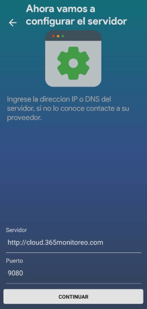
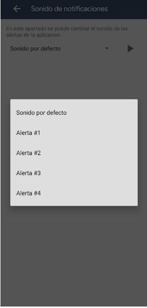
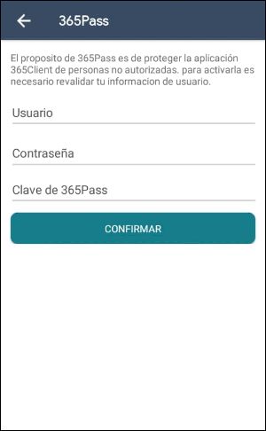
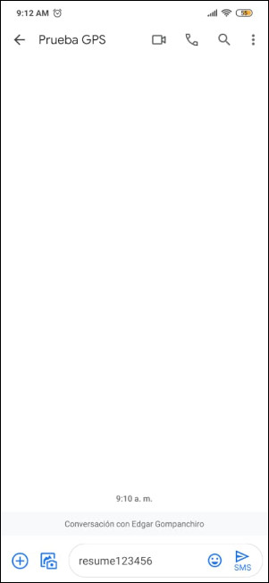

---------------------------------------------------
# Descripción

365Client es una aplicacion global de seguridad para el control - gestión y monitoreo movil. Esta App funciona para la gestión de sus dispositivos conectados a 365Connect

# Descargar la Aplicacion:

## Android

*	Ingrese a la Playstore desde su dispositivo android e introduzca en la sección de búsqueda la combinación 365Client.

*	Seleccione la opción de instalación presionando el botón verde que dice instalar para empezar con la descarga.

* Una vez instalada, podemos acceder a la aplicación.

<!--## Iphone -->

<!--*No esta disponible en la tienda*-->

## Configurar Servidor 

En esta pantalla debe introducir la dirección del servidor y el puerto, esta información la proporciona su proveedor de Servicio. Si los datos son correctos pasará a la siguiente pantalla.

## Pantalla de Autenticación

En esta pantalla deberá ingresar su usuario y contraseña para poder utilizar la aplicación.

Si el cliente con el que está intentado acceder no tiene la opción "365Client Android" activada en la plataforma web 365, le saldrá un mensaje de error que dice "Notificacion, Acceso en Android inactivo, consulte a su proveedor".

## Pantalla Principal

En esta pantalla se le mostrara una lista con todos los dispositivos adjudicados al cliente con el cual se acaba de iniciar sesion, así mismo podrá acceder a la cada uno de estos dispositivos y visualizar todas las pestañas que aparecen en la versión web de la plataforma 365.

### Ir al mapa general 
Le permite ver la ubicación de cada uno de los dispositivos en un mapa general.

### Buscador: 
Le permite buscar un dispositivo en específico mediante el nombre del dispositivo. Al hacer clic en el boton de buscar ubicado en la parte superior derecha de la pantalla se le mostrara una nueva pantalla con toda la lista de los dispositivo que posee.

## Opciones

Al pulsar este boton se nos despliegan varias opciones las cuales nos permiten configurar mas opciones como lo es el 365pass y el sonido de las notificaciones, tambien nos permite observar la informacion del dispositivo y cerrar sesion del mismo.

### Informacion del Dispositivo
El contenido de esta seccion lo podemos ver mas adelante en la card del mismo nombre.

### Sonido de Notificaciones
En esta seccion podemos configurar los sonidos de la notificaciones que tiene por defecto el telefono y darle sonidos mas acorde a señales de alarma. Una vez dentro de esta seccion se nos mostrara una pantalla que nos permitira seleccionar y reproducir el sonido elegido.

Para seleccionar otro sonidos simplemente presionamos el boton de flecha hacia abajo se nos desplegara una lista con los sonidos para seleccionar.

Despues presionamos el boton de play para reproducir el sonido, al momento que se este reproduciendo el sonido el icono cambiara a uno de pausa, el cual utilizaremos para detener el sonido.

###  365pass
para activar el 365pass hay que hacer clic en el botón en forma de candado ubicado en la parte superior derecha de la pantalla.
#### ¿Qué es el 365pass?
Es un nivel de autenticación adicional para la app 365client, que impide la entrada a la app 365client aunque ya haya iniciado sesion en ella, ya que pide otra contraseña personalizada distinta a la del usuario y login del cliente.

Una vez activado te saldrá una notificación con el mensaje "Clave agregada exitosamente".

Luego cada vez que accedas a la aplicación de 365client te solicitara la clave 365pass.

### Cerrar Sesion
Permite terminar la sesion en donde se esta conectado.

## Cards

Al seleccionar un dispositivo se muestra todas las pestañas que tiene el mismo, en la plataforma web. 

Por ejemplo si seleccionamos el dispositivo edgar alvarado nos mostrara cada opcion o **card** que tiene el mismo y para acceder a ella solo tenemos que presionar la card a la cual queremos entrar.

## Información del Dispositivo

Muestra la información detallada del dispositivo, como el tipo, el código del dispositivo, el alias, la marca, la fecha de inicio del dispositivo, el último reporte, así como datos de la ubicación como el estado y el país, además de datos de contacto como el número telefónico y el correo.

## Seguimiento

En esta sección puedes ver un mapa al le pueden aplicar varios filtros de búsqueda como por rutas, por paradas, por exceso de velocidad y los días entre los cuales se desean realizar la búsqueda.

### Cambiar Terreno del Mapa

Presionamos el botón de mapa ubicado en la parte inferior derecha de la pantalla, luego se desplegara una lista con los terrenos que se pueden utilizar, seleccionamos uno y listo se cambiara el terreno automáticamente.

### ¿Cómo Hacer un Seguimiento?

*	Para realizar un seguimiento presionamos el botón con el icono ubicación del mapa, el cual nos desplegara una ventana con la búsqueda avanzada.

*	Luego seleccionamos por el tipo de categoría que queremos realizar las cuales son rutas, paradas y exceso de velocidad.

*	Una vez seleccionadas las dos fechas entre las que deseamos buscar presionamos el botón ir, para que luego nos genere en el mapa el resultado de la búsqueda deseada.

## Enviar Comandos

En esta sección se muestra los tipos de comandos que se le pueden enviar al dispositivo.

### ¿Cómo Enviar un Comando?

*   Una vez en la sección de comandos seleccionamos la forma de envió del comando que necesitamos trasmitir al dispositivo, ya sea GPRS o SMS.

*   Luego seleccionamos el tipo de comando entre todos los que posea el dispositivo, luego le presionamos el botón ir y listo.

:::warning[Importante]
Si no te sale una notificación al intentar enviar comandos a un dispositivo, es porque a ese dispositivo no se le puede enviar comandos.
:::

* Una vez el comando sea enviado se mostrara el siguiente mensaje en la aplicacion 365client.

### ¿Como configurar el envio de comandos SMS desde el telefono?

Los mensajes normalmente son enviados desde el servidor pero esta es solo la forma predeterminada como viene configurado el envio de mensajes, esto se puede cambiar de la siguiente manera:

* Seleccionamos el dispositivo que deseamos y nos vamos al panel del dispositivo.

* Una vez en el panel dispositibo damos clic en el boton editar dispositivo, ubicado en la parte superior derecha de la pantalla.

* Luego nos vamos a la etiqueta **Comandos desde** y hacemos clic encima del interruptor que dice servidor, el cual pasara a telefono, lo cual significa que ahora enviara comandos desde la aplicacion de mensajeria del telefono.

* Una vez hecho esto, le damos clic en el boton guardar y listo, cuando enviemos un comando desde la aplicacion 365client se abrira nuestra aplicacion de mensajes configurada o nos permitira seleccionar una de las que tenemos disponbile

* Luego se nos mostrara el comando que seleccionamos, al sim del numero de telefono configurado y con la clave del gps configurado 

* y la persona sera el responsable el mismo de enviar el comando presionando el boton enviar de la aplicacion de mensajes

## Zonas

En esta parte se muestra las zonas que tiene creadas el dispositivo seleccionado, las zonas son exclusivas de las centrales de alarma pero un dispositivo guard también puede poseer zonas, en zonas se muestra la descripción de la zona y la ubicación de la misma.

## Contactos

Se muestra una lista que define el nombre de la persona, el parentesco, el número de teléfono, de todos los contactos que tenga registrado el cliente en una o más particiones.

## Usuarios

Se refiere a las personas que tienen acceso al dispositivo, a las cuales se les asigna una imagen referencial, el nombre y apellido, el parentesco, el correo, un número de identificación, el teléfono móvil y también a cuales particiones tiene acceso el usuario.

## Horarios

En esta sección se muestran los horarios creados desde la plataforma web, se puede ver el día, la hora de inicio, la hora de salida y el tiempo de tolerancia en ambos.

Para más información de los horarios puede consultar en [Horarios.](dispositivos#horarios)

## Historial del Dispositivo

Este apartado de la aplicación muestra el historial del dispositivo, las ultimas señales generadas, con su zona/usuario, la partición a la que pertenecen, la fecha y la hora que fue generada dicha señal y el evento generado.

En el historial de dispositivos también podemos ver señales anteriores a las últimas cien o señales de un día en específico, esto se hace presionando la flecha ubicada en la parte superior derecha de la pantalla.

Luego simplemente seleccionamos el día que queremos ver y se nos mostraran todas las señales de ese día.

### ¿Cómo utilizar la búsqueda avanzada del historial?

*	Si queremos buscar una señal en específico de un dispositivo tenemos debemos historial del mismo y presionar el botón con forma de lupa.

* Luego se nos desplegara una ventana, en la cual tendremos que seleccionar la fecha de inicio de la búsqueda y la fecha final.

*	Para luego elegir entre las muchas categorías de señales que hay, y elegimos la que más se adecue a nuestras necesidades.

*	Después de elegir la categoría simplemente presionamos el botón ir y se nos mostrara el historial pero solo con las señales entre los días elegidos y de la categoría que seleccionamos.

## Notas

En esta sección se pueden mostrar todas las notas creadas en el dispositivo, ya sean estas notas fijas o notas temporales, así como también el mensaje que posee cada nota.

## Ordenes

Muestra el historial de las ordenes de servicio asociadas al dispositivo, como también el número de orden, la fecha de creación de la orden junto con la hora, el problema por el cual fue reportado el dispositivo, el comentario final del operador y la fecha que lo hizo, además del estado en el cual se encuentra la orden.

### Línea de tiempo

Esta opción nos muestra el estado de a través del tiempo de la orden de servicio junto con los comentarios que se han hecho en la misma a lo largo del tiempo.

## Autoprocesar Señales

Es posible notificar o confirmar señales desde la aplicacion 365Client. Estos eventos especiales deben tener activada la opción autoprocesar, alguna notificación push configurada incluyendo un plan relacionado con la señal y registrada la Clave master, una palabra usada para confirmar su identidad.

### ¿Como autoprocesar señales?

* Usted recibirá una notificación push cuando se genere una señal autoprocesable, debe responder si es una falsa alarma seleccionando la opción si o no.

* Si elije Si, entonces aparecerá una pantalla donde debe elegir la clave master de entre las opciones disponibles. 

Al elegir correctamente la respuesta secreta, se notificará a la central y se procesara la señal de manera automática.

De lo contrario se identificara la señal en la central con un icono en forma de letra x detallando que la respuesta secreta fue invalida.

* Si elije no, entonces el icono de la señal en el monitoreo indicara que el evento está verificado y requiere la atención del operador de monitoreo.

Para más información consulte [Señales Autoprocesables en monitoreo.](monitoreo#señales-autoprocesables)