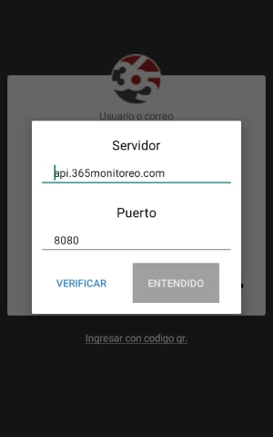
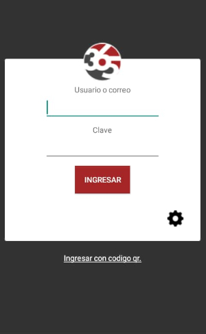

# Descripción

365Guard es una aplicación que funciona en la nube totalmente en tiempo real para el control de las rondas del personal de guardia con el poder de reportar incidencias mediante imágenes, audios, videos y mas, ademas del aumento de la seguridad en la eficiencia y aprovechando las nuevas tecnologías.

# Descargar la Aplicacion:

## Android

* Ingrese a la Playstore desde su dispositivo android e introduzca en la sección de búsqueda la combinación 365Guard.

* Seleccione la opción de instalación presionando el botón verde que dice instalar para empezar con la descarga.

* Una vez instalada, podemos acceder a la aplicación.

## Configurar servidor

En esta pantalla debe introducir la dirección del servidor y el puerto, esta información la proporciona su proveedor de Servicio. Una vez introducidos los datos darle verificar, si los datos están correcto el botón de entendido se pondrá en verde y le permitirá logearse.

|Campo|Descripción  |
|----------------|-----------|
|`Servidor`| Computadora u ordenador que pone recursos a disposición a través de una red.|
|`Puerto`| Entrada y salida de la información que envías o recibes en tu red.|

## Pantalla de Autenticación

En esta pantalla deberá ingresar su usuario y contraseña para poder utilizar la aplicación.

## Ingresar número Telefónico
Al loguearse la aplicación le solicitará introducir su número telefónico, recordando poner también el código correspondiente a su país.

## Pantalla Principal

En la pantalla principal podemos observar todas las opciones a las cuales podemos acceder en la aplicación 365guard.

### Leer QR

Activa la cámara para escanear un código QR, se utiliza en las rondas para verificar la actividad y en cualquier otro momento para crear una incidencia relacionada con un punto.

### Solicitud

* **Llamar:** Esta acción permite llamar al número autorizado configurado en la plataforma y enviara un even call a la central de monitoreo.
* **Llamarme:*** Realiza una solicitud de llamada a la central de monitoreo y enviara un evento callme a la central de monitoreo.

### Incidencia

Permite enviar en cualquier momento una incidencia con archivos multimedia adjuntos. Esta opción acepta imagen, video, audio y texto. Además puede asociarse la incidencia a uno de los puntos QR.

### Médica
Enviá una alarma Médica a la central de monitoreo, a esta señal se le puede adjuntar una imagen o no.

### Pánico
Enviá una alarma de Pánico a la central de monitoreo, a esta señal se le puede adjuntar una imagen o no.

### Fuego
Enviá una alarma de Fuego a la central de monitoreo, a esta señal se le puede adjuntar una imagen o no.

### ¿Como funcionan los botones de emergencia?

* Al precionar alguno de los botones de emergencia ya sea panico, fuego o medica se desplegara una ventana con un contador de 5 segundos para enviar el evento seleccionado.

* Luego se desplegara para preguntar si desea adjuntar una imagen al evento que acabade enviar, la cual podra aceptar o denegar.

* Al presionar el boton **enviar ahora** se abrira la camara para que el usuario pueda tomar la foto que necesite.

## Pantalla de Rondas
Muestra un listado de las rondas asignadas al dispositivo, el nombre de los puntos qr, y permite observar el tipo de ronda, la hora de inicio y Final, además de los días que estará activa la ronda.

### Ronda en Ejecución

Cuando inicia una ronda y la aplicación 365guard esta minimizada se muestra una notificación push que muestra el mensaje **Ronda Iniciada**.

Una vez dentro de la pantalla de principal de la aplicacion 365guard y una ronda este en ejecucion, se mostraran los puntos que tiene que escanear el guardia para cumplir la ronda.

Ademas en la parte inferior del mapa se muestra los **puntos sin localizacion restantes**, junto con el nombre del punto. Esto en caso de que la ronda ejecutada sea una ronda de tipo **No Secuencial**.

:::warning[Importante]
Si un punto no tiene localizacion esta incluido en la ronda, la pantalla de la app se mostrara el siguiente mensaje **Punto actual no se puede ubicar en el mapa. Dirigirse al punto QR para su lectura.**
:::

Si una ronda es **Secuencial** se muestra el orden en como deben ser escaneado los puntos por el guardia y se muestran los mismos en el mapa. Si hace una lectura de puntos en forma incorrecta la app enviara un evento de salto de punto a la central de monitoreo.

Una vez terminada la ronda y estando fuera de la aplicacion llega a la misma una notifiacion push que notifica la finalizacion de la ronda, con el mensaje **Su ronda ha terminado**.

Si desea obtener más información de cómo funciona una ronda puede irse a la sección de  [Rondas.](dispositivos#rondas)

## Pantalla de Detalles
Puede acceder a detalles seleccionando el icono con forma de hoja de papel.

Una vez presionado el icono se nos desplegaran dos opciones:
* Historial 
* Preferencias.

### Historial
Lista todas las señales y eventos que fueron enviados desde el dispositivo.

### Preferencias
Muestra las configuraciones de la aplicación guard, como el número de teléfono registrado, intervalo de rastreo, etc.

## Pantalla de Configuración
Puede acceder a Configuración seleccionando el icono de la tuerca.

Una vez presionado el botón se nos desplegaran una lista con todas opciones configurables de 365guard.

### Vista del Mapa
Permite elegir qué tipo de mapa se va a mostrar en la pantalla principal.
### Tiempo de Espera
Personaliza el tiempo de espera para el envío de eventos.
### Habilitar Pánico Rápido
Activa el shortcut para el envió de pánico rápido.
### Tamaño de La Imagen
Selecciona el tamaño de la imagen, relacionado con la calidad de la misma.

### Cerrar Sesión
Cierra sesión en el dispositivo.

## Eventos 365Guard

### Eventos que envia un usuario de 365guard:

| Cod. Evento 	| Descripción 	| Condición 	|
|-------------	|-------------	|-----------	|
|callme|Solicitud de Llamada|Se utilizó el botón solicitud llamada|
|callyou|Llamada al Numero Autorizado|Se utilizó el botón llamar|
|fire|Alarma de Fuego|Se utilizó el botón Fuego|
|medic|Alarma Medica|Se utilizó el botón Médica|
|panic|Alarma de Panico|Se utilizó el botón Pánico o se presionó el botón de encendido 2 veces (si la configuración se encuentra activa)|
|incidence|Reporte de Incidencia|Se utilizó el boton para envio de incidencia|
|incidencetask|Incidencia de tarea|Se utilizó el boton para envio de incidencia, relacionada con la tarea de un punto qr|
|nfcread|Lectura de nfc|Se utilizó el boton de Lectura en Punto NFC válido|
|qrread|Lectura QR|Se utilizó el boton de lectura en un qr|

### Eventos en segundo plano
| Cod. Evento 	| Descripción 	| Condición 	|
|-------------	|-------------	|-----------	|
|gps_disable|Gps deshabilitado en el dispositivo|Se genera cuando el usuario de 365guard desactiva el gps del telefono|
|gps_enable|Gps habilitado en el dispositivo|Se genera cuando el usuario de 365guard activa el gps del telefono|
|qrmove|Lectura de qr fuera de lugar|se genera cuando utilizó el boton de lectura de qr, pero la lectura ocurrió fuera de la ubicación(la distancia maxima por defecto es de 50metros)|

### Eventos generados por el sistema relacionados con las rondas
| Cod. Evento 	| Descripción 	| Condición 	|
|-------------	|-------------	|-----------	|
|E365_TS|Inicio de Ronda|Se genera cuando el sistema inicia el proceso de ronda|
|E365_OP|Punto de Ronda Omitido|Se genera cuando finaliza la ronda y el guardia no leyó uno o más puntos. Se generará 1 evento de este tipo por cada punto qr omitido|
|E365_SPR|Salto de punto de Ronda|Se genera cuando la ronda es tipo secuencial y el usuario de guard no sigue el orden de lectura|
|E365_TFG|Ronda Completada|Se genera cuando el sistema finaliza la ronda, se completo la lectura de todos los puntos y se realizaron todas las tareas|
|E365_TFB|Ronda No Completada|Se genera cuando el sistema finaliza la ronda, pero no se leyeron todos los puntos y/o faltaron tareas por completar|
|nfc_not_device|Dispositivo no posee lector NFC|Se genera cuando se inicia una ronda que contiene puntos NFC, pero el telefono que esta usando 365guard no es compatible con lectura nfc|
|TASK_COMPLETE|Tareas completadas|Se genera cuando se completaron todas las tareas de un punto qr|
|TASK_NOT_COMPLETED|Tareas no completadas|Se genera si alguna tarea de un punto qr no fue completada|

### Eventos generados en el historial de un panel de alarmas:
| Cod. Evento 	| Descripción 	| Condición 	|
|-------------	|-------------	|-----------	|
|E365_IS|Patrullero en el sitio|Se genera cuando el usuario de 365Guard escanea el qr asociado al panel de alarmas|
|incidence_is|Entrada de reporte de incidencia|Se genera cuando el usuario de 365Guard realiza un envio de incidencias relacionado con el qr asociado al panel de alarmas|