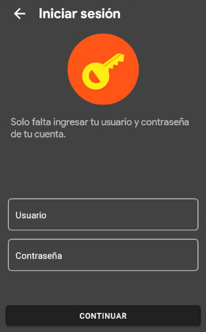
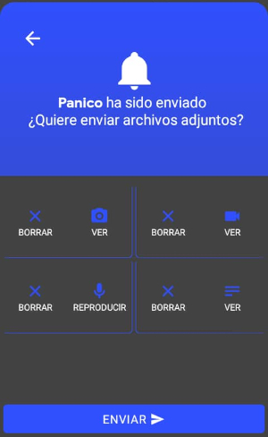
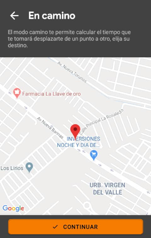
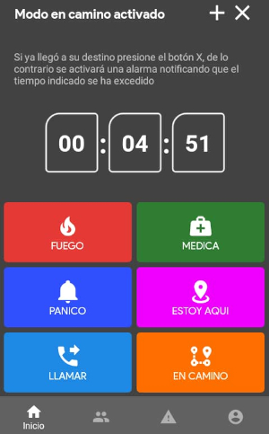
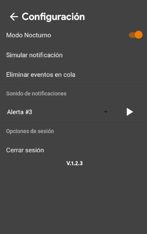

# Descripción

365SOS App de seguridad personal para el reporte de emergencias en tiempo real. Es una aplicacion que te permite tener un botón de emergencia en cualquier dispositivo. 365SOS es la app para brindar seguridad a personas. Ofrece envíos de incidencias con contenido multimedia como texto, imágenes, audio y videos a la central de monitoreo con 365Connect Pro y a todos los "Contactos" que tengas agregado de forma instantánea.

# Descargar la Aplicacion:

### Android

1. 	Ingrese a la Playstore desde su dispositivo android e introduzca en la sección de búsqueda la combinación 365SOS.

2.	Seleccione la opción de instalación presionando el botón verde que dice instalar para empezar con la descarga.

3. Una vez instalada, podemos acceder a la aplicación.

<!--### Iphone

1. Ingresa a la Apple Store busque 365SOS.

*sacar capturas ios adham* -->

# Primeros Pasos

<!-- ## Pantalla de Iniciales -->

<!-- Esta es la pantalla para autenticarse, donde debe introducir sus datos de inicio de sesión. -->

<!-- * Ingresar con codigo QR: esta opción permite acceder a la aplicación mediante el escaneo de un codigo QR asociado a un dispositivo o cliente. Este código se puede localizar ubicando el icono qr, en la esquina derecha del panel de un dispositivo o cliente Guard. -->

<!-- * Configuración: esta opción permite configurar el acceso al servidor, estos datos son facilitados por su proveedor. -->

## Pantalla inicial

En esta pantalla nos muestra los botones de iniciar con QR, cambiar servidor y el boton iniciar con el cual podemos conectarnos a la plataforma staging de 365monitoreo.com.

### Iniciar con QR

Este boton nos permite conectarnos a un cliente o aun dispositivo en especifico, con el codigo QR que se encuentran en el panel del dispositivo o en el panel del cliente, esta opcion nos loguea directamente en el servidor que esta alojado el cliente o el dispositivo, sin necesidad de saber u obtener las credenciales.

### Cambiar Servidor

El boton cambiar servidor nos llevara a la pantalla de configuracion del servidor.

### Iniciar

El boton iniciar conectara nuestra aplicacion 365sos al servidor de pruebas de 365monitoreo.com.

## Pantalla de configuración del servidor

En esta pantalla debe introducir la dirección del servidor y el puerto, esta información la proporciona su proveedor de Servicio. Si los datos son correctos pasará a la siguiente pantalla.

1. Servidor propio:  tendrá que introducir el DNS de su servidor y si no posee DNS tendrá que introducir la dirección IP publica del mismo, y el puerto utilizado es el que se tenga configurado en la plataforma pero normalmente se utiliza 7080.

2. Servidor 365: tendrá que simplemente que dejar los datos que trae predeterminados darle verificar y luego entendido.

## Pantalla de Inicio de Sesión

Puede seleccionar entre registrarse en la plataforma o iniciar sesión. 

 

## Pantalla de Registro
*nota: esta opción no está disponible por defecto*
Dependiendo de la Configuración de la empresa, esta pantalla puede tener más campos requeridos para el registro.

 

## Pantalla de Autenticación

En esta pantalla deberá ingresar su usuario y contraseña para poder utilizar la aplicación.

### Olvide mi usuario y contraseña

1. Si no sabe cuál es el usuario y contraseña, que tiene que insertar en esta sección, pues son los mismos datos con los que accede a la plataforma de 365monitoreo.com o su proveedor de servicio.

2. Si posee acceso a nuestra plataforma puede dirigirse al módulo de clientes, puede buscar el propio y en la columna de login se les mostraran los datos necesarios para acceder.

:::warning[Importante]
En caso de no tener ningún dispositivo sos creado con el cliente el cual está intentado acceder se mostrara el siguiente mensaje.
:::

## Pantalla de Selección

Debe elegir el dispositivo con el cual desea acceder, luego presione Empezar Ahora.

## Pantalla Principal

* La pantalla principal esta divida en tres partes, la parte inferior, la parte central y la parte superior. En la parte inferior encontramos el menú de opciones.

  * **Inicio**
  * **Contactos**
  * **Mis Alertas**
  * **Perfil**

### Inicio

La sección de inicio es la primera pantalla a la que accedemos una vez entramos a la app 365sos, en esta sección podemos ver todos los menús, botones y opciones que posee la misma, junto con el mapa de posicionamiento, esta pantalla esta compuesta empezando desde abajo hacia arriba por el menu de opciones, los botones de envió de señales, ademas de los botones de notificaciones y configuración. 

### Contactos
Para moverse a la pantalla del contactos nos ubicamos en la barra inferior de la aplicación y presionamos el segundo botón de la barra, el botón de contacto. En esta sección se agregan y listan todos los contactos, también puede configurar que desea mostrar a cada amigo.

**1. Búsqueda:** la herramienta de búsqueda puede encontrar un contacto fácilmente.

**2. Eliminar:** para eliminar un contacto, seleccione el contacto que desea eliminar y mantenga presionada la pantalla por al menos dos segundos y confirme que desea eliminar el contacto.

**3. Agregar:** para agregar amigos mediante el codigo 365 o mediante la lectura de qr.

#### Opción agregar contacto
Esta opción se encuentra ubicada en la misma pantalla de contactos, y para llegar a ella solo es necesario presionar el botón con el signo de más.

Esta opción nos llevara a otra pantalla en la cual nos mostrara nuestro código QR para que otros usuarios puedan agregarlo como contacto, deberán escanear el código QR de su amigo o su amigo el de usted, en su defecto también puede compartir el Código escrito con la otra persona.

Muestra el código QR y contacto de su dispositivo.

  **1. Leer Código QR:** esta opción activa la cámara para escanear el código QR. Debe tener activado los permisos de la cámara.

  **2. Ingresar Código de Contacto:** permite añadir un contacto utilizando un código escrito, éste se presenta con el prefijo *365_* seguida de letras y Números.

  **3. Copiar Código de contacto:** mantenga pulsado por al menos tres segundos o hasta ver el mensaje *"Código de Contacto Copiado"*

#### Perfil de Contactos Detalles

Una vez en la pantalla de contactos presionamos sobre el contacto al cual queremos acceder a su perfil y nos mostrara el perfil del contacto, junto con todos sus datos.

#### Llamar 

Esta opción nos permite comunicarnos con el número que tenga almacenado el contacto a través de una llamada normal.

#### Dirección

Nos muestra la ubicación del contacto la ruta que debemos seguir para llegar hasta donde está ubicado el contacto.

#### Privacidad
**1. Permitir ver mi ubicación:**
Determina si el contacto puede o no ver la ubicación del 365SOS.

**2. Notificación:**
Establece que notificaciones recibir del contacto seleccionado. Puede elegir entre Todas, Emergencia, Ninguna.

### Mis Alertas
Para moverse a la pantalla de mis alertas nos ubicamos en la barra inferior de la aplicación y presionamos el tercer botón de la barra, el botón de mis alertas. Esta sección muestra eventos adicionales configurados por el proveedor de servicio, funcionan de la misma manera que los eventos de la Pantalla Principal. Si desea eventos adicionales consulte a su proveedor.

### Perfil

Para moverse a la pantalla del perfil nos ubicamos en la barra inferior de la aplicación y presionamos el cuarto botón de la barra, el botón de perfil. El perfil muestra el número de cuenta, el correo y teléfono asociados al 365SOS; además también es posible visualizar la imagen de usuario registrada en la plataforma.

* En la parte central de la pantalla encontramos los:

  * Botones

## Botones
Los Botones se utilizan para enviar incidencias a la central de monitoreo y existen cuatro tipos de botones incidencia, posición, llamar y en camino. Al pulsar en cualquiera de ellos ocurrirá alguna opción dependiendo del tipo de Botón que sea. Los Botones por defectos son:

  ### **Fuego:** 

 Este es un botón de tipo incidencia y genera un evento de fuego, junto con un evento de incidencia cuando a esta señal se le decide agregar contenido multimedia a la cual se le puede asignar videos y fotos tomadas desde el teléfono o almacenadas en la memoria del mismo, así mismo audios y texto generados desde la misma aplicación 365sos. 
  ### **Medica:** 

  Este es un botón de tipo incidencia y genera un evento de emergencia médica, junto con un evento de incidencia al cual se le puede agregar contenido multimedia, como videos y fotos tomadas desde el teléfono o almacenadas en la memoria del mismo, así como también audios y texto.
  ### **Pánico:** 

 Este es un botón de tipo incidencia y genera un evento de pánico, además se le agrega un evento de incidencia al momento de agregarle contenido multimedia al evento emitido, como videos, fotos, audios y texto, ya sean generados desde el teléfono o almacenado en la memoria del mismo.

#### ¿Cómo funcionan los botones de tipo incidencia?

1.	Presionamos el botón del evento que desea enviar, ya sea pánico, médico o fuego.

2. Esperamos hasta que finalice el tiempo de envío o pulse "Enviar Ahora"

3. Luego se nos mostrara una pantalla con los diferentes tipos de archivos que podemos adjuntar al evento de incidencia, para hacerlo seleccione el botón con el tipo de archivo que desea adjuntar.

4. Si seleccionamos la opción de foto o video, se nos mostrara una pequeña ventana que nos mostrara una notificación que nos preguntara si queremos generar el archivo, ya sea una foto o video y otra opción que nos permitirá buscar el archivo en la galería de nuestro teléfono.

5. Una vez cargados todos los archivos que deseamos enviar, presionamos el botón enviar. La aplicación puede tardar en enviar los archivos dependiendo del tamaño del archivo y la calidad de su conexión a internet.

  ### **Estoy Aquí:** 

 Este es un botón de tipo posición, el cual envía un tracker una señal que no es monitoreable pero que actualiza la posición del dispositivo en la plataforma.

 
 ### **Llamar:**

  Este es un botón de tipo llamada, el cual abre la aplicación de llamadas predeterminada y permite llamar a un número de emergencia o un numero configurado en el sistema o en la plataforma.

  ### **En Camino:** 

  Este es un botón de tipo en camino, que genera un evento en camino, el modo en camino se utiliza cuando se va a desplazar de un punto a otro de forma segura. Se enviá una señal de advertencia a la central de monitoreo la cual advierte al operador de estar atento con este dispositivo en especifico y al terminar el tiempo o llegar al destino final, enviá una señal de cancelación manual o que cumplió el tiempo en camino. 

#### ¿Cómo funciona el modo en camino?

1. La ventana mostrará su posición actual en forma de un marcador rojo.

2. Ubique el área de destino desplazando el mapa y pulse para seleccionar el punto de llegada. Aparecerá un marcador azul. Puede mover el mapa para cambiar la posición del punto de llegada. Una vez seleccionado el punto, presione continuar.

3. Se abrirá una ventana para seleccionar el tiempo estimado de llegada a destino, deberá seleccione un tiempo estimado y presione iniciar.

Mientras se encuentra en camino, la aplicación mostrará el tiempo de llegada y dos nuevas opciones más

**4. Agregar tiempo al modo en camino:** Si aún no ha llegado a su destino, puede añadir más tiempo.

**5. Salir del modo encamino:** Si ya llegó a su destino puede usar esta opción para abandonar el modo en camino.

Todos estos eventos son enviados su proveedor.

:::warning[Importante]
Los botones que se muestran en la pantalla principal se pueden cambiar o personalizar dependiendo de lo que necesite la empresa, mas no se puede personalizar por cada cliente.
:::

* En la esquina superior derecha encontramos:

  * Notificaciones
  * Configuración

## Notificaciones
Para moverse a la pantalla de notificaciones solo necesitamos presionar el botón con forma de campana ubicado en la parte superior derecha de la pantalla principal.

Muestra un listado de las notificaciones 365SOS recibidas en el dispositivo. Puede pulsar una notificación para obtener más detalles de la misma. Para limpiar la lista de notificaciones se le puede dar clic en el botón con forma de bote de basura de la parte superior izquierda la pantalla.

Si presionamos una notificación en específico podemos ingresar directamente a la posición de la incidencia.

## Posición la incidencia
Cuando Ingresa a la notificación, puede observar la posición exacta desde donde se envió el alerta, representado con el símbolo de un marcador rojo con una mano en el centro. También puede desplazar el mapa para obtener más detalles de la zona.

### ¿Cómo llegar?: 
Esta opción despliega google maps para mostrar el recorrido necesario para llegar al origen de la señal.

### Visto
Al activar este botón, se le notificara al contacto que su evento ha sido visto y el botón quedara inhabilitado.

### Llamar
Permite abrir la aplicación de llamadas predeterminada y permite hacer una llamada al número registrado en la plataforma de ese contacto.

:::warning[Importante]
Cuando el contacto no tenga un número registrado nos mostrara el mensaje de Numero Invalido.
:::

### Chat
Establece una vía de comunicación textual con el contacto, hay dos tipos.

**1. Whatsapp:**
Genera un mensaje predeterminado para enviar al contacto, se hará a través de la aplicación de mensajería Whatsapp.

**2. SMS:**
Abre la aplicación predeterminada de mensajería y genera un sms predeterminado para el número de contacto.

## Configuración
Para moverse a la pantalla de configuración solo necesitamos presionar el botón con forma de tuerca ubicado en la parte superior derecha de la pantalla principal.

Esta pantalla reúne las opciones de configuración disponibles dentro de la aplicación.

### Modo Nocturno
Permite cambiar el tema entre el modo claro y el modo nocturno, el modo claro es predominantemente blanco, y con colores claros; El modo nocturno a su vez presenta colores oscuros. El modo nocturno viene activado por defecto.

### Simular Notificación
Genera una notificación push de prueba para explorar las opciones que se pueden visualizar en la notificación de un contacto SOS. Esta notificación push se nos muestra en la parte superior de la pantalla.

### Eliminar Eventos en Cola
Borra todos los eventos que no se han enviado. Esto solo eliminado los eventos generados a través del teléfono junto con los archivos adjuntos, no afecta de ninguna forma la plataforma 365. Esta opción nos muestra un mensaje de confirmación para evitar borrar eventos por equivocación.

### Sonido de Notificaciones
Permite cambiar el sonido de la notificación por uno diferente de la lista de sonidos disponibles. 

Se puede usar el botón reproducir en forma de triángulo para escuchar el sonido.

### Cerrar Sesión
Finaliza la sesión del usuario actual en la 365SOS App. Esta opción también nos muestra un mensaje de confirmación para evitar cerrar sesión por equivocación.

### Versión

El texto muestra la versión actual de la aplicación la cual es la Versión 1.2.3

