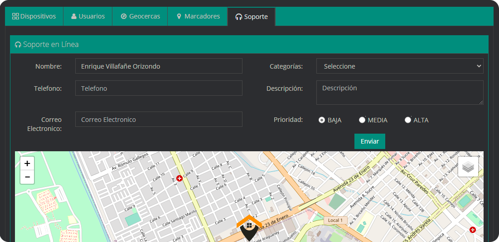
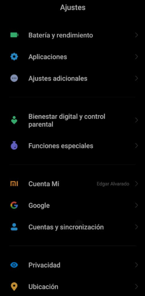

Preguntas Frecuentes de los clientes.

    
¿Por qué no me llegan los eventos de aperturas y cierres tardías en el monitoreo?

    

     
    * Revisar si esta configurado correctamente el horario.
    * Revisar si es dia feriado
    

    
¿Por qué solo veo el modulo de contactanos al ingresar con mi usuario?

    

    * Si solo ve la opción de contactanos, entonces es un problema de permisos puede que alguien mas se los haya quitado o cambiado.
    

    
¿Por qué no me llegan las notificaciones (sms,correo)?

    

    * Revisar el protocolo, plan de notificaciones.
    * Revisar si otros dispositivos presentan el mismo problema.
    

    
¿Cómo puedo agregar un evento propio a la plataforma?

    

    * Para agregar eventos necesitas varios datos en especifico, como el código del evento, el protocolo y muchas cosas mas, pero si quieres saber como agregar un evento en nuestra plataforma puedes dirigirte a [Agregar Evento.](../365connectPro/parametros.md#¿como-agregar-un-evento)
    

    
¿Cómo puedo hacer un respaldo de la base de datos?

    

    * Para hacer un respaldo desde la plataforma 365 solo necesitas ir al modulo de parametros, buscar el sub-modulo respaldo, te aparecerá un mensaje que dice "Desea exportar una base de datos a la carpeta predefinida", luego damos clic en aceptar y listo. Para mas información haga clic en [Respaldo.](../365connectPro/parametros.md#respaldo )
    

    
¿Cómo programar un GPS?

    

    Existe dos formas de configurar un gps en la plataforma 365 y las dos son diferentes dependiendo del modelo y la marca del mismo.

#### Modelo Coban g103

Para programar un gps modelo coban g103 necesitamos enviarle una serie de comandos SMS al numero de la tarjeta sim o chip al cual este ligado el gps.

**1. Inicialización**

    SMS Que se Envía =  begin123456

**2. Configuración del APN**

    SMS Que se Envía =  apn123456 internet.movistar.ve  ( Esto lo cambias por el APN de tu proveedor de telefonía)

**3. Configuración del IP de nuestro servidor**

    SMS Que se Envía =     adminip123456 173.212.218.146 5001

**4. Programación para recibir mensajes continuos y programados**

    SMS Que se Envía =   fix180s***n123456

**5. Obtener el IMEI del equipo**

    SMS Que se Envía =   imei123456

**6. Activación del GPRS**

    SMS Que se Envía =   gprs123456

**7. Chequeo del estado del equipo y del vehículo**

    SMS Que se Envía =   check123456

#### Sinotrack Tk-901

Para programar un gps modelo Sinotrack Tk-901 necesitamos enviarle una serie de comandos SMS al numero de la tarjeta sim o chip al cual este ligado el gps.

**1. Zona Horaria**

    8960000E00      (timezone 0)

**2. Configura ip y puerto del servidor**

    8040000 173.212.218.146 5013     (configura ip y puerto)

**3. Programar APN de Operador Celular**

- Movistar

        8030000 internet.movistar.ve

- Digitel

        8030000 gprsweb.digitel.ve

**4. Tiempo para reportar a la plataforma con motor encendido**

    8050000 60       (reporte con motor encendido 60segs, 1min)

**5. Tiempo para reportar a la plataforma con motor Apagado**

    8090000 300     (reporte con motor apagado 300 segs son 5min)

**6. Reiniciar para que agarre los cambios programados**

    RESTART

Una vez terminado la programación del GPS este debe mostrarse el icono del dispositivo ya sea una moto o un carro con un punto en verde en cualquiera de los mapas de la plataforma 365monitoreo, lo que significara que el auto está conectado y mandando la ubicación correcta del mismo a la plataforma, si surge algún problema, revise el estado actual del gps mediante el comando y verifique que todos los pasos anteriores se hicieron correctamente.

    
¿No puedo acceder a la app de android de 365cliente?

    

    * Revisar que el cliente tenga habilitado el uso de la aplicación. 
    * Esta opción se muestra en el modulo Clientes, al momento de agregar o editar a un cliente.

    
¿Donde configuro la inactividad de sistema de un dispositivo?

    

    * Al ingresar a través de la plataforma web todos los dispositivos poseen una barra en la parte superior y a la izquierda de dicha barra se puede ver botón configurar inactividad del sistema.

    

    * Si el icono se muestra en rojo significa que ese dispositivo no tiene configurado la inactividad del sistema.

    

    * Luego le da clic al botón para configurar, le saldrá un modal con las horas o los minutos de cada cuanto tiempo quiere que transmita la inactividad del dispositivo, si el mismo no genera una señal, ademas de un fecha con la ultima actividad del dispositivo.

    

    * Una vez configurado el tiempo y darle guardar el icono de inactividad del sistema deberá aparecer en verde que significa que esta activado.

    

   

    
¿Cómo enviar un evento en la aplicación 365SOS?

    

    * Una vez dentro de la aplicacion 365sos se nos mostrara una la pantalla principal de la aplicacion.

    

    - Una vez en la pantalla principal pulsasmos el botón del evento que desea enviar, en este caso panico.

    

    - Espere hasta que finalice el tiempo de envío o pulse "Enviar Ahora"

    

    - Puede adjuntar archivos multimedia al evento, para hacerlo seleccione el botón con el tipo de archivo que desea adjuntar.

    

    - Luego presione el botón enviar. La aplicación puede tardar en enviar los archivos dependiendo del tamaño del archivo y la calidad de su conexión a internet.

   

    
¿Cómo funciona el modo en camino en la aplicacion 365SOS?

    

    El modo en camino se utiliza cuando se va a desplazar de un punto a otro de forma segura.

    - La ventana mostrará su posición actual en forma de un marcador rojo.

    - Ubique el área de destino desplazando el mapa y pulse para seleccionar el punto de llegada. Aparecerá un marcador azul. Puede mover el mapa para cambiar la posición del punto de llegada. Una vez seleccionado el punto, presione continuar.

    - Se abrirá una ventana para seleccionar el tiempo estimado de llegada a destino, deberá seleccione un tiempo estimado y presione iniciar.

    

    Mientras se encuentra en camino, la aplicación mostrará el tiempo de llegada y dos nuevas opciones más

    - Agregar tiempo al modo en camino: Si aun no ha llegado a su destino, puede añadir más tiempo.
    - Salir: Si ya llegó a su destino puede usar esta opción para abandonar el modo en camino.

    

    Todos estos eventos son enviados a la central de monitoreo.

   

¿Cómo configurar smtp para el envío de correo electrónico?

#### Paso 1:

- Para poder usar el servidor SMTP gratuito de Gmail, debes permitirle el acceso a aplicaciones menos seguras. Google bloquea aplicaciones y dispositivos que, según ellos, no usan estándares de seguridad modernos. Sin embargo, el acceso para aplicaciones menos seguras se puede activar fácilmente [**aqui.**](https://myaccount.google.com/u/0/lesssecureapps?pli=1)
  :::tip Nota
  _esto aplica si la cuenta de google con la que esta logeado actualmente es la que desea utilizar para enviar correos_.
  :::

:::warning Importante
si usas autenticación de 2 factores para acceder a tu cuenta de Google, no se puede habilitar el acceso a aplicaciones menos seguras. En este caso, tendrás que iniciar sesión usando la contraseña de la aplicación.
:::

#### Paso 2

- Conocer los datos que te solicita el formulario, los cuales son:

  - **Servidor SMTP:** smtp.gmail.com
  - **Usuario SMTP:** Tu usuario de Gmail completo (email), por ejemplo tuemail@gmail.com
  - **Contraseña SMTP:** Tu contraseña de Gmail.
  - **Puerto SMTP:** 587
  - **TLS/SSL:** No requerido.

#### Paso 3:

- Dirijase al módulo Parametros, Empresa.

- Elige la empresa a la cual desea configurar el envio de correos SMTP, haga clic en el **boton editar**

- Ubique el apartado referente a SMTP y rellene los datos

- Al terminar la configuracion del correo SMTP en el 365receiver en la parte inferior derecha se le mostrara el nombre de la empresa junto con un boton azul que dice en espera, esto seguira asi hasta que se intente enviar un correo

- Si sigue los pasos de esta guia correctamente y los datos introducidos estan bien, deberia cambiar de estado y mostrar el mensaje de conectado una vez se haya enviado el mensaje.

¿Cómo configurar una camara?

* Si sigue los pasos de esta guia correctamente y los datos introducidos son los correctos, deberia poder visualizar las camaras, en las centrales de alarma en la pestaña de camaras y en la seccion de monitoreo. Ir a esta seccion del manual [**Aqui.**](../365connectPro/dispositivos.md#cámaras)

¿Que es un asociado?

* Un asociado es una cuenta compartida entre personas, empresas u organizaciones las cuales por alguna razon requieren o deben compartir sus dispositivos, pero sin otorgar las credenciales de sus cuentas. Para esto, tenemos la opcion de asociados, la cual permite vincular dos o mas dispositivos de clientes y visualizar todas las señales en el monitoreo.

Para mas informacion de que es un asociados y sus funciones puede hacer clic [**Aqui.**](../../manual-y-faq/365connectPro/asociados.md)

    
Protocolos con los que 365ReceiverGPS es compatible

    

        |Protocolo|Puerto|
        |---|---|
        | Gps gps103 | 5001|
        | Gps gt06 | 5023|
        | Gps taip | 5031|
        | Gps skypatrol | 5021|
        | Gps atrack | 5044|
        | Gps 365protocol | 5139 
        | Gps 365Sosprotocol | 6140 
        | Gps osmand | 5055| 
        | Gps calamp | 5082 |
        | Gps enfora | 5008 |
        | Gps gl100 | 5003 |
        | Gps gl200 | 5004 |
        | Gps meitrack | 5020 |
        | Gps pt502 | 5017 |
        | Gps meiligao | 5009|
        | Gps suntech | 5011|
        | Gps teltonika | 5027|  
        | Gps xexun | 5006|
        | Gps h02 | 5013|
        | Gps tk102 | 5036|
        | GPS tk103  |5002|
        | GPS t55  |5005|
        | GPS totem  |5007|
        | GPS trv  |5010|
        | GPS progress  |5012|
        | GPS jt600  |5014|
        | GPS huabao  |5015|
        | GPS v680  |5016|
        | GPS tr20  |5018|
        | GPS navis  |5019|
        | GPS gt02  |5022|
        | GPS gt02.timeout|500|
        | GPS megastek  |5024|
        | GPS navigil  |5025|
        | GPS gpsgate  |5026|
        | GPS mta6  |5028|
        | GPS tzone  |5029|
        | GPS tlt2h  |5030|
        | GPS wondex  |5032|
        | GPS cellocator  |5033|
        | GPS galileo  |5034|
        | GPS ywt  |5035|
        | GPS intellitrac  |5037|
        | GPS gpsmta  |5038|
        | GPS wialon  |5039|
        | GPS carscop  |5040|
        | GPS apel  |5041|
        | GPS manpower  |5042|
        | GPS globalsat  |5043|
        | GPS pt3000  |5045|
        | GPS ruptela  |5046|
        | GPS topflytech  |5047|
        | GPS laipac  |5048|
        | GPS aplicom  |5049|
        | GPS gotop  |5050|
        | GPS sanav  |5051|
        | GPS gator  |5052|
        | GPS noran  |5053|
        | GPS m2m  |5054|
        | GPS osmand  |5055|
        | GPS easytrack  |5056|
        | GPS gpsmarker  |5057|
        | GPS khd  |5058|
        | GPS piligrim  |5059|
        | GPS stl060  |5060|
        | GPS cartrack  |5061|
        | GPS minifinder  |5062|
        | GPS haicom  |5063|
        | GPS eelink  |5064|
        | GPS box  |5065|
        | GPS freedom  |5066|
        | GPS telic  |5067|
        | GPS trackbox  |5068|
        | GPS visiontek  |5069|
        | GPS orion  |5070|
        | GPS riti  |5071|
        | GPS ulbotech  |5072|
        | GPS tramigo  |5073|
        | GPS tr900  |5074|
        | GPS ardi01  |5075|
        | GPS xt013  |5076|
        | GPS autofon  |5077|
        | GPS gosafe  |5078|
        | GPS tt8850  |5079|
        | GPS bce  |5080|
        | GPS xirgo  |5081|
        | GPS mtx  |5083|
        | GPS tytan  |5084|
        | GPS avl301  |5085|
        | GPS castel  |5086|
        | GPS mxt  |5087|
        | GPS cityeasy  |5088|
        | GPS aquila  |5089|
        | GPS flextrack  |5090|
        | GPS blackkite  |5091|
        | GPS adm  |5092|
        | GPS watch  |5093|
        | GPS t800x  |5094|
        | GPS upro  |5095|
        | GPS auro  |5096|
        | GPS disha  |5097|
        | GPS thinkrace  |5098|
        | GPS pathaway  |5099|
        | GPS arnavi  |5100|
        | GPS nvs  |5101|
        | GPS kenji  |5102|
        | GPS astra  |5103|
        | GPS homtecs  |5104|
        | GPS fox  |5105|
        | GPS gnx  |5106|
        | GPS arknav  |5107|
        | GPS supermate  |5108|
        | GPS appello  |5109|
        | GPS idpl  |5110|
        | GPS huasheng  |5111|
        | GPS l100  |5112|
        | GPS granit  |5113|
        | GPS carcell  |5114|
        | GPS obddongle  |5115|
        | GPS hunterpro  |5116|
        | GPS raveon  |5117|
        | GPS cradlepoint  |5118|
        | GPS arknavx8  |5119|
        | GPS autograde  |5120|
        | GPS oigo  |5121|
        | GPS jpkorjar  |5122|
        | GPS cguard  |5123|
        | GPS fifotrack  |5124|
        | GPS smokey  |5125|
        | GPS extremtrac  |5126|
        | GPS trakmate  |5127|
        | GPS at2000  |5128|
        | GPS maestro  |5129|
        | GPS ais  |5130|
        | GPS gt30  |5131|
        | GPS tmg  |5132|
        | GPS pretrace  |5133|
        | GPS pricol  |5134|
        | GPS siwi  |5135|
        | GPS starlink  |5136|
        | GPS dmt  |5137|
        | GPS xt2400  |5138|
        | GPS 365Protocol  |5139|  
        | GPS alematics  |5140|
        | GPS gps056  |5141|
        | GPS flexcomm  |5142|
        | GPS vt200  |5143|
        | GPS owntracks  |5144|
        | GPS vtfms  |5145|
    

¿Como configurar un sonido personalizado a un evento?

* Para agregarle un sonido personalizado a los eventos, vamos a parametros > configurar eventos, luego eventos, buscamos el evento al que queremos asignarle un sonido personalizado y le damos clic en editar.

- Se desplegara el formulario de eventos y buscamos campo con el nombre **audio del evento**, hacemos clic en la opcion **seleccione audio**

- y buscamos la carpeta donde se encuentra el sonido que queremos utilizar y guardamos el sonido en el evento.

- Luego nos vamos a parametros > empresa, buscamos nuestra empresa y le damos clic en editar, se nos desplegara el formulario de la empresa y buscaremos el campo Sonido de eventos y activamos esta opcion.

    
¿Como enviar un requerimiento desde el 365web siendo cliente?

        

        * Para enviar un requerimiento debe seleccionar la pestaña soporte.

        

        - Se desplegara el formulario donde deberá llenar los datos de contacto,**Descripción** y **Prioridad**.

        

            - Luego de llenar los campos, presione el botón enviar.

   

¿Como limitar el uso de aplicaciones en android?

* Descargar la aplicación Kioware desde la tienda de aplicaciones

- Ejecutar la aplicacion y asignar todos los permisos

- Iniciar la configuración guiada, presione siguiente

- En el paso número 4 seleccione **añadir un botón nuevo**.

- Deberá añadir la aplicación 365Guard, la aplicación de teclado y la de cámara para garantizar el correcto funcionamiento de 365Guard

:::warning Importante
puede activar otras aplicaciones que considere necesarias, por ejemplo la app de llamada o mensajeria.
:::

- Una vez finalizada la configuración guiada, acceda al menu de Configuración general y marque la casilla **Inicio en arranque**

- Acceda al menu Navegador y marque la casilla **Habilitar la geolocalización**

- Ahora debe configurar kioware como aplicación de inicio o homescreen por defecto.

- Reinicie su smartphone para iniciar kioware.

:::warning Importante
para salir del bloqueo de aplicaciónes debe marcar las 4 esquinas de la pantalla en el sentido de las agujas del reloj, comenzando por la esquina superior izquierda (deberá hacerlo en menos de 8 segundos) esto activara la interfaz para ingresar la contraseña de desbloqueo, que por defecto es **3523** , puede cambiar esta contraseña desde el panel de configuracion.
:::

- Para cambiar la contraseña, ingrese al menu Seguridad y seleccione la opción **Códigos de acceso de salida**

- Seleccione **Contraseña para salir**

- Confirme la contraseña

 ¿Que efectos me trae en las aperturas y cierres cuando es un dia feriado?

* Cuando se configura un dia como feriado, todos los eventos de apertura y cierre que son generados ese dia no son monitoreables, ya que es un dia feriado.

---

¿Como habilitar el sonido de las notificaciones en mi xiaomi?

- Buscamos la aplicacion **Ajustes.**

- Despues selecionamos **Aplicaciones**

- Luego en buscamos la opcion **Administrar Aplicaciones.**

- Buscamos la aplicacion **365Client**

- Seleccionamos la opcion **Notificaciones**

- Despues buscamos la opcion **Permitir Sonido** y la marcamos como se muestra en la imagen.

¿Como habilitar los trackers en segundo plano en mi xiaomi? 

* Para habilitar los trackers en segundo plano para los telefono xiaomi es necesario ir a la opcion de **Ajustes** y luego a la opcion **Bateria y Rendimiento**.

- Una vez adentro, presionamos el boton de engranaje en la parte superior derecha de la pantalla.

- Al entrar en la siguiente pantalla, hacemos scroll hacia abajo hasta ver los ajustes adicionales y presionamos la opcion "Economizar Bateria en aplicaciones" o "Ahorro de energia en aplicaciones".

- Espararmos que cargue la lista y luego buscamos la aplicacion de 365 correspondiente.

- Luego seleccionar "Sin restricciones" para quitar todas las limitantes del uso de la aplicacion.

    
 ¿Como habilitar los eventos test de XML?

        

            * Para habilitar los eventos test de XML nos vamos a la carpeta<code> C:\Program Files (x86)\365Monitoreo.com\365Connect Pro\conf </code>

            - Luego abrimos el archivo de nombre config.ini, buscamos la seccion [EVENT] y si no esta entonces agregarla con la opcion test_xml, como se muestra en la imagen.

            

            - Cambiamos el valor de la variable de False a True, y luego guardamos los cambios del archivo config.ini

   

 ¿Como desactivar un Dispositivo 365guard?

* Una vez en el modulo dispositivos, buscamos el dispositivo que queremos desactivar y no ubicamos en la columna servicios y hacemos clic en la opcion editar estatus.

- Se nos desplegara el modal de servicios con todos los estatus que podemos editar, desmarcamos el check de estatus general y hacemos clic en guardar.

- Una vez hecho esto automaticamente el dispositivo guard se estara desactivando, el cual no nos permitira ingresar a la aplicacion y se mostrara de la siguiente forma.

