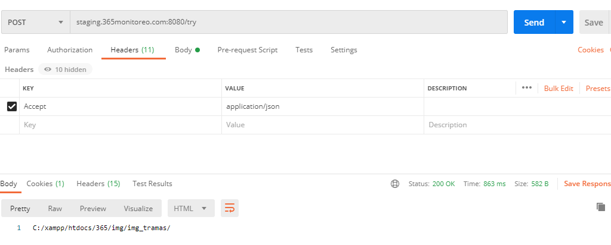
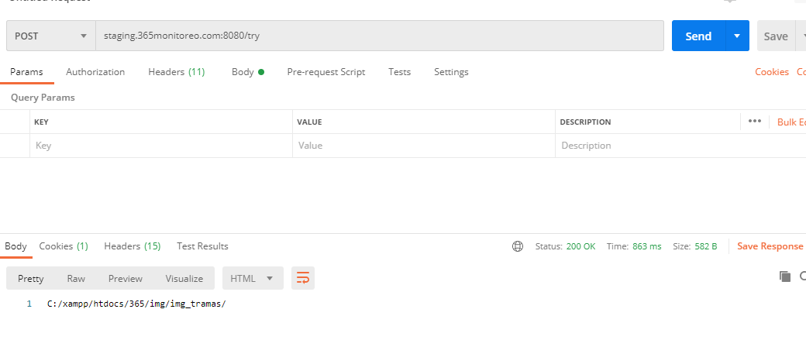
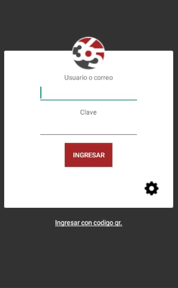
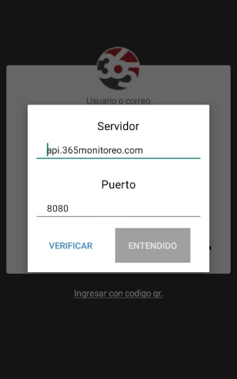
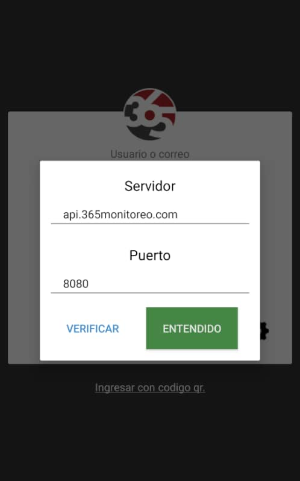

## 365Guard

### Verificar conexión con Postman

Para verificar la conexión de la aplicacion 365guard o cualquier otra aplicacion, se hace es una llamada en postman apuntando al server, para ver que responde el servidor. Ejemplo 

**¿Como hacer una llamada a postman?**

Aquí esta la única instrucción que se necesita introducir en el header para apuntar al servidor.

Aquí se ve como responde correctamente, con el status y la respuesta.

### Pruebas con nuestro teléfono

Abrir la aplicación 365Guard desde un telefono movil, seleccionar la opción de configuración y verificar la conexión.

Seleccionanado el boton de configuracion, se nos mostraran dos campos el primero con un DNS/IP y el segundo es el puerto por el cual accede nuestra plataforma.

Para confirmar que tenemos conexion con el servidor hacemos clic sobre el boton verificar, si el boton entendido se coloca en verde es porque existe conexion con el servidor.

### Verificar conexión a internet

Ingresar a google desde el smartphone para asegurarse de que no exista un problema de conexión a internet.