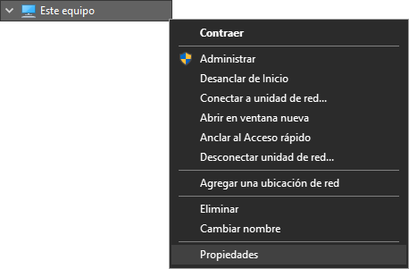

Problemas relacionados con el servicio de 365RecevierGPS.

<!-- | Problema 	| Posible Causa 	| Solución 	|
|----------	|---------------	|----------	|
|           |                   |          	| -->

## Como instalar 365receiverGPS

Normalmente este servicio se instala cuando se corre el archivo 365config del instalador, pero si sucede algun inconveniente u error con este servicio tambien se puede instalar y desinstalar desde la carpeta `C:\Program Files (x86)\365Monitoreo.com\365Connect Pro\365ReceiverGPS\bat` ejecutando el siguiente archivo.

> Ejecutar todos los archivos siguientes como administrador

* installService.bat

Una vez instalado el servicio ejecutamos el archivo

* startService.bat

## Como desinstalar 365receiverGPS

En caso de que querramos desintalar el serivicio, y el servicio este `ejecutandose` lo primero que debemos hacer es denetenerlo.

* stopService.bat

Una vez detenido el servicio luego procedemos a desinstalar el servicio

* uninstallService.bat

### ¿Como eliminar el servicio 365ReceiverGPS por comando?

Como he comentado es muy fácil y simplemente tienes que seguir estos pasos: Abre la ventana de servicios.

*	Para esto haz clic en la tecla windows y escribe servicios. También puedes hacer win+r y poner services.msc

* En la ventana que saldrá busca el servicio que quieres eliminar.

*	Haz doble clic sobre él y verás una ventana similar a esta.

*	Copia el nombre del servicio (el primero). 

*	Dale a la tecla windows y escribe cmd, clic derecho sobre el símbolo del sistema y ejecutar como administrador. 

*	Ahora solo tienes que escribir lo siguiente:

    `SC delete 365ReceiverGPS`

Te aparecerá un mensaje como que el servicio ha sido eliminado. Ahora si vuelves a la ventana de servicios y refrescas verás que ha desaparecido. 

Si tenías abierta la ventana con los detalles del servicio seguramente verás algún error. No te preocupes, pues es normal ya que has forzado la eliminación del servicio al que hace referencia. Simplemente ciérralo y ya está.

## 365ReceiverGPS No Funciona

### Verificar que el Servicio este en Ejecución

* Abrir el **Administrador de tareas**
* Ubicarse en la pestaña **Servicios**
* Buscar el servicio **365ReciverGPS** 
* verificar el **Estado** del servicio.
    - Si esta **En Ejecución**, esta todo bien.
    - Si esta **Detenido**, cambiar el estado del servicio.

### Verificar que No esté bloqueado por base de datos
* Ejecutar SQL Management Studio
* abrir la Base de Datos `365ReceiverGPS`
* Ingresar a la tabla `DATABASECHANGELOCK` y verificar el campo Locked. Si esta en **True** cambiar a **False**.

### Revisar los logs
Cuando ReceiverGPS esta en ejecución pero no funciona.
* Ir la carpeta de instalación, generalmente `C:\Program Files (x86)\365Monitoreo.com\365Connect Pro\365ReceiverGPS\logs`
* revisar los archivos `tracker-365` y `tracker-server`

### Servicio está detenido y al ejecutarlo da error
Esta solución da por hecho de que existe un respaldo de la carpeta `C:\Program Files (x86)\365Monitoreo.com\365Connect Pro\365ReceiverGPS\`.

* Eliminar el servicio desde CMD, para tal objetivo ejecutamos el comando: `sc delete "365ReceiverGPS"`.
* Abrir la carpeta de respaldo y copiar el 365ReceiverGPS.jar y la carpeta conf.
* Ejecutar de nuevo el servicio y verificar los logs para comprobar que funcione.

### Servicio está detenido y al iniciarlo se detiene
* Verificar el archivo **config** de 365ReciverGPS en la carpeta `C:\Program Files (x86)\365Monitoreo.com\365Connect Pro\365ReceiverGPS\conf`
>Ejecutar como administrador 
* **El bloc de notas** o cualquier programa como **SublimeText 3** que se utilice para ver editar el archivo **config**.
* Verificar que todos los **datos de acceso** sean igual a los del SQL Mangament Studio.
Ejemplo:

## Verificar las carpetas de JAVA el JRE y verificar las variables de entorno

Aveces ha pasado que ha un cliente se le va luz y es probablemente se dañe el config.ini y otra veces daña es el 365ReceiverGPS no arranque, cuando esto pase debemos verificar las carpetas Javas en Archivo de programa para ver si tiene el JRE y aparte entrar en las variables del sistema en el PATH para ver si están configuradas correctamente.

### Verificar JRE en Java

* Ir la dirección C:\Program Files\Java\jre1.8.0_202 y verificar los archivos.

### ¿Como ver las variables definidas correctamente?

* Abrir una carpeta y hacer clic izquierdo sobre **Este Equipo**, hacer clic en **Propiedades**.

* Luego en la parte derecha de la pantalla hacer clic en **Configuración avanzada del sistema**.

* Hacemos clic en el botón **Variables de entorno** ubicado en la parte inferior de la ventana de propiedades del sistema.

* En la ventana de **Variables del sistema** seleccionamos la variable **Path** y se edita.

* Luego buscamos la linea `C:\Program Files (x86)\Common Files\Oracle\Java\javapath`.

* Si existe la variables de entorno están creadas correctamente.

## 365ReceiverGPS se Ejecuta pero no conectan las aplicaciones

Este caso ocurre generalmente en entorno de desarrollo, es decir, cuando no se usó el instalador de 365Connect Pro.

* Ir a la dirección 'C:\xampp\apache\conf\extra'
* Abrir el archivo 'httpd-vhosts.conf'
* Verificar los VirtualHost correspondan con los puertos y la dirección donde están las apis

## 365ReceiverGPS no se ejecuta "Operacion no se pudo completar"

* Verificar el java instalado en la maquina que sea el Java 8 Update 202

* Si hay mas de un java instalado en la maquina como se muestra en la imagen

* Hay que verificar que cada uno este aislado del otro, para estos nos vamos a las carpetas java dependiendo si el equipo es 32 o 64bits, si hay una version de java mas reciente y solo existe esa carpeta lo mas seguro es que el java se halla actualizado y halla que reinstalar la version de java de 365.

* Si hay varias carpetas con diferentes versiones de java entonces este no es el problema.

> Nota: el java 8 Update 202 que utiliza 365 es de 64bits.

[Link para descargar Java](descargar-instaladores)