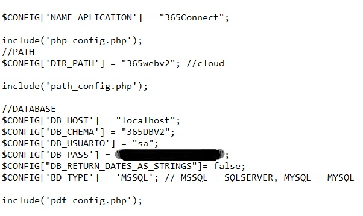
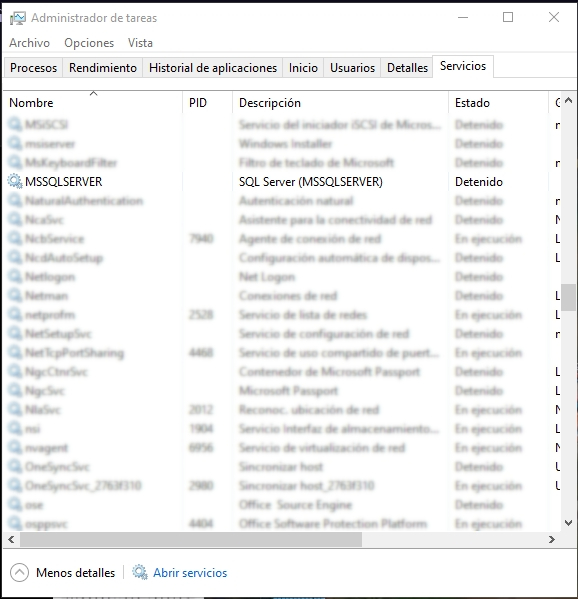
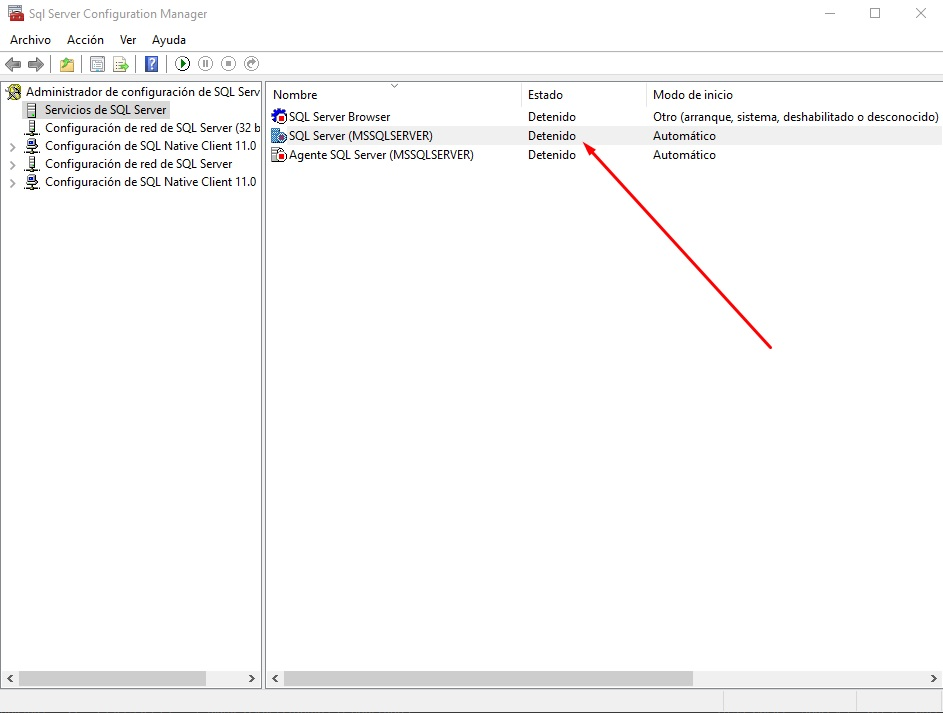
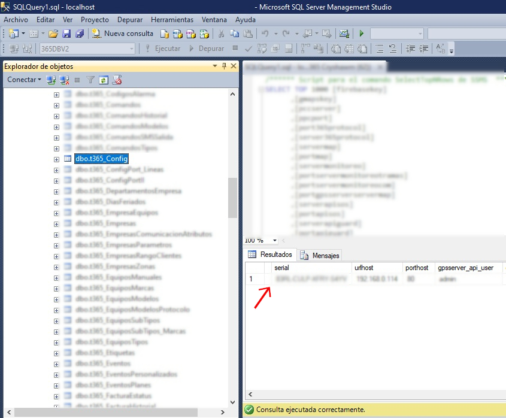
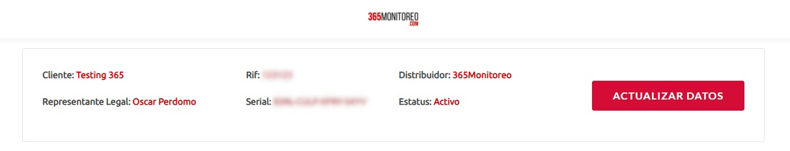

Problemas relacionados con el Web.

| Problema 	| Posible Causa 	| Solución 	|
|----------	|---------------	|----------	|
|Error 601|[el archivo config.php esta dañado o no existe](problemas-365web#archivo-configphp-no-existe) |Crear o Restaurar el config.php|
|Error 601|[los datos de conexion con la bd del config.php son incorrectos](problemas-365web#datos-de-conexión-con-la-base-de-datos)|Verificar los parametros de conexión|
|Error 601|[El servicio de MSSQL Server está detenido](problemas-365web#servicio-mssql-server-está-detenido)|Iniciar el Servicio|
|Error  404|[el serial  del software es incorrecto](problemas-365web#el-serial-en-base-de-datos-no-es-correcto)| Copiar el serial de validate|
|Error 404|[El servidor no se ha conectado en mucho tiempo para validar la licencia](problemas-365web#el-servidor-no-se-ha-conectado-en-mucho-tiempo-para-validar-la-licencia)|Conectar el servidor a internet en caso de que sea posible, o actualizar manualmente la licencia|
|Error  404|[el cliente se encuentra inactivo en validate](problemas-365web#solucionar-problema-cliente-serial-inactivo)|Verificar que las estaciones, macs y aplicaciones tengan el estatus activo|
|El diseño del login se ve mal/ no cargan las imagenes|[La ruta del archivo config.php es incorrecta](problemas-365web#dir_path-incorrecto)|Modificar el valor de la variable path|
|Mensaje "Hay error en WSCOM"| [365Receiver no está ejecutandose](problemas-365receiver#365receiver-no-está-en-ejecución)|Ejecutar 365Receiver|
|el panel dispositivo tarda mucho en cargar o no carga|[El dispositivo tiene entradas masivas en el historial de señales o en mensajeria](solucion-de-problemas.html#limpieza-de-tramas-y-mensajería)|Realizar un mantenimiento a las tramas o mensajería dejando los ultimos meses|
|al entrar a monitoreo o a cualquier ventana la computadora se relentiza|[el computador no cumple con los requerimientos minimos](inicio#requerimientos-para-equipos-con-fines-de-monitoreo-y-uso-de-la-plataforma-web)|Aumentar las especificaciones del equipo|
|al entrar a monitoreo o a cualquier ventana la computadora se relentiza|[El dispositivo tiene entradas masivas en el historial de señales o en mensajeria](solucion-de-problemas.html#limpieza-de-tramas-y-mensajería)|Limpieza de tablas con entradas muy antiguas|
|al entrar a monitoreo o a cualquier ventana la computadora se relentiza|[Se está monitoreando en el servidor y es un equipo de recursos limitados](inicio#requerimientos-para-equipos-con-fines-de-monitoreo-y-uso-de-la-plataforma-web)|Monitorear desde un computador que no sea el servidor|
|la plataforma carga lento, en local y ip externa pero se normaliza temporalmente al reiniciar apache|[Problema de conexión de Puertos](problemas-365web#cambiar-puerto-de-acceso-a-365)|cambiar los puertos|
|la plataforma web deja de responder indefinidamente a menos que se reinicie apache|[el proveedor de internet tiene un conflicto con los puertos principales de 365](problemas-365web#problemas-de-conexión-por-bloqueo-de-puertos)|Configurar un job para ejecutar el reinicio de apache por consola de windows|

## Solucionar problemas con el config.php
El primer paso es Ingresar al directorio `C:\xampp\htdocs\365\include\scriptdb` y abrir el archivo `config.php`.

### Archivo config.php no existe
Esta situación puede ocurrir cuando se instala por primera vez o por problemas con el disco duro. Se puede solucionar copiando el archivo config.php desde un respaldo anterior, o generando uno nuevo con ayuda del 365Config y luego editar los parametros de conexión con la base de datos ya que casi siempre varian.

### DIR_PATH incorrecto
La variable DIR_PATH se refiere al directorio es decir, la carpeta donde se accede al web y que puede ser 365, 365webv2 (en el caso de la version de desarrollo) o vacio en algunos servidores. Esta variable le indica a xampp donde va a buscar ciertos archivos que necesite, por ejemplo imagenes. La solución es cambiar el DIR_PATH, en versiones de producción se puede cambiar el valor del parametro de "365" a "" y viceversa, hasta que se logren visualizar las imagenes.

### Datos de Conexión con la base de datos
Utilizar los valores de las variables que inician con "DB_". para ingresar a la Base de datos desde el sql management estudio, si no conecta hay un problema con la direccion del servidor de base de datos, el usuario y la contraseña de acceso.

## Solucionar problemas servicio de MSSQL Server 

### Servicio MSSQL Server está detenido
Revisar en el administrador de tareas que el servicio de MSSQL Server no esté detenido, si está detenido entonces volverlo a iniciar. 

### Servicio de MSSQL Server no inicia en el administrador de tareas
Ejecutar el SQL Server Manager para iniciar el servicio desde allí.

### Servicio Motor de SQL no inicia
*aqui va algo que esta en otro lado*

## Solucionar problemas con el Serial

### El serial en base de datos no es correcto
Revisar desde el SQL Server Management Studio, la tabla t365_config en el campo Serial y verificar que tenga un serial válido.

Revisar y comparar el serial en la base de datos con el serial de esa empresa que esta en validate.

## Solucionar problema cliente Serial Inactivo

Ingresar a validate y verificar que el cliente tenga activo los servicios a los programas de la plataforma, se debe verificar que el estatus esté activo en la pestaña de Estaciones, macs y aplicaciones.
 
## Problemas de conexión por bloqueo de puertos

* [Verificar que los puertos esten abiertos](pruebas-de-funcionamiento#prueba-de-puertos-abiertos), si los puertos están cerrados lo primero es verificar que esten agregados en el firewall, pero si están agregados y aun asi permanecen cerrados hay que indicar al cliente que realice el forwarding, en ultima instancia si no se soluciona el problema entonces es un bloqueo de puertos por parte del proveedor de servicio, y el cliente debe tratar eso con su proveedor.

### Cambiar puerto de acceso a 365

* Ingresar en Xampp control panel, en el servicio de apache presionar el botón config y seleccionar la opcion `Apache(httpd.conf)`

* Buscar donde esten agregadas las lineas de escucha a los puertos, por ejemplo `Listen 1080` y crear o sustituir el puerto con problemas por el puerto nuevo.

* Guardar y reiniciar el servicio de Apache

* En parametros 365config, tambien se debe cambiar el `Puerto HTTP de 365Web`

## El servidor no se ha conectado en mucho tiempo para validar la licencia

Este error ocurre en servidores que no poseen conexión a internet, la plataforma necesita conectarse via internet con validateapp para verificar el estatus de la licencia. La manera más sencilla de solucionarlo es conectar el servidor a internet y dejar que valide la licencia y actualice las fechas, en caso de no poder se debe realizar un cambio en un archivo determinado.

### Actualizar el archivo session_web.txt para validar la licencia sin conexión a internet

* Ingresar a la ruta `C:\xampp\htdocs\365\include\phpscript` y abrir el archivo session_web.txt

* Copiar el contenido del archivo e ingresar a la siguiente dirección https://www.base64decode.org/ para decodificar. 

* Copiar los parametros decodeados y modificar la fecha futura, puede ser añadiendo un año más a la fecha actual.

* Copiar el valor con los parametros modificados y codificarlos en la siguiente dirección https://www.base64encode.org/

* Copiar el string codificado y sustituirlo dentro del archivo session_web.txt

### Cambiar puerto HTTP de 365Web en Parametros 365Config

Este procedimiento se debe realizar cuando no cargan las imagenes ni los marcadores en la app 365client, se debe colocar el puerto web que está abierto en el Xampp.

* Ingresar al modulo parametros 365Config

* Ubicar el campo `Puerto HTTP de 365Web` y cambiar al valor correcto

* Cerrar Sesión en la aplicación e ingresar nuevamente

