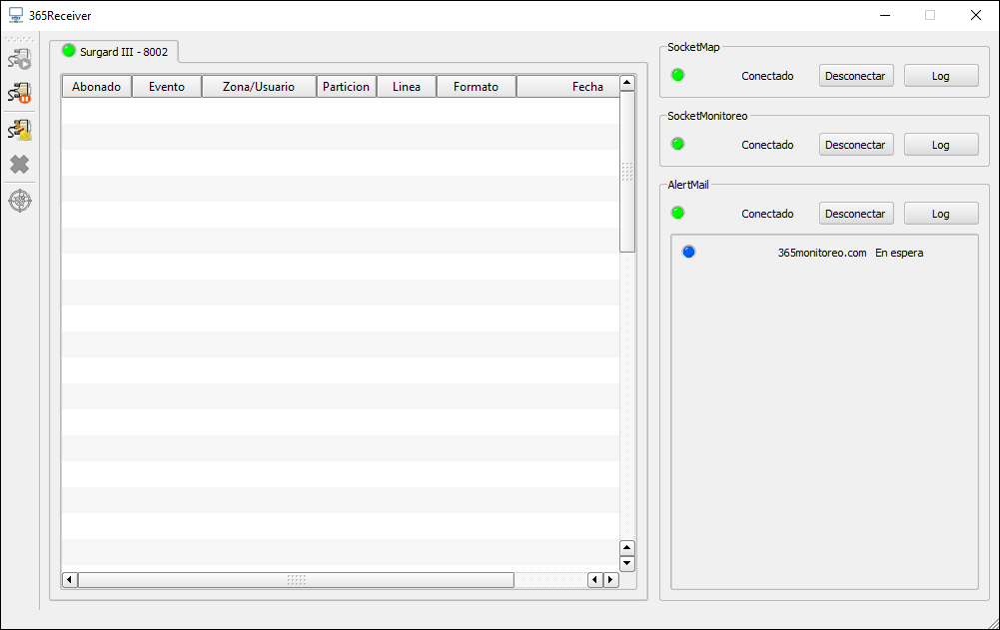
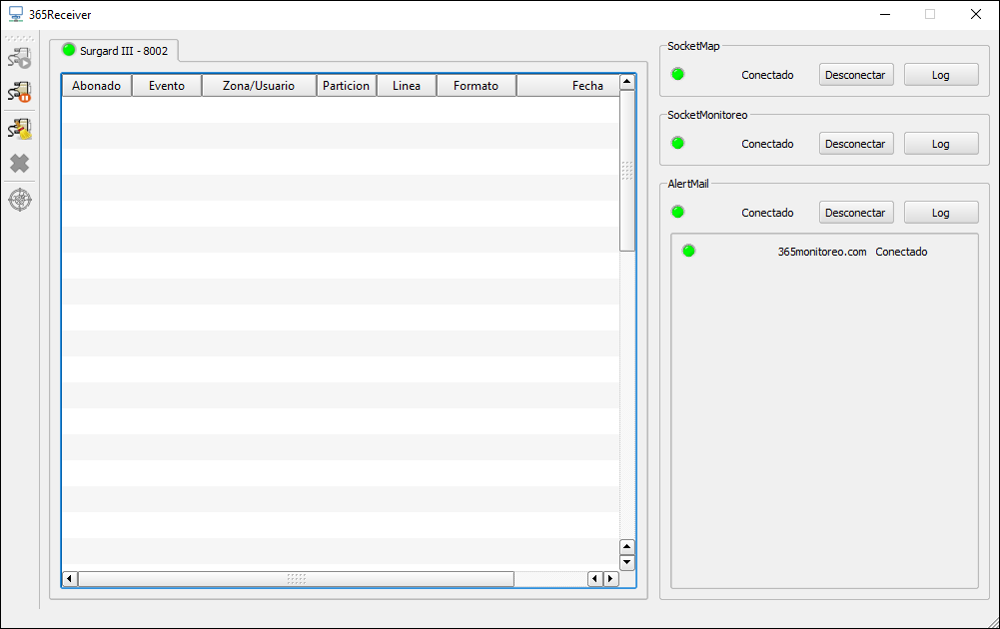

Problemas relacionados con AlertMail.

| Problema 	| Posible Causa 	| Solución 	|
|----------	|---------------	|----------	|
|SMTPAuthenticationError: 535, '5.7.8 Username and Password not accepted|[El correo y contraseña no son correctos o se cambio la clave recientemente](problemas-con-alertmail#correo-y-contraseña-no-son-correctos)|Configurar la nueva contraseña de correo en la plataforma 365|
|SMTPAuthenticationError: 534, '5.7.9 Application-specific password required|[La verificación de dos pasos está activa](problemas-con-alertmail#autenticación-de-dos-pasos-está-activa)|Crear una contraseña de aplicación|

## Revisar Logs de Alertmail

Abrir el 365Receiver, ubicar la ruta `C:\Program Files (x86)\365Monitoreo.com\365Connect Pro\logs\alert_mail` identificar si existe algún error.

## Errores documentados

### Correo y contraseña no son correctos
> SMTPAuthenticationError: (535, '5.7.8 Username and Password not accepted. Learn more at\n5.7.8  https://support.google.com/mail/?p=BadCredentials

Esto sucede si el usuario o contraseña introduciodos no son correctos, o la contraseña fue cambiada recientemente. Se puede verificar si la contraseña es correcta ingresando a gmail manualmente para comprobar si los ratos son corretos.

### Autenticación de dos pasos está activa
> SMTPAuthenticationError: (534, '5.7.9 Application-specific password required. Learn more at\n5.7.9 https://support.google.com/accounts/answer/185833?p=InvalidSecondFactor&visit_id=637799287852607777-1866657414&rd=1

Este error sucede cuando está activada la verificación de dos pasos, para solucionarlo se debe crear una contraseña de aplicación que se usará en la plataforma en lugar de la contraseña del correo electronico.

## Como crear una contraseña de aplicación en google
La nueva política de Gmail sólo permite iniciar sesión en AlertMail utilizando una contraseña de aplicación. Para eso es necesario tener activada la verificación de dos pasos en la cuenta.

### Como activar verificación de 2 pasos

* <a href="https://support.google.com/accounts/answer/185839" target="_blank">Activar Verificación de 2 pasos en Gmail</a>

### Crear contraseña de aplicaciones

* <a href="https://support.google.com/accounts/answer/185833" target="_blank">Contraseñas de aplicaciones Gmail]</a>

### Como ingresar la contraseña de aplicación para el envio de correos en 365

* Conocer los datos que te solicita el formulario, los cuales son:

    * **Servidor SMTP:** smtp.gmail.com
    * **Usuario SMTP:** Tu usuario de Gmail completo (email), por ejemplo tuemail@gmail.com
    * **Contraseña SMTP:** Tu contraseña de aplicación de Gmail.
    * **Puerto SMTP:** 587
    * **TLS/SSL:** No requerido.

* Dirijase al módulo Parametros, Empresa.

* Elige la empresa a la cual desea configurar el envio de correos SMTP, haga clic en el **boton editar** 

* Ubique el apartado referente a SMTP y rellene los datos

* Al terminar la configuracion del correo SMTP en el 365receiver en la parte inferior derecha se le mostrara el nombre de la empresa junto con un boton azul que dice en espera, esto seguira asi hasta que se intente enviar un correo 

* Si sigue los pasos de esta guia correctamente y los datos introducidos estan bien, deberia cambiar de estado y mostrar el mensaje de conectado una vez se haya enviado el mensaje.

