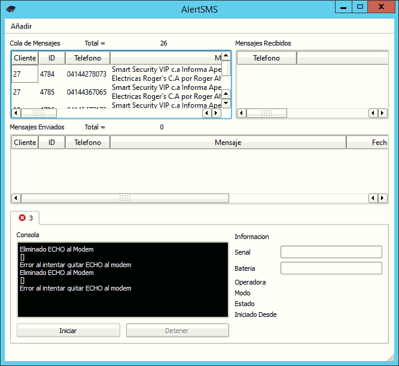
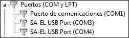
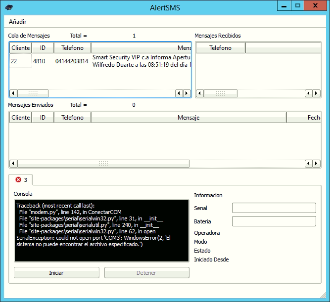
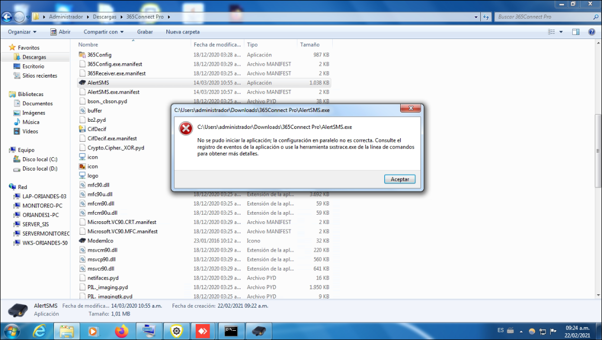

Problemas relacionados con AlertSMS.

| Problema                                                                | Posible Causa                                                                                                             | Solución                                                                                                                                |
| ----------------------------------------------------------------------- | ------------------------------------------------------------------------------------------------------------------------- | --------------------------------------------------------------------------------------------------------------------------------------- |
| Los mensajes no llegan al destinatario de la notificacion               | el formato del número es incorrecto o contiene caracteres no permitidos                                                   | Realizar un diagnostico de notificaciones SMS                                                                                           |
| Los mensajes llegaron repetidamente al telefono del cliente             | La alarma tiene un problema y envia eventos repetidos                                                                     | Revisar el historial del dispositivo                                                                                                    |
| Los mensajes no se envian y hay un error en la consola de AlertSMS      | [Error con el modem o el proveedor](./problemas-con-alertsms.md#errores-de-cms-documentados)                              | Revisar el codigo de error CMS                                                                                                          |
| AlertSMS muestra error de conexión con el puerto COM                    | [el modem fue cambiado de puerto, o el controlador se desinstaló](./problemas-con-alertsms.md#alertsms-perdido-el-puerto) | Buscar en el administrador de dispositivos por qué puerto COM está conectado el modem                                                   |
| AlertSMS muestra error al quitar ECHO al modem                          | [Error en el modem](./problemas-con-alertsms.md#error-al-intentar-quitar-echo-al-modem)                                   | Cerrar el programa, desconectar el modem y realizar mantenimiento                                                                       |
| No se pudo iniciar AlertSMS la configuración en paralelo no es correcta | [Error de windows](./problemas-con-alertsms.md#alertsms-dañado-o-con-problemas-de-permisos)                               | Instalar alertsms individualmente                                                                                                       |
| Tarda mucho tiempo en enviar los mensajes                               | Parametro de paridad y velocidad del modem incorrecto                                                                     | Verificar el modelo de modem para ajustar la configuración en la plataforma de 365                                                      |
| Tarda mucho tiempo en enviar los mensajes                               | el modem no es compatible con los comandos AT de alertSMS                                                                 | Comunicar con la gerencia para evaluar la posibilidad de hacer compatible ese modelo o en lo posible reemplazarlo por uno ya compatible |
| Los mensajes no se envian y estan en cola indefinidamente               | El número destinatario pertenece a una linea fija que rechaza los SMS                                                     | Eliminar la notificación                                                                                                                |

## Diagnostico de Notificaciones SMS

### Verificación particular

Revisar si el problema con la mensajeria ocurre unicamente con un dispositivo particular o con todos los dispositivos, ya que si ocurre con todos los dispositivos entonces puede que el problema no sea de configuración sino de comunicación del alertsms y el modem.

### Verificación de destinatario

Revisar y comparar el número de telefono destinatario con otro número que si reciba notificaciones SMS. Esto para destacar diferencias en el formato o caracteres especiales.

### Verificación de Estatus

Revisar los estatus del dispositivo y de la empresa.

### Verificación de Notificacion

Revisar el estatus de la notificacion, verificar que el plan de la notificación se corresponda con el protocolo de los eventos del dispositivo.

### Pruebas de Notificaciones

Se recomienda crear una notificación similar a la que presenta problemas cambiando el destinatario por un número personal para probar la recepción de SMS desde nuestro telefono particular.

## Revisar Logs de AlertSMS

    C:\Program Files (x86)\365Monitoreo.com\365Connect Pro\history

## Revisar consola

Si se muestra una x en la consola de alertSMS es porque perdió el puerto, hay que meterse por windows y ver cual puerto es, si no se muestra el numero del puerto no esta bien configurado el módem. Si alertSMS intenta enviar muchos mensajes y fallan, automáticamente se desconecta, esto puede ser porque esta baneado o esta cortado el chip.

## Errores de CMS documentados

| Codigo        |               Error               | Descripción                                                                                                                                                                                                                                                                 |
| :------------ | :-------------------------------: | :-------------------------------------------------------------------------------------------------------------------------------------------------------------------------------------------------------------------------------------------------------------------------- |
| CMS ERROR 8   |    Operator determined barring    | Esta causa indica que la linea ha intentado enviar un mensaje corto de origen móvil cuando el operador de red o el proveedor de servicios de la linea ha prohibido tales transacciones.                                                                                     |
| CMS ERROR 50  | Requested facility not subscribed | Esta causa indica que la red no pudo proporcionar el servicio de mensajes cortos solicitado porque el usuario no ha completado los arreglos administrativos necesarios con sus redes de soporte. (Sucedió una vez cuando se intento enviar sms a números en el extranjeros) |
| CMS ERROR 305 |    invalid text mode parameter    | Esta causa indica que el modem esta intentando enviar un parametro invalido en modo texto, esto puedes ser un caracter especial (o un espacio en blanco) en el nombre del cliente, del dispositivo o de un Zona/Punto                                                       |
| CMS ERROR     |  short message transfer rejected  | Esta causa indica que el destinatario rechazó el SMS, posiblemente debido a que ese número pertenece a una linea telefonica que no recibe mensajes                                                                                                                          |

## Error al intentar quitar ECHO al modem

Este no es un error de la plataforma si no del modem en si, primero que nada hay que cerrar el alertsms, despues si pueden apagar el modem desconectarlo, limpiar el sim card y volverlo a a conectar, una vez la luces del modem esten estaticas, abrir el alertsms

**Diagnostico**

- **Led fijo:** Es un problema con el controlador de ese enfora, se necesita verificar si esta instalado el controlador en el administrador de dispositivos, puede usar la imagen inferior para comparar, si puede visualizar algún puerto **SA-EL USB Port**, entonces el controlador esta instalado y corriendo correctamente, si no se muestra el controlador no esta instalado y hay que instalarlo, ademas podemos ver la configuracion del hiperterminal en el [**Manual de enfora 1308**](../../instalacion-y-configuracion/configuracion/configuracion-de-modem-enfora.md#manual-de-usuario-de-modem-enfora-1308).

:::warning Importante
Los puertos **SA-EL USB Port** son dedicados especificamente para los modems.
:::

- **Led titilando:** Es un problema de conexion con el cable a la maquina el cual no esta comunicando bien, se recomendaria sacar el cable limpiarlo y volverlo a conectar.

## AlertSMS perdido el puerto

- Buscar en el administrador de dispositivos el puerto COM que muestra el alert sms.

- En caso de que no se muestre el puerto **PCI_COM (COM3)** por ejemplo, puede que el windows alla perdido el controlador o no esta conectado el cable o el mismo esta dañado.

## AlertSMS dañado o con problemas de permisos

Cuando el AlertSMS este dañado o con problemas de permisos y aparezca el error de windows de la siguiente imagen, no se ha encontrado forma de corregir este error asi que la solucion actual que tenemos es descargar un nuevo AlertSMS, este que dejaremos mas abajo.

<a href="https://drive.google.com/file/d/1mLAOxbaYJLk6w9xbD6OWEzs7TanhyyWk/view?usp=sharing
" target="_blank">AlertSMS</a>

## Pagina para ver el significado de los errores cms

<a href="http://www.ozekisms.com/index.php?owpn=380
" target="_blank">CMS Error codes</a>

## No se envían mensajes de texto en la version 1

**Paso 1:** Revisar el 365connect si da error.

**Paso 2:** Si da error meterse a la tabla de clientes y eliminar a los últimos clientes desconocidos.

**Pase 3:** Una vez eliminado esos clientes, volver a intentar abrir el 365connect.

:::warning Importante
El 365connect en la version 1 es el encargado de enviar los mensajes predeterminados. **Ejemplo:** "MC-24 C.A Informa Batería Baja Del Sistema del Cliente Enrique Villafañe a las 07:19:37 del Dia 27/06/20".
:::

**Paso 4:** Abrir el AlertSMS y esperar a que envié un mensaje o enviar uno manualmente.

### Verificar el estado de las luces del módem

Preguntar el estado de las luces del módem, si están todas fijas la conexión se estableció correctamente.

### Verificar la señal del dispositivo

En el alertSMS revisar que el estado no indique `not network services` , o también que la señal no sea demasiado baja
