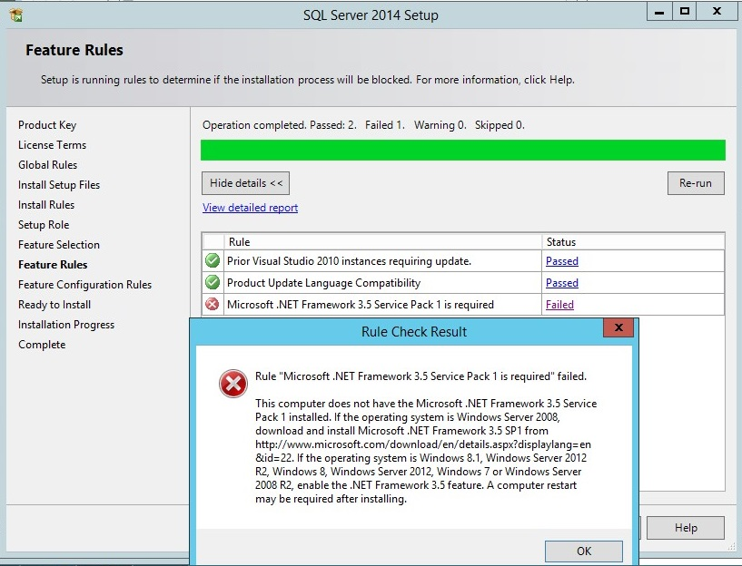
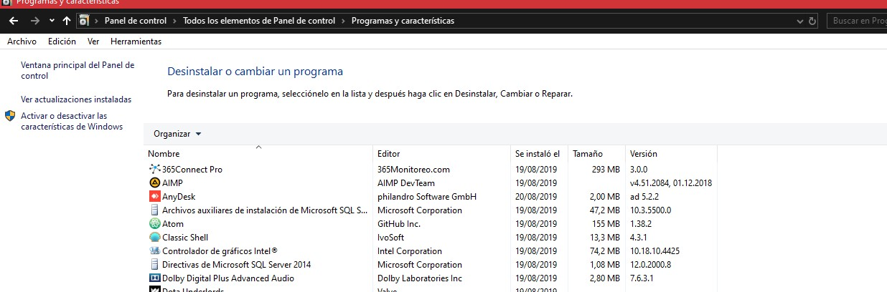
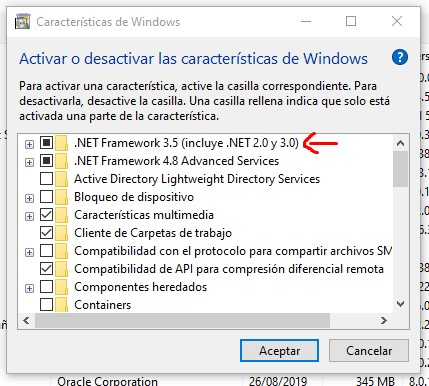

A veces se presentan fallas en el proceso de intalación debido a conflictos y bugs con las versiones de Windows, y software de terceros.

## Instalador de SQL Server no detecta NET Framework 3.5


### Instalar desde Panel de Control
Ir a Panel de Control, programas y características, 

seleccionamos **Activar o desactivar las caraterísticas de windows**, marcamos la opción que dice **.NET Framework 3.5**.


### Instalar desde una imagen ISO montada, o desde un USB booteable

Abrimos una Consola CMD como administrador y ejecutamos el siguiente codigo, cambiamos `D:` Por la letra de la unidad donde esté la iso montada o la unidad USB.

```
Dism /online /enable-feature /featurename:NetFX3 /All /Source:D:\sources\sxs /LimitAccess
```
Esperar que el proceso de instalación finalice.