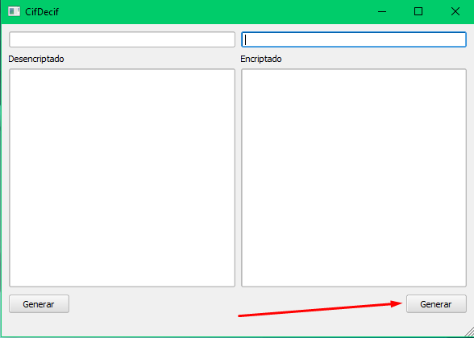
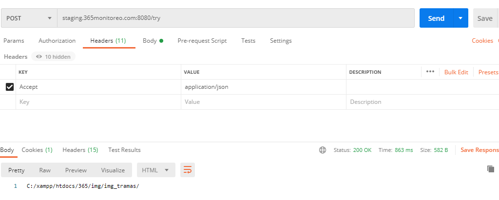
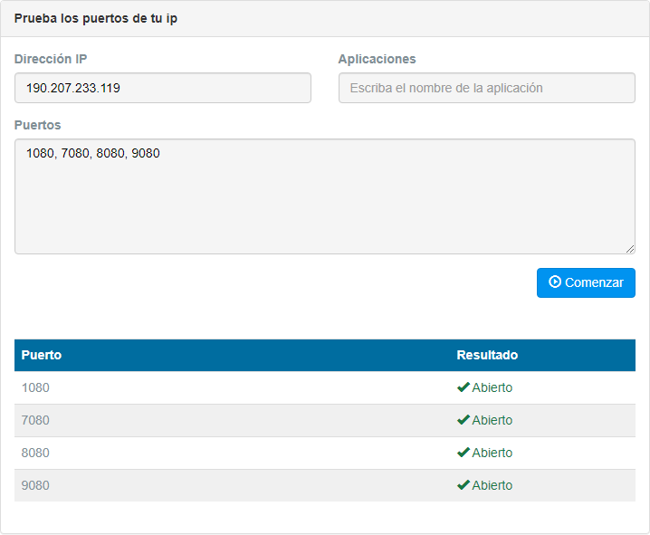

Se realizan para identificar o determinar que partes del software funcionan o para descartar las razones por la cual no esta funcionando.

## Verificar archivos de configuración
Por defecto los archivos de configuración se encuentran ofuscados, es necesario utilizar el programa CifDecif para obetener la información real. Se debe ingresar a la carpeta de instalación de 365, usualmente
en `C:\Program Files (x86)\365Monitoreo.com\365Connect Pro` y ejecutar CifDecif.exe.

### ¿Cómo Desencriptar la data de configuración?
* Se debe pegar la información del archivo en el campo Encriptado.

* Ingresar la contraseña de seguridad dentro del campo superior derecho.

* Presionar el boton generar del lado derecho, para mostrar la información desencriptada en el panel de la izquierda.

### ¿Cómo Encriptar la data de configuración?
* Se debe pegar la información del archivo en el campo Desencriptado.

* ingresar la contraseña de seguridad dentro del campo superior izquierdo.

* Presionar el boton generar del lado izquierdo, para mostrar la información Encriptada en el panel de la derecha.

## Verificar conexion de puertos
Se debe ingresar a la pagina web para <a href="https://www.testdevelocidad.es/test-de-puertos/
" target="_blank">Probar Puertos</a> e ingresar la direccion ip del servidor. Para conocer los puertos que deben estar abiertos puede encontrarlos en la configuración del firewall de su servidor y en los archivos config de 365ReceiverGPS.

## ¿Cómo conectar un dispositivo manualmente a 365ReceiverGPS?
Se puede simular la conexión de un dispositivo con ayuda de postman para realizar la siguiente petición `http://ipdelservidor:8089/api/updateconnex?accont=iddispositivo`, de esta forma aparecerá como conectado de manera temporal.

* Nos ubicamos en la pestaña authorization, en type seleccionamos **Basic Auth**.

* En la pestaña headers, nos aseguramos que este configurado como en la siguiente imagen. 

* Hacemos clic al botón send para realizar el envío de posición.

## ¿Cómo generar un reporte rutas con Postman?
Para generar un reporte de rutas mediante postman se necesita realizar la siguiente peticion `http://ipdelservidor:9080/getrutas_react` luego necesitamos introducir los datos que espera la peticion.

* Para eso nos posicionamos en la pestaña **Body**, para luego seleccionar la opcion **x-www-form-urlencoded**.

* En los campos **KEY** y **VALUE**, introducimos los nombres de los variables y el valor de los datos que espera la peticion.

:::tip Nota
Nota Es importante saber que las variables inicialDate y finalDate estan en formato **Unix Time Stamp**.
:::

* Hacemos clic en el boton send para realizar la peticion y recibir los puntos de la ruta generada.

# Prueba de Funcionamiento 365Guard

## Verificar conexión con Postman

Para verificar la conexión de la aplicacion 365guard o cualquier otra aplicacion, se hace es una llamada en postman apuntando al server, para ver que responde el servidor. Ejemplo 

**¿Como hacer una llamada a postman?**

Aquí esta la única instrucción que se necesita introducir en el header para apuntar al servidor.

Aquí se ve como responde correctamente, con el status y la respuesta.

## Prueba de conexion TCP con 365ReceiverGPS

* Descargar instalador de TCP Test Tool [**Aqui.**](https://tcp-test-tool.apponic.com/download/)

* Instalar TCP Test Tool.

* Una vez instalado el TCP Test Tool, lo ejecutamos y nos mostrara la pantalla principal del mismo.

* Introducimos la IP publica del servidor y el puerto por el cual queremos conectarnos, luego presionamos el boton Connect.

* Despues introducimos el mensaje que queremos enviar, en la seccion Edit/Send Data y luego presionamos el boton Send.

* Luego revisamos el log de 365ReceiverGPS.

### Condiciones

* Que sea un puerto que se encuentre en el default.XML de 365ReceiverGPS.

* Que el puerto sea TCP.

* En el monitor de recursos que utilice java.exe (Administrador de tareas > pestaña de rendimientos > barra inferrior Abrir el monitor de recursos).

## Prueba de Puertos Abiertos

Para probar que los puertos estan abiertos, se puede utilizar varias herramientas, en 365monitoreo utilizamos la pagina web <a href="https://www.testdevelocidad.es/test-de-puertos/" target="_blank"><b>Test de Velocidad</b></a> para comprobar el estado de los puertos, si los puertos que se utilizan para 365 estan abiertos se mostraran de la siguiente forma.

## Prueba de Envio envio de eventos con Packet Sender

 Descargar instalador de TCP Packet Sender [**Aqui.**](https://packetsender.com/download#show)

* Instalar Packet Sender.

* Una vez instalado el Packet Sender, lo ejecutamos y nos mostrara la pantalla principal del mismo.

* El packet sender se divide en 3 partes los cuales son el formulario, los paquetes guardados y los logs. En el formulario podemos ver los campos 

|**Campo**|**Descripcion**|
|---|---|
|Name| Nombre del paquete |
|ASCII| Estructura del paquete con toda la informacion contenida en el mismo |
|Adresss| Direccion del servidor o DNS |
|Port| Puerto de acceso de la señal |
|Resend Delay| Tiempo de re-envio |

* En la seccion de paquetes guardados podemos ver toda la informacion enviada anteriormente, en el formulario.

En el segmento de los logs podemos ver el registro de los paquetes que enviamos con toda la informacion.

* Luego se introduce el paquete que deseamos enviar, la IP publica del servidor o si esta conectado en la misma red la IP local y el puerto por el cual queremos conectarnos, luego presionamos el boton send.

:::tip Nota
Nota Para que el receptor permanezca conectado al enviar una trama con esta aplicación,es necesario marcar la casilla **persistent TCP**.
:::

## ¿Cómo activar el modo debug de 365Receiver?

Se puede activar el modo debug modificando el archivo config, para ello se puede sustituir el siguiente código en el archivo config de 365Receiver y posteriormente reiniciar el programa.

    [DEBUG]
    main = logging.DEBUG
    receivers = logging.DEBUG
    monitoring_socket = logging.DEBUG
    map_socket = logging.DEBUG
    alert_mail = logging.DEBUG

## ¿Cómo desactivar los eventos TEST de 365Receiver?

Para desactivar los eventos TEST de EBS que llegan desde OSM al listado de 365Receiver, se puede agregar o sustituir el siguiente código en el archivo config de 365Receiver y posteriormente reiniciar el programa. Si se desean habilitar simplemente escribir true en lugar de false

    [EVENT]
    test_xml = false

## ¿Cómo desactivar los eventos de conexión de Receptores en 365Receiver?

Para desactivar los eventos de conexión y desconexión que genera 365Receiver , se puede agregar o sustituir el siguiente código en el archivo config de 365Receiver y posteriormente reiniciar el programa. Si se desean habilitar simplemente escribir true en lugar de false.

    [RECEPTOR]
    status = false

## ¿Cómo desactivar las notificaciones push en Formato FCM nuevo 365Receiver para recibir las notificaciones en el formato antiguo?

Actualmente las notificaciones push de nuestras apps son generadas por nuestras propias aplicaciones, para ello se necesita estar logeado en la aplicacion y tenerla abierta en segundo plano, con el nuevo formato, el que genera las notificaciones es el sistema operativo del telefono, sin necesidad de tener la aplicacion abierta en segundo plano.

Para recibir el nuevo formato de notificaciones la variable notification debe estar en true, de lo contrario si se desea recibir unicamente las notificaciones en el formato de servidores antiguos entonces debe estar en false.

    [FIREBASE]
    notification = False
    
## Verificar conexion con los receptores por puerto serial

Para verificar la conexion con los receptores por puerto serial necesitamos utilizar el programa terminal, el cual utiliza la configuracion del receptor para escuchar lo que transmite el receptor incluyendo el heartbit del mismo, el cual es una señal de frecuencia que emite el receptor para establecer que esta conectado con la computadora u otro equipo.

### ¿Como utilizar el terminal?

1. Vamos a la carpeta *365Monitoreo.com\365Connect Pro\Utilitarios* o *365Monitoreo.com\365Connect Lite\Utilitarios* dependiendo de la version del 365 que este instalado en el ordenador y nos vamos al programa terminal.exe

2. Una vez ejecutado el programa se nos mostrara una ventana con todos las caracteristicas que podemos configurar en un receptor, ademas de unas cuantas opciones mas para limpiar la pantalla y la forma en como queremos recibir la trama, cosas que no explicaremos en este seccion porque no somos expertos en como utilizar este programa.

3. Para configurar el terminal primero seleccionamos el puerto que queremos probar en al seccion de **COM Port**, luego configuramos el **Baud rate**, el **Data bits**, el **Parity**, el **Stop Bits** y el **Handshaking** por el cual transmite el dispositivo, si el dispositivo esta bien configurado estos datos deberian ser igual a lo que este registrado en la seccion de parametros>receptores del web.

|COM Port|Baud rate|Data bits|Parity|Stop Bits|Handshaking|
|---|---|---|---|---|---|
|| | | | ||

4. Una vez terminada la configuracion del receptor que queremos probar, le damos clic en el boton conectar, y esperamos la llegada del hearthbeat del dispositivo, si llega el hearthbeat el dispositivo esta conectado y enviando, si no esta llegando puede ser un problema con el driver del dispositivo en el puerto COM o un problema del cable fisico que esta mal conectado o flojo.

# Pruebas de diagnostico relacionadas con el servidor
Este procedimiento se realiza cuando el funcionamiento del servidor se percibe pausado o relentizado.

## Programas de terceros
Monitorear los programas en ejecución y su consumo de recursos, se debe acceder al administrador de tareas y listar los programas en ejecución según el consumo de ram y cpu.

De esta manera se determina el nombre del programa que máyor consumo de recursos tiene, los programas que comunmente afectan el rendimiento del equipo son:

* Antivirus
* Troyanos, keylogger, Virus para minar criptomonedas

## Reinicio y monitoreo
El procedimiento de reinicio debe solventar temporalmente los problemas de rendimiento con el servidor, una vez realizado se debe determinar cuanto tiempo transcurre hasta que el servidor vuelva a presentar problemas de lentitud.

## Hardware
Cuando se determina que el servidor cumple con los requisitos, y no hay programas de terceros consumiendo los recursos del sistema entonces puede llegarse a la conclusión de que el origen del problema viene del hardware. En este caso es deber del cliente encargarse del diagnostico.

## Probar conexiones SQL con archivos .udl

1. En el escritorio creamos un nuevo documento de texto y le damos por nombre **test.udl**

2. Luego abriremos el archivo y buscaremos o escribiremos el nombre del del servidor en el que nos deseamos conectar en este caso es **"DESKTOP-5Q088IE"**, luego introducimos el nombre de usuario, la contraseña y seleccionamos la base de datos del servidor **"365DBV2"**

**NOTA:** Si no está utilizando ninguna instancia con nombre, utilice el siguiente formato: (nombredeservidor),(puerto).

### Ejemplos:

**DESKTOP-5Q088IE,1433**

3. Por utlimo hacemos click en el boton probar conexion, si la conexion es exitosa nos mostrara el mensaje que dice **"La prueba de conexion fue satisfactoria"**

