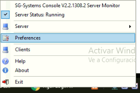
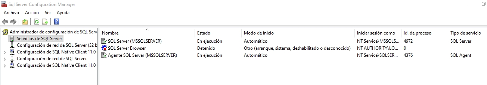
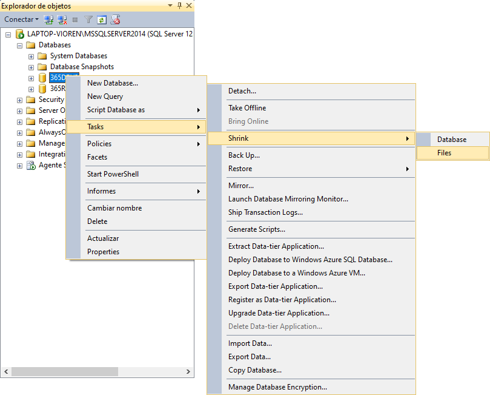
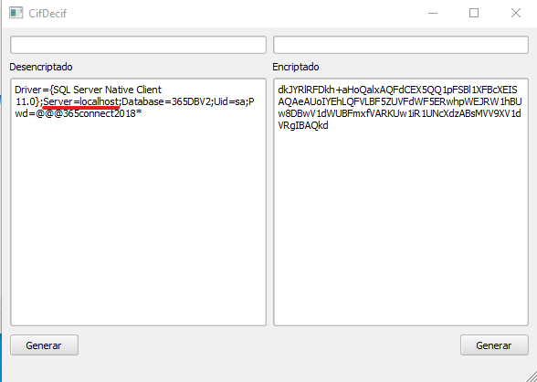

## Mensaje "Failed to execute script main" en 365Connect Lite


Entramos a la base de datos y listamos los clientes para ver los últimos registrados. Posteriormente seleccionamos editar y eliminamos los que digan Cliente Desconocido.

## SG-Systems Console

### Problemas de conexion con el SG-Systems Console V2 Client


Lo primero que hacemos es cerrar todos los programas, reiniciar el equipo y luego volver abrir el **SG-Systems Consolse V2 Monitor** y luego **SG-Systems Console V2 Client** deberia conectar con normalidad.

:::warning[Importante]
Si el equipo tiene un OSM instalado, se debe ejecutar primero el OSM.
:::

### ¿Como cambiar el puerto de conexion de SG-Systems Console Client V2?

- Nos dirigimos al icono del **SG-Systems Console Server**, buscamos la opcion **Preferencias**



- Podemos ver el puerto por el cual actualmente se puede conectar el SG-System Console Client que por defecto es el **9000**, cambiamos el puerto por el que deseamos haciendo doble clic en el puerto actual y cambiandolo por el que deseamos en este caso el **9001**.


- Luego iniciamos el **SG-System Console Client V2**, nos pedira el Host y la clave,


- En el host escribimos localhost agregamos dos puntos y el puerto por el que deseamos ingresar en este caso el **9001**, luego simplemente ingresamos la clave para conectarnos.

## Error en OSM

Cuando el osm no abre la interfaz o el panel principal y muestra el siguiente mensaje de error

Es necesario instalar este java, sin desintalar los que haya para que el osm pueda trabajar normalmente.

<a href="https://drive.google.com/file/d/1fbxlWoyMaMrWJNoJh26ghMlnA13ObeP4/view?usp=sharing" target="_blank"><b>JAVA PARA EL OSM</b></a>

## Mensaje de error en varias apps


Este error se encuentra entre uno de los más comunes y ocurre principalmente en clientes de Venezuela, debido a los constantes cortes de servicio eléctrico. Algunas de las causas más comunes son:

### El Servicio de Base de Datos no se está ejecutando

Abrimos el administrador de tareas y nos posicionamos en la pestaña "Servicios", allí buscamos un servicio llamado MSSQLSERVER Si se encuentra detenido le damos clic derecho, iniciar.

Sino, continuamos con la siguiente opción.

### El Archivo config ha desaparecido

Para constatar que este sea el problema nos dirigimos a la carpeta de instalación de 365Connect, generalmente: `C:\Program Files (x86)\365Monitoreo.com\365Connect Pro` . Luego ingresamos en la carpeta conf, y allí deberían haber dos archivos:

- config.ini
- config_bk.ini

Si falta el archivo config.ini o está vació, podemos solucionar este problema abriendo config_bk en un blog de notas, copiando el contenido al archivo config.

Si el archivo config está en perfecto estado, pasamos a la siguiente opción.

### La Base de Datos entró en modo SUSPECT

Ingresamos al SQL Management Studio, nos conectamos al servidor y observamos que en la lista de Base de datos se encuentre marcada como Suspect o Sospechoso .


Para solucionarlo ejecutamos alguno de los siguientes códigos, para versión Lite y versión Pro, respectivamente.

Version 1

```
EXEC sp_resetstatus [365DB];
ALTER DATABASE [365DB] SET EMERGENCY
DBCC checkdb([365DB])
ALTER DATABASE [365DB] SET SINGLE_USER WITH ROLLBACK IMMEDIATE
DBCC CheckDB ([365DB], REPAIR_ALLOW_DATA_LOSS)
ALTER DATABASE [365DB] SET MULTI_USER
```

Version 2

```
EXEC sp_resetstatus [365DBV2];
ALTER DATABASE [365DBV2] SET EMERGENCY
DBCC checkdb([365DBV2])
ALTER DATABASE [365DBV2] SET SINGLE_USER WITH ROLLBACK IMMEDIATE
DBCC CheckDB ([365DBV2], REPAIR_ALLOW_DATA_LOSS)
ALTER DATABASE [365DBV2] SET MULTI_USER
```

Luego cerrar el SQL Management Studio, y abrirlo.

## Base de Datos en modo Usuario único/Single user


El problema suele suceder cuando se restaura un respaldo de la base de datos, se puede solucionar rápidamente abriendo el Administrador de Configuración de SQL Server, y deteniendo el servicio de SQL Server (MSSQL)



Volvemos a iniciar el servicio, y ejecutamos el siguiente comando SQL:

```
-- Start in master
USE MASTER;

-- Add users
ALTER DATABASE [365DBV2] SET MULTI_USER
GO
```

## Mantenimiento de Base de datos

### Backups Programados mediante el Agente SQL

- Abrir el SQL Management Studio y conectar con la base de datos

- Ubicar la carpeta Administración->Planes de mantenimiento, hacer clic derecho y crear un Nuevo plan de mantenimiento
  
- Ingresar el nombre del nuevo plan de mantenimiento y luego hacer clic en el icono de calendario para Configurar la frecuencia.
  
- Establecer los parametros segun los requerimientos del cliente y hacer clic en aceptar.
  
- En la parte derecha de la ventana hacer click en donde dice `Cuadro de Herramientas`, desplegara una lista de Tareas de plan de mantenimiento. Ubicar la tarea Copia de seguridad de base de datos y la arrastramos hacia la derecha.
  
- Hacer doble clic en el nuevo componente para configurar los parametros de mantenimiento.
  
- En la pestaña general podemos seleccionar la base de datos a la cual se le va a realizar mantenimiento, lo recomendable es hacer respaldo de 365DBV2, tambien es posible programar respaldo para 365ReceiverGPS. En la pestaña destino se configura el directorio donde se van a almacenar las copias de seguridad.
  
- En la pestaña Opciones es posible configurar un vencimiento para las copias de seguridad.
  
- Una vez configurado el respaldo hacer clic derecho en la pestaña del plan de mantenimiento y seleccionar la opción guardar los elementos seleccionados.
  
- Se puede verificar que se creo el mantenimiento ubicando el agente de SQL Server en la carpeta trabajos debe aparecer el subplan del respaldo creado. desde aqui tambien se puede ejecutar el respaldo manualmente.
  

### Limpieza de tramas y mensajería

Algunas veces el cliente requiere eliminar información de la base datos ya que esta ocupa mucho espacio en el disco, con lo cual se dejará la información de los ultimos 2 meses eliminando por completo los meses anteriores, para ello podemos ejecutar este script:

```
DELETE FROM t365_Tramas WHERE (fecha < GETDATE() - 60)
DELETE FROM t365_MensajesRecib WHERE (recib_date < GETDATE() - 60)
DELETE FROM t365_MensajesSend WHERE (send_date < GETDATE() - 60)
DELETE FROM t365_ReceiveSignal WHERE (date_signal < GETDATE() - 60)
DELETE FROM t365_BsalidaSpeed WHERE (Fecha_creada < GETDATE() - 60)
DELETE FROM t365_Bentrada WHERE (Fecha < GETDATE() - 60)
DELETE FROM t365_TramasProcesadas WHERE (Fecha < GETDATE() - 60)
DELETE FROM t365_TramasAlertas WHERE (Fecha < GETDATE() - 60)
DELETE FROM t365_TramasProcesadasObservaciones WHERE (Fecha < GETDATE() - 60)
```

:::warning[Importante]
Se puede cambiar cuantos meses de información quedaran, cambiando el número 60 que es equivalente a 2 meses.
:::

### Limpieza de ordenes de servicio

Algunas veces el cliente requiere empezar con las ordenes de servicio desde cero, para ello podemos ejecutar este script:

```
TRUNCATE TABLE [t365_OrdServNotifi]
TRUNCATE TABLE [t365_OrdServ_UserRelacionado]
TRUNCATE TABLE [t365_OrdSerTipoServicios]
TRUNCATE TABLE [t365_OrdSerTecRelacionados]
TRUNCATE TABLE [t365_OrdSerLog]
TRUNCATE TABLE [t365_OrdSerItems]
TRUNCATE TABLE [t365_OrdRecordRelacionados]
TRUNCATE TABLE [t365_OrdRecordatorios]
TRUNCATE TABLE  [t365_OrdenServicio]
```

### Como reducir los logs de SQL

Seleccionamos la base de datos 365DBV2 hacemos clic izquierdo en la misma y despues en propiedades


Luego se abrira una ventana y en la lista de la izquierda hacemos clic en opciones, en la ventana buscamos el campo modelo de recuperacion, lo cambiamos de completo a simple y luego hacemos clic en aceptar.


Despues volvemos a hacer clic izquierdo en la base de datos y nos vamos a la opcion Task, luego a Shrink y por ultimo vamos a Files



Se nos abrira una ventana, buscamos el campo tipos de archivo y cambiamos la opcion seleccionada de Datos a Registro (o en ingles de Datos a Log) para finalmente hacer clic en aceptar.


Luego volvemos a cambiar el modelo de recuperacion de simple a completo.


### Como eliminar los sms en pendientes por enviar

Algunas veces el cliente requiere eliminar los SMS para comenzar desde cero, para ello podemos ejecutar este script:

```
DELETE FROM T365_BsalidaSpeed WHERE status = 0 OR status=5 OR status=3
```

## Cliente no Pueda Entrar en Horarios en 365Client

> Esto ya fue corregido, pero puede quedar algún cliente con este error.

Cuando un cliente no pueda entrar desde la aplicación 365client, hay que eliminar unas variables en el servidor del cliente.

1. **Pedir acceso al servidor**

2. **C:\xampp\htdocs\365\apis\365client en el archivo index.php**

3. **Buscar dentro del archivo el método "schedules_react"**

4. **Borrar las lineas dentro del método anterior**

```
"$r['fecha']" = ToTimeZoneUser($r['fecha'],$timezonetxt->descript);"
"$r['fechaop']" = ToTimeZoneUser($r['fechaop'],$timezonetxt->descript);"
"$r['fechacl']" = ToTimeZoneUser($r['fechacl'],$timezonetxt->descript);"
```

## Problemas con Base de Datos

### No se puede conectar con el motor de sql


Ocurre muy pocas veces, no es posible detener o reiniciar el servicio de SQLServer. Para solucionarlo, en primer lugar creamos un respaldo de las bases de datos, y luego debemos desintalar Microsoft SQL Server 20xx 64 bits. Y reinstalar .
**mejorar**

### Error 'The conversion of a nvarchar data type to a datetime data type resulted in an out-of-range value' en version de SQL Server 2016

El problema está relacionado con el idioma del usuario de base de datos, para solucionarlo hay que seguir los siguientes pasos.

1. **Ingresar a SQL Server Management Studio**

2. **En el explorador de Objetos buscar la carpeta Seguridad->Inicios de Sesión**
   

3. **Hacer clic derecho al usuario sa, y seleccionar Propiedades**

4. **En la parte inferior, seleccionar 'Spanish' como idioma predeterminado.**
   

5. **Guardar los cambios**

### Notificaciones push duplicadas o problemas de sesiones en las apps

El problema esta relacionado con las key de firebase duplicadas, se puede solucionar ejecutando la siguiente consulta en la base de datos.

```
DELETE t365_FirebaseTokens

 WHERE token IN
 (
 SELECT token FROM t365_FirebaseTokens
 GROUP BY token
 )

 AND fecha NOT IN (
 SELECT MAX(fecha) AS fecha FROM t365_FirebaseTokens
 GROUP BY token
 )
```

## ¿Como agregar otro puerto a la conexion de SQL Server?

Para agregar un puerto adicional de conexion de SQL, necesitamos abrir el **Administrador de configuracion de SQL Server 2014**.


Luego nos dirigimos a la opcion **Configuracion de red de SQL Server** y la expandimos, seleccionamos la opcion **Protocolos de MSSQLSERVER** una vez alli buscamos el protocolo **TCP/IP**, hacemos clic izquierdo en el y nos mostrara la opcion de **propiedades**.


Despues se nos abrira otra ventana, nos movemos a la pestaña de **Direcciones IP** y bajamos hasta la seccion **IPALL**, buscamos la opcion **Puerto TCP**, al puerto que existe actualmente, le agregamos una coma junto con el otro puerto que queremos habilitar, como se ve en este caso que es el puerto **9433**.

> Aperturar este puerto tanto en el **Firewall** como en la configuración de redes (En caso de ser local)


Por ultimo necesitamos reiniciar el servicio de **SQL Server (MSSQLSERVER)**, podemos hacerlo como se ve en la imagen o desde el administrador de tareas.


> Para verificar la conexión del SQL [**Probar conexiones SQL con archivos .udl**](pruebas-de-funcionamiento#probar-conexiones-sql-con-archivos-udl)

## ¿Cómo editar instancias SQL en el Config.ini?

Primero abrimos el **Config.ini** generalmente ubicado en `C:\Program Files (x86)\365Monitoreo.com\365Connect Pro\conf`

Seleccionamos la data encriptada en `Conexion` y la desencriptamos.


> Dirigirse al siguiente enlace para saber [**¿Cómo desencriptar la data de configuración?**](./pruebas-de-funcionamiento.md#cómo-desencriptar-la-data-de-configuración)

Luego editamos los valores en `Server` colocando el `Ip` del servidor al que se desea apuntar.



> En algunas ocasiones hace falta mencionar la instancia y/o puerto para realizar la conexion, por ejemplo:

> xxx.xxx.xxx\instanciaSQL, xxx.xxx.xxx,9433 o xxx.xxx.xxx,9433\instanciaSQL


Luego procedemos a encriptar la nueva data editada y sustituirla en el **Config.ini**

> Dirigirse al siguiente enlace para saber [**¿Cómo Encriptar la data de configuración?**](./pruebas-de-funcionamiento.md#cómo-encriptar-la-data-de-configuración)
