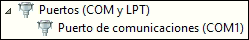
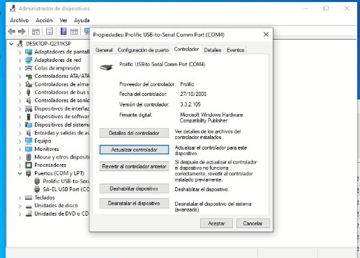
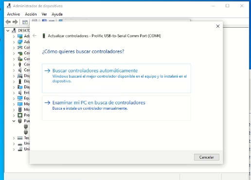
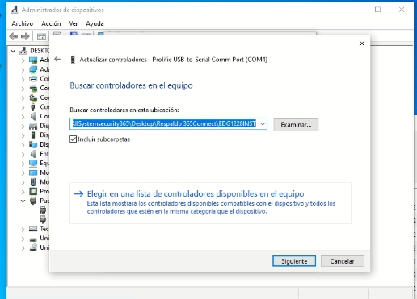
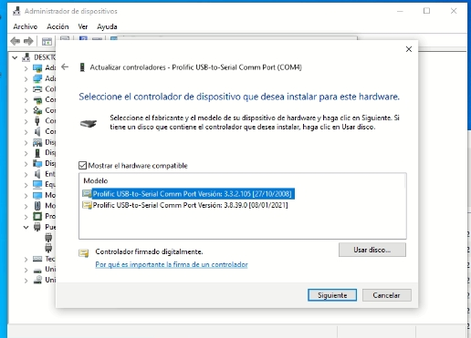

Problemas con relacionados con los receptores.
<!-- | Problema 	| Posible Causa 	| Solución 	|
|----------	|---------------	|----------	|
|           |                   |          	| -->

## Receptor desconectado
Verificar si está siendo reconocido en el administrador de dispositivos si el receptor esta conectado por el puerto COM.

### Reiniciar el proceso
Abrir el administrador de tareas, buscar el proceso 365Receiver y finalizarlo. Ejecutar nuevamente la app.

### Verificar el correcto funcionamiento del receptor
#### Receptor SG System
Abrir el SG System Console, ir a la sección CPM, Connection. Posteriormente realizar los test de conexión desde el menu indicado. Tambien es posible ingresar en el Cliente de System Console para realizar un reset fallback, para reconectar.

## Driver del puerto serial perdido 

Si solo hay un receptor conectado en la maquina como es el en caso en esta imagen y no se muestra en el **Administrador de dispostivos>Puertos**, posiblemente la maquina perdió el controlador.

    

:::warning[Importante]
Los **Puerto de comunicaciones** se usan específicamente para conectar modems y receptores de señales.
:::

<a href="" target="_blank">Driver del puerto serial (Falta el link)</a>

## Driver Cable COM a USB (Error:this is not prolific pl2303 please contact your supplier)

Este error ocurre en algunas versiones de windows con el controlador actualizado, al observar los puertos COM. La solución es instalar una versión anterior de este controlador.

### Instalacion del driver alternativo

Descargar e instalar el controlador alternativo >[Más Información: sobre dispositivos.](../../instalacion-y-configuracion/descargar-instaladores/descargar-instaladores.md).

* Abrir el administrador de dispositivos y ubicar el dispositivo con el error "this is not prolific pl2303 please contact your supplier" en la pestaña de dispositivos COM, clic derecho en propiedades y seleccionar "Actualizar controlador"

* Seleccionar "examinar mi PC en busca de controladores"

* Seleccionar en la parte inferior "Elegir en una lista de controladores disponibles en el equipo"

* Ubicar el controlador Prolific USB 3.3.2.105, y hacer clic en el boton Siguiente

Al terminar debería identificar correctamente el dispositivo.